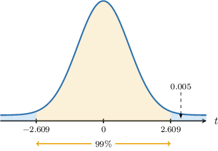
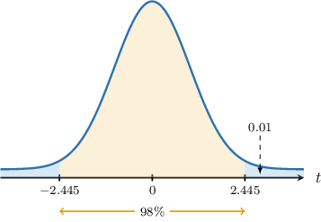

# Confidence Intervals for Paired Samples: Unknown Variances

Source: https://www.mathacademy.com/topics/3977?courseId=73
Topic ID: 3977

## Prerequisites

- [Confidence Intervals for One Mean: Unknown Population Variance](./3855-confidence-intervals-for-one-mean-unknown-population-variance.md)
- [Confidence Intervals for Paired Samples: Known Variances](./3970-confidence-intervals-for-paired-samples-known-variances.md)

## Lesson

### Introduction

In a previous lesson, we learned that given two *paired* samples of size $n{:}$

$$

X_1, X_2, \ldots, X_n, \qquad Y_1, Y_2, \ldots, Y_n,

$$

we can reduce this to a set of single-sample observations by defining the difference between each observation as

$$

D_i = X_i - Y_i.

$$

If we assume that the differences are independent and identically distributed (I.I.D), then we have two cases:

- If each $D_i$ is normally distributed, then the distribution of the sample mean $\overline D$ is given by where $\mu$ is the population mean of $D_i,$ and $\sigma^2$ is the population variance of $D_i.$

- If each $D_i$ is not normally distributed but the sample size is large, then by the central limit theorem,

In either case, we can construct a $[100(1-\alpha)]\%$ confidence interval for $\mu$ as follows:

$$

\overline{d} \pm z_{\alpha/2}\cdot\dfrac{\sigma}{\sqrt n}

$$

where

- $\overline{d}=\overline{x}-\overline{y}\,$ is a point estimate for $\mu,$

- $P(Z > z_{\alpha/2}) = \dfrac{\alpha}{2}$ and $Z\sim N(0,1).$

In most practical situations, $\sigma^2$ is unknown, so we must use the sample variance $S^2.$ This introduces additional variability, and the resulting random variable:

$$

T = \dfrac{\overline D - \mu}{S/\sqrt n}

$$

follows a $t$-distribution with $n-1$ degrees of freedom. This is *exact* if $D_i$ is normally distributed and *approximate* in the large sample case.

Thus, our confidence interval is given by

$$

\overline{d} \pm t_{n-1, \alpha/2} \cdot \dfrac{s}{\sqrt{n}}

$$

where

- $s^2$ is the sample variance, and

- $P(T > t_{n-1, \alpha/2}) = \dfrac{\alpha}{2}.$

Let's see some examples.

### Example: Finding a Confidence Interval for Two Means

#### Question

Consider two paired samples of size $n=150$ from the random variables $X$ and $Y.$ Given that the mean of the differences $d_i = x_i - y_i$ is $\overline{d} =5.6,$ and the variance of those differences is $s^2=2^2,$ find a $99\%$ confidence interval for the population mean $\mu$ of $D=X-Y.$ You may assume that the differences between the $i$th sample elements $X_i - Y_i$ are I.I.D random variables and each has the same distribution as $D.$

**

#### Explanation

We do not know the distribution of the difference $D,$ nor do we know the population variance $\sigma^2.$ However, the sample size $n = 150\geq 30$ is **.

In cases like this, the random variable

$$

\dfrac{\overline{D} - \mu}{S/\sqrt n}

$$

can be approximated by the student's $t$-distribution $T_{n-1}$ with $n-1$ degrees of freedom, where

where

- $\overline{D}$ is the sample mean of the differences,

- $\mu$ is the population mean of the variable $D,$

- $S^2$ is the sample variance of the differences, and

- $n$ is the sample size.

Given a value $\alpha$ between $0$ and $1,$ the corresponding $[100(1-\alpha)]\%$ confidence interval for the population mean $\mu$ is given by

$$

\overline{d} \pm t_{n-1,\alpha/2} \cdot \dfrac{s}{\sqrt{n}},

$$

where

- $P(T > t_{n-1,\alpha/2}) = \dfrac{\alpha}{2},$ and $T$ has a student's $t$-distribution with $n-1$ degrees of freedom,

- $\overline{d}$ is a point estimate of $\mu,$

- $s$ is an unbiased estimate of $\sigma,$ the standard deviation of $D.$

In our case,

$$

\overline{d}=5.6, \qquad n = 150, \qquad s = 2.

$$

We are interested in finding a $99\%$ confidence interval. So, we have

$$

\alpha=1-0.99=0.01 \qquad\Longrightarrow\qquad \dfrac{\alpha}{2}=0.005.

$$

From the table, we can see that $P(T_{149} > 2.609) = 0.005.$ As a result,

$$

t_{n-1,\alpha/2} = t_{149,0.005} = 2.609,

$$

as shown below.

Therefore, the $99\%$ confidence interval for the population mean $\mu$ of the difference is the following:

$$

\begin{aligned}5.6 & ±2.609⋅\frac{2}{\sqrt{150}}\end{aligned}

$$

which approximately equals

$$

\begin{aligned}5.6 & ±0.4.\end{aligned}

$$

### Example: Finding a Confidence Interval for Two Means: Applications

#### Question

An educational academy has two locations: Location A and Location B. The academy offers $34$ different courses, and both locations offer all courses.

The manager wants to know if students generally score higher in a final test at Location A compared to Location B across all courses. They decided to sample the test scores at both locations for all $34$ courses and compute the difference $d_i = x_i - y_i$ for each course. Here, $x_i$ and $y_i$ give the mean test score for course $i$ at locations A and B, respectively.

After conducting the sample, he found that the average difference in the mean score was $\overline{d}=1.20,$ and the sample variance of the differences was $s^2=4^2.$

Construct a $98\%$ confidence interval for the mean difference $\mu$ between the mean scores and interpret the result.

**

#### Explanation

Let us call $D$ the random variable representing the difference in the number of students attending a randomly selected course at locations A and B.

We do not know the distribution of the difference $D,$ nor do we know the population variance. However, the sample size $n = 34\geq 30$ is **.

In cases like this, the random variable

$$

\dfrac{\overline{D} - \mu}{S/\sqrt n}

$$

can be approximated by the student's $t$-distribution $T_{n-1}$ with $n-1$ degrees of freedom, where

- $\overline{D}$ is the sample mean of the differences,

- $\mu$ is the population mean of $D,$

- $S^2$ is the sample variance of the differences, and

- $n$ is the sample size.

Given a value $\alpha$ between $0$ and $1,$ the corresponding $[100(1-\alpha)]\%$ confidence interval for the population mean $\mu$ is given by

$$

\overline{d} \pm t_{n-1,\alpha/2} \cdot \dfrac{s}{\sqrt{n}},

$$

where

- $P(T > t_{n-1,\alpha/2}) = \dfrac{\alpha}{2},$ and $T$ has a student's $t$-distribution with $n-1$ degrees of freedom,

- $\overline{d}$ is a point estimate of $\mu,$

- $s$ is an unbiased estimate of $\sigma,$ the standard deviation of $D.$

In our case,

$$

\overline{d}=1.2, \qquad n = 34, \qquad s =4.

$$

We are interested in finding a $98\%$ confidence interval. So, we have

$$

\alpha=1-0.98=0.02 \qquad\Longrightarrow\qquad \dfrac{\alpha}{2}=0.01,

$$

We are given that $P(T_{33} > 2.445) = 0.01.$ As a result,

$$

t_{n-1,\alpha/2} = t_{33,0.01} = 2.445

$$

as shown below.

Therefore, the $98\%$ confidence interval for the population mean $\mu$ of the difference is the following:

$$

\begin{aligned}1.20 & ±2.445⋅\frac{4}{\sqrt{34}}\end{aligned}

$$

which can be approximated by

$$

\begin{aligned}1.20 & ±1.68.\end{aligned}

$$

The confidence interval is

$$

(1.20-1.68, \, 1.20+1.68) = (-0.48, \, 2.88).

$$

Since the confidence interval contains zero, we cannot conclude that students generally score higher at Location A compared to Location B.
