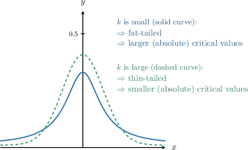
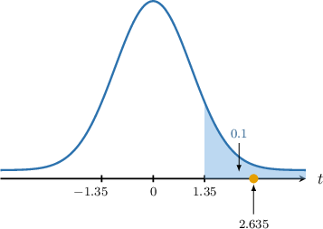
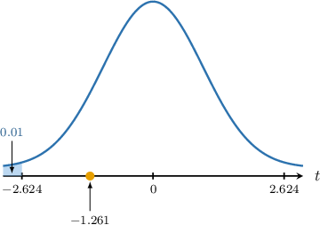
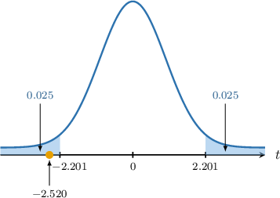
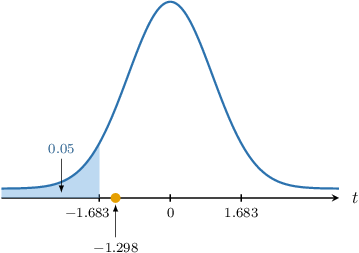

# Hypothesis Tests for Two Means: Unequal and Unknown Population Variances

Source: https://www.mathacademy.com/topics/4119?courseId=73
Topic ID: 4119

## Prerequisites

- [Hypothesis Tests for Two Means: Known Population Variances](./3310-hypothesis-tests-for-two-means-known-population-variances.md)
- [Hypothesis Tests for One Mean: Unknown Population Variance](./3311-hypothesis-tests-for-one-mean-unknown-population-variance.md)

## Lesson

### Introduction

In this lesson, we will learn how to conduct hypothesis tests for the difference between the means of two normal populations with *unknown* and *unequal* population variances.

Suppose we have two normal populations $X$ and $Y{:}$

$$

X \sim N(\mu_x, \sigma^2_x), \qquad Y \sim N(\mu_y, \sigma^2_y)

$$

where $\mu_x$ and $\mu_y$ are the population means, and $\sigma_x^2$ and $\sigma_y^2$ are the population variances.

In a previous lesson, we saw that the difference between the sample means is given by

$$

\overline{X} - \overline{Y} \sim N\left(\mu_x - \mu_y,\dfrac{\sigma_x^2}{n_x} + \dfrac{\sigma_y^2}{n_y} \right).

$$

where $\overline{X}$ and $\overline{Y}$ are the sample means, and $n_x$ and $n_y$ are the sample sizes. By $z$-scoring this result, we can express this as follows:

$$

\dfrac{\overline{X} - \overline{Y}- (\mu_x - \mu_y)}{\sqrt{\dfrac{\sigma_x^2}{n_x} + \dfrac{\sigma_y^2}{n_y}}} \sim N(0,1)

$$

In most practical situations, the population variances $\sigma_x^2$ and $\sigma_y^2$ are unknown and must be replaced with estimates $S_x^2$ and $S_y^2$. In this situation, the random variable

$$

\begin{aligned}𝑇 & =\frac{(\overset{𝑋}{}−\overset{𝑌}{})−(𝜇_{𝑥}−𝜇_{𝑦})}{\sqrt{√\frac{𝑆_{2𝑥}^{}}{𝑛_{𝑥}}+\frac{𝑆_{2𝑦}^{}}{𝑛_{𝑦}}}}\end{aligned}

$$

follows a $t$-distribution with $k$ degrees of freedom.

We can approximate the number of degrees of freedom $k$ in various ways.

- *Method 1:* We can approximate the degrees of freedom using the so-called **Welch-Satterthwaite approximation:** where the final result is rounded *down* to the nearest integer.

- *Method 2:* We can also approximate the degrees of freedom using the formula where $\min(a,b)$ denotes the **minimum** of $a$ and $b.$

In this lesson, we'll use the second method. You'll get practice applying the first method in separate lessons.

Please bear in mind that this method is simpler but also more conservative:

- Under Method 2, our estimate for the degrees of freedom will be *smaller* than Method 1.

- Thus, the tails of the resulting distribution will be fatter, leading to *larger* critical values for a given significance level $\alpha.$ Note that "larger critical values" here means larger in the absolute sense, i.e., whenever $k_1 < k_2$ for critical values $t_{k_1}$ and $t_{k_2}.$

- Therefore, the probability of a Type I error (i.e., rejecting $H_0$ when it is true) *decreases.*

Remember that as $k\to\infty,$ the $t$-distribution approaches $N(0,1).$ The standard normal curve has *extremely thin* tails!

### A Worked Example

Consider two samples of size $n_x = 14$ and $n_y = 18$ from independent normal populations $X$ and $Y$ with unequal population variances, where the unbiased estimates of $\mu_x$ and $\mu_y$ from these samples are $\overline{x}=47$ and $\overline{y}=40,$ and unbiased estimates of the population variances $\sigma_x^2$ and $\sigma_y^2$ are $s_x^2=7^2$ and $s_y^2=8^2.$

We wish to carry out a hypothesis test at the $10\%$ significance level to determine whether there is sufficient evidence that the population mean $\mu_x$ of $X$ is larger than the population mean $\mu_y$ of $Y.$

To solve a problem like this, we proceed as follows.

We are told that the populations are normally distributed, but we do not know the population variances $\sigma_x^2$ and $\sigma_y^2.$

In cases like this, the random variable

$$

\dfrac{\overline{X} - \overline{Y}- (\mu_x - \mu_y)}{\sqrt{\dfrac{S_x^2}{n_x} + \dfrac{S_y^2}{n_y}}}

$$

follows a student's $t$-distribution $T_k$ with $k$ degrees of freedom, where

- $\overline{X}$ and $\overline{Y}$ are the sample means,

- $\mu_x$ and $\mu_y$ are the population means,

- $n_x$ and $n_y$ are the sample sizes, and

- $S_x^2$ and $S_y^2$ are the sample variances.

In our example, the null and alternative hypotheses are the following:

- $H_0: \mu_x = \mu_y$ is the null hypothesis

- $H_1: \mu_x > \mu_y$ is the alternative (one-tailed) hypothesis

We can estimate the number of degrees of freedom $k$ as follows:

$$

\begin{aligned}𝑘 & =min(𝑛_{𝑥}−1,𝑛_{𝑦}−1) \\ & =min(14−1,18−1) \\ & =min(13,17) \\ & =13\end{aligned}

$$

Assuming the null hypothesis, i.e. $\mu_x - \mu_y = 0,$ we compute the test statistic:

$$

\begin{aligned}𝑡 & =\frac{\overset{𝑥}{}−\overset{𝑦}{–}−(𝜇_{𝑥}−𝜇_{𝑦})}{\sqrt{√\frac{𝑠_{2𝑥}^{}}{𝑛_{𝑥}}+\frac{𝑠_{2𝑦}^{}}{𝑛_{𝑦}}}} \\ & =\frac{47−40−(0)}{\sqrt{√\frac{7^{2}}{14}+\frac{8^{2}}{18}}} \\ & ≈2.635\end{aligned}

$$

Next, we determine the critical region corresponding to our significance level.

Given a random variable $T$ that has a student's $t$-distribution $T_k$ with $k$ degrees of freedom, the table below shows the $t$-scores $t_{k,p}$ such that $P(T > t_{k,p}) = p$ for some particular values of $k$ and $p.$

According to the table, the $10\%$ one-tailed critical value for $k = 13$ degrees of freedom is $t \approx 1.350.$ Since the alternative hypothesis is $\mu_x > \mu_y,$ we must consider the right tail. So, our critical region is

$$

T \geq \boxed{\color{blue}1.350}.

$$

Finally, notice that our test statistic $(2.635)$ lies in the critical region, as shown below.

So, we reject the null hypothesis $H_0.$ As a result, we conclude that there is $\boxed{\color{blue}\textrm{sufficient}}$ evidence that, at the $10\%$ level of significance, we have $\mu_x > \mu_y.$

### Example: Testing a Hypothesis Given Normal Populations: One-Tailed Tests

#### Question

Consider two samples of size $n_x = 15$ and $n_y = 16$ from independent normal populations $X$ and $Y$ with unequal population variances. You're given that unbiased estimates of $\mu_x$ and $\mu_y$ from these samples are $\overline{x}=30$ and $\overline{y}=31,$ and unbiased estimates of the population variances $\sigma_x^2$ and $\sigma_y^2$ are $s_x^2=1^2$ and $s_y^2=3^2.$

Conduct a hypothesis test at the $1\%$ significance level to determine whether there is sufficient evidence that the population mean $\mu_x$ of $X$ is smaller than the population mean $\mu_y$ of $Y.$

The table below shows the $t$-scores $t_{k,p}$ such that $P(T>t_{k,p})=p$ for some particular values of $k$ and $p,$ where $T$ follows a student's $t$-distribution with $k$ degrees of freedom.

#### Explanation

We are told that the populations are normally distributed, but we do not know the population variances $\sigma_x^2$ and $\sigma_y^2.$

In cases like this, the random variable

$$

\dfrac{\overline{X} - \overline{Y}- (\mu_x - \mu_y)}{\sqrt{\dfrac{S_x^2}{n_x} + \dfrac{S_y^2}{n_y}}}

$$

follows a student's $t$-distribution $T_k$ with $k$ degrees of freedom, where

- $\overline{X}$ and $\overline{Y}$ are the sample means,

- $\mu_x$ and $\mu_y$ are the population means,

- $n_x$ and $n_y$ are the sample sizes, and

- $S_x^2$ and $S_y^2$ are the sample variances.

In our example:

- $H_0: \mu_x = \mu_y$ is the null hypothesis

- $H_1: \mu_x < \mu_y$ is the alternative (one-tailed) hypothesis

We can estimate the number of degrees of freedom $k$ as follows:

$$

\begin{aligned}𝑘 & =min(15−1,16−1) \\ & =min(14,15) \\ & =14\end{aligned}

$$

Assuming the null hypothesis, i.e. $\mu_x - \mu_y = 0,$ we compute the test statistic:

$$

\begin{aligned}𝑡 & =\frac{\overset{𝑥}{}−\overset{𝑦}{–}−(𝜇_{𝑥}−𝜇_{𝑦})}{\sqrt{√\frac{𝑠_{2𝑥}^{}}{𝑛_{𝑥}}+\frac{𝑠_{2𝑦}^{}}{𝑛_{𝑦}}}} \\ & =\frac{30−31−(0)}{\sqrt{√\frac{1^{2}}{15}+\frac{3^{2}}{16}}} \\ & ≈−1.261\end{aligned}

$$

According to the table, the $1\%$ one-tailed critical value for $k = 14$ degrees of freedom is $t \approx 2.624.$

However, since the alternative hypothesis is $\mu_x < \mu_y,$ we must consider the left tail. We do this using the symmetry of the $t$-distribution. So, our critical region is

$$

T \leq \boxed{\color{blue}-2.624} .

$$

Our test statistic $(-1.261)$ does not lie in the critical region, as shown below.

**

### Example: Testing a Hypothesis Given Normal Populations: Two-Tailed Tests

#### Question

Consider two samples of size $n_x = 15$ and $n_y = 12$ from independent normal populations $X$ and $Y$ with unequal population variances. You're given that unbiased estimates of $\mu_x$ and $\mu_y$ from these samples are $\overline{x}=8$ and $\overline{y}=9,$ and unbiased estimates of the population variances $\sigma_x^2$ and $\sigma_y^2$ are $s_x^2=0.75^2$ and $s_y^2=1.2^2.$

Carry out a hypothesis test at the $5\%$ significance level to determine whether there is sufficient evidence that the population mean $\mu_x$ of $X$ does not equal the population mean $\mu_y$ of $Y.$

The table below shows the $t$-scores $t_{k,p}$ such that $P(T>t_{k,p})=p$ for some particular values of $k$ and $p,$ where $T$ follows a student's $t$-distribution with $k$ degrees of freedom.

#### Explanation

We are told that the populations are normally distributed, but we do not know the population variances $\sigma_x^2$ and $\sigma_y^2.$

In cases like this, the random variable

$$

\dfrac{\overline{X} - \overline{Y}- (\mu_x - \mu_y)}{\sqrt{\dfrac{S_x^2}{n_x} + \dfrac{S_y^2}{n_y}}}

$$

follows a student's $t$-distribution $T_k$ with $k$ degrees of freedom, where

- $\overline{X}$ and $\overline{Y}$ are the sample means,

- $\mu_x$ and $\mu_y$ are the population means,

- $n_x$ and $n_y$ are the sample sizes, and

- $S_x^2$ and $S_y^2$ are the sample variances.

In our example:

- $H_0: \mu_x = \mu_y$ is the null hypothesis

- $H_1: \mu_x \neq \mu_y$ is the alternative (two-tailed) hypothesis

We can estimate the number of degrees of freedom $k$ as follows:

$$

\begin{aligned}𝑘 & =min(𝑛_{𝑥}−1,𝑛_{𝑦}−1) \\ & =min(15−1,12−1) \\ & =min(14,11) \\ & =11\end{aligned}

$$

Assuming the null hypothesis, i.e. $\mu_x - \mu_y = 0,$ we compute the test statistic:

$$

\begin{aligned}𝑡 & =\frac{\overset{𝑥}{}−\overset{𝑦}{–}−(𝜇_{𝑥}−𝜇_{𝑦})}{\sqrt{√\frac{𝑠_{2𝑥}^{}}{𝑛_{𝑥}}+\frac{𝑠_{2𝑦}^{}}{𝑛_{𝑦}}}} \\ & =\frac{8−9−(0)}{\sqrt{√\frac{0.75^{2}}{15}+\frac{1.2^{2}}{12}}} \\ & ≈−2.520\end{aligned}

$$

According to the table, the $5\%$ ** critical value (the same as the $5\% \div 2 = 2.5\%$ ** critical value) for $k = 11$ degrees of freedom is $t \approx 2.101.$

Our test statistic $(-2.520)$ lies in the critical region, as shown below.

**

### Large Samples

Up to now, we've assumed that the underlying population is normally distributed. However, if we have a *sufficiently large* sample, then the random variable

$$

\dfrac{\overline{X} - \overline{Y}- (\mu_x - \mu_y)}{\sqrt{\dfrac{S_x^2}{n_x} + \dfrac{S_y^2}{n_y}}}

$$

can be approximated by the student's $t$-distribution $T_k$ with $k$ degrees of freedom.

Typically, "sufficiently large" means that $n \geq 30.$

So, even though we might not know the underlying distribution, we can still use the same formula for the test statistic.

### Example: Testing a Hypothesis Given Large Samples

#### Question

Consider two samples of size $n_x = 42$ and $n_y = 47$ from independent populations $X$ and $Y$ with unequal population variances. You're given that unbiased estimates of $\mu_x$ and $\mu_y$ from these samples are $\overline{x}=2.1$ and $\overline{y}=3.8,$ and unbiased estimates of the population variances $\sigma_x^2$ and $\sigma_y^2$ are $s_x^2=8^2$ and $s_y^2=3^2.$

Carry out a hypothesis test at the $5\%$ significance level to determine whether there is sufficient evidence that the population mean $\mu_x$ of $X$ is smaller than the population mean $\mu_y$ of $Y.$

The table below shows the $t$-scores $t_{k,p}$ such that $P(T>t_{k,p})=p$ for some particular values of $k$ and $p,$ where $T$ follows a student's $t$-distribution with $k$ degrees of freedom.

#### Explanation

We do not know the distribution of the population, nor do we know the population variances $\sigma_x^2$ and $\sigma_y^2.$ However, the sample sizes $n_x = 42 \geq 30$ and $n_y = 47 \geq 30$ are ** Therefore, we can apply the central limit theorem.

In cases like this, the random variable

$$

\dfrac{\overline{X} - \overline{Y}- (\mu_x - \mu_y)}{\sqrt{\dfrac{S_x^2}{n_x} + \dfrac{S_y^2}{n_y}}}

$$

can be approximated using a student's $t$-distribution $T_k$ with $k$ degrees of freedom, where

- $\overline{X}$ and $\overline{Y}$ are the sample means,

- $\mu_x$ and $\mu_y$ are the population means,

- $n_x$ and $n_y$ are the sample sizes, and

- $S_x^2$ and $S_y^2$ are the sample variances.

In our example:

- $H_0: \mu_x = \mu_y$ is the null hypothesis

- $H_1: \mu_x < \mu_y$ is the alternative (one-tailed) hypothesis

We can estimate the number of degrees of freedom $k$ as follows:

$$

\begin{aligned}𝑘 & =min(𝑛_{𝑥}−1,𝑛_{𝑦}−1) \\ & =min(42−1,47−1) \\ & =min(41,46) \\ & =41\end{aligned}

$$

Assuming the null hypothesis, i.e. $\mu_x - \mu_y = 0,$ we compute the test statistic:

$$

\begin{aligned}𝑡 & =\frac{\overset{𝑥}{}−\overset{𝑦}{–}−(𝜇_{𝑥}−𝜇_{𝑦})}{\sqrt{√\frac{𝑠_{2𝑥}^{}}{𝑛_{𝑥}}+\frac{𝑠_{2𝑦}^{}}{𝑛_{𝑦}}}} \\ & =\frac{2.1−3.8−(0)}{\sqrt{√\frac{8^{2}}{42}+\frac{3^{2}}{47}}} \\ & ≈−1.298\end{aligned}

$$

According to the table, the $5\%$ one-tailed critical value for $k = 41$ degrees of freedom is $t \approx 1.683.$

However, since the alternative hypothesis is $\mu_x < \mu_y,$ we must consider the left tail. We do this using the symmetry of the normal distribution. So, our critical region is

$$

T \leq \boxed{\color{blue}-1.683}.

$$

Our test statistic $(-1.298)$ lies outside the critical region, as shown below.

**
