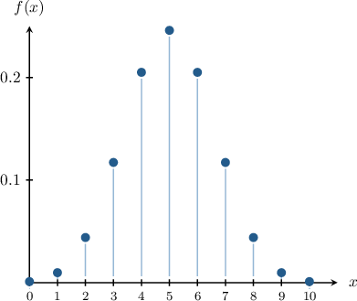
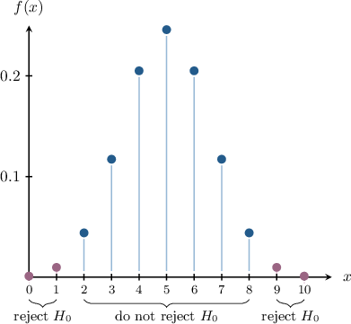

# Two-Tailed Hypothesis Tests

Source: https://www.mathacademy.com/topics/4120?courseId=73
Topic ID: 4120

## Prerequisites

- [Critical Regions for Right-Tailed Hypothesis Tests](./4948-critical-regions-for-right-tailed-hypothesis-tests.md)

## Lesson

### Introduction

In this lesson, we will discuss **two-tailed** hypothesis tests.

Suppose we have a coin that we suspect is unfair. We wish to conduct a hypothesis test at the $5\%$ level of significance to determine whether or not our suspicions are correct.

Let's go through the usual process of setting up our hypothesis test:

- First, we define $p$ as "the probability that the coin lands on heads when tossed randomly."

- Second, we form a null hypothesis. The null hypothesis states that the coin is *fair*, which we write as follows:

- Third, we form an alternative hypothesis. The alternative hypothesis states that the coin is *unfair*, which we write as follows: Notice the use of the "not equal to" symbol. This is different from the one-tailed cases we've seen before. Here, we're not specifying whether the coin is biased toward heads or tails. Instead, we include the possibility that it is biased toward *either* heads *or* tails.

In a two-tailed test, the alternative hypothesis always involves a "not equal to" symbol.

- Fourth, we must specify a test statistic. In this case, a suitable test statistic could be as follows: $\qquad$ $X=$ "the number of times the coin lands on heads after $10$ random tosses."

Let's get some practice at identifying valid two-tailed hypothesis tests.

### Example: Identifying Two-Tailed Alternative Hypotheses

#### Question

Let $\mu$ represent the average IQ among a particular population. Given the null hypothesis $H_0: \mu = 105,$ which of the following are valid **** alternative hypotheses?

1. $H_1: \mu < 105$

2. $H_1: \mu > 105$

3. $H_1: \mu \neq 105$

#### Explanation

The alternative hypothesis $H_1$ is what we conclude about the population parameter if our null hypothesis is shown to be wrong.

In particular, a two-tailed alternative hypothesis states that the population parameter is ** the value given by the null hypothesis.

Here, the null hypothesis is $H_0: \mu = 105.$ If this hypothesis is shown to be wrong, then there is one valid two-tailed alternative hypothesis:

$$

H_1: \mu \neq 105

$$

Therefore the correct answer is "III only."

### Conducting a Two-Tailed Hypothesis Test

Let's return to our first example, where we wish to conduct a hypothesis test to determine whether a particular coin is unfair.

Recall the following:

- We defined $p$ as "the probability that the coin lands on heads when tossed randomly."

- Since we want to check whether the coin is unfair, we have the following null and alternative hypotheses:

- The significance level is $\alpha = 5\%.$

Under the conditions specified in the null hypothesis, the random variable $X$ is a binomial random variable given by

$$

X\sim B\left(10,\dfrac12\right).

$$

The probability mass function of $X$ under the null hypothesis is shown below.

Note the following:

- When we select a significance level $\alpha$ in a two-tailed test, the convention is to allow $\dfrac{\alpha}{2}$ at either tail.

- So if $\alpha = 5\%,$ we have $\dfrac{\alpha}{2} = 2.5\%$ at either tail.

Now, suppose we conduct our experiment and get $2$ heads out of $10$ tosses.

If the result $X=2$ is statistically significant, it will lie in the critical region in the *left* tail of the probability distribution of $f(x).$

We can compute the probability of getting $X\leq 2$ heads under the null hypothesis using our knowledge of the binomial distribution:

$$

\begin{aligned}𝑃(𝑋≤2) & =𝑃(𝑋=0)+𝑃(𝑋=1)+𝑃(𝑋=2) \\ & =(\frac{10}{0})(\frac{1}{2})^{0}(\frac{1}{2})^{10−0}+(\frac{10}{1})(\frac{1}{2})^{1}(\frac{1}{2})^{10−1}+(\frac{10}{2})(\frac{1}{2})^{2}(\frac{1}{2})^{10−2} \\ & =1⋅(\frac{1}{2})^{10}+10⋅(\frac{1}{2})^{10}+45⋅(\frac{1}{2})^{10} \\ & =56⋅(\frac{1}{2})^{10} \\ & =0.055 \\ & =5.5\%.\end{aligned}

$$

This probability is *larger than* $\dfrac\alpha2 = 2.5\%.$ This means that our result is *not* statistically significant. In other words, it is "likely enough" that this event could have occurred if the null hypothesis is true.

Therefore, we should *not* reject the null hypothesis. Consequently, we conclude that the coin is fair.

### Critical Regions and Critical Values for Two-Tailed Tests

Recall that the **critical region** contains all $x$-values that are *collectively* unlikely under the null hypothesis and therefore cause the null hypothesis to be rejected.

For two-tailed tests, the critical region typically consists of *two* disjoint sets. Consequently, there are, typically, *two* critical values.

The critical region for the hypothesis test we just carried out is shown below.

As we saw, $X=2$ does not lie in the critical region. Let's consider the possible value of $X$ that *do* lie in the critical region:

- For the left tail, it's easy to show that the values $X=0$ and $X=1$ lie in the critical region, but $X=2$ does not.

- For the right tail, $X=10$ and $X=9$ lie in the critical region, but $X=8$ does not.

Therefore:

- The critical region for this hypothesis test is

- The critical values are $X=1$ and $X=9.$

### Example: Identifying Critical Regions

#### Question

A restaurant has changed some of its recipes and thinks this could change the number of customers. With the old recipes, an average of $7$ customers per hour visited the restaurant. Let $X$ represent the number of customers that arrive at the restaurant during a randomly selected one-hour period. Under the null hypothesis that the number of customers is the same as before, what is the critical region of a two-tailed test at a significance level of $5\%?$

**

#### Explanation

Let $\lambda$ be the average number of customers visiting the restaurant per hour. Then, we have the following null and alternative hypotheses:

$$

\begin{aligned}𝐻_{0}:𝜆 & =7 \\ 𝐻_{1}:𝜆 & ≠7\end{aligned}

$$

The critical region is the set of values of $X$ for which we reject the null hypothesis.

This is a two-sided test. So, to reject the null hypothesis, we need to observe an abnormally large or abnormally small value of $X.$

To reject the null hypothesis at a significance level of $5\%,$ we must observe a value $x$ such that $P(X \leq x) = 0.025$ or $P(X \geq x) = 0.025$ under the null hypothesis.

Using the table, we have the following probabilities:

- For the left tail:

- For the right tail:

So, the values of $X$ that would cause the null hypothesis to be rejected at a significance level of $5\%$ are the values such that $X \leq 1$ and $X \geq 14.$

Therefore, the critical region is $X\leq 1$ or $X\geq 14.$

### Example: Identifying Critical Values

#### Question

Mary owns a pastry shop and decides to use a new muffin recipe. With the previous recipe, $55\%$ of the customers bought at least one muffin. Let $X$ represent the number of customers that buy at least one muffin made with the new recipe in a random sample of $6$ customers. Under the null hypothesis that the proportion of customers that buy a muffin with the new recipe is the same as before, what are the critical values of a two-tailed test at a significance level of $10\%?$

**

#### Explanation

Let $p$ be the probability that a randomly selected customer buys at least one muffin. Then, we have the following null and alternative hypotheses:

$$

\begin{aligned}𝐻_{0}:𝑝 & =55\% \\ 𝐻_{1}:𝑝 & ≠55\%\end{aligned}

$$

The critical region is the set of values of $X$ for which we reject the null hypothesis. A critical value is the boundary point of the critical region, and it is included in the region.

This is a two-sided test. So, to reject the null hypothesis, we need to observe an abnormally large or abnormally small value of $X.$

To reject the null hypothesis at a significance level of $10\%,$ we must observe a value $x$ such that $P(X \leq x) = 0.05$ or $P(X \geq x) = 0.05$ under the null hypothesis.

Using the table, we have the following probabilities:

- For the left tail:

- For the right tail:

$$

\begin{aligned}𝑃(𝑋≥6) & =1−𝑃(𝑋≤5) \\ & =1−0.9723 \\ & =0.0277 \\ & <0.05\,✓ \\ 𝑃(𝑋≥5) & =1−𝑃(𝑋≤4) \\ & =1−0.8364 \\ & =0.1636 \\ & ≮0.05\,×\end{aligned}

$$

So, the values of $X$ that would cause the null hypothesis to be rejected at a significance level of $10\%$ are the values such that $X\leq 0$ and $X\geq 6.$

Therefore, the critical values are $0$ and $6.$
