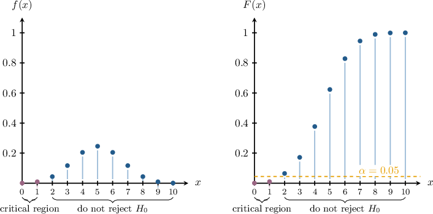

# Critical Regions for Left-Tailed Hypothesis Tests

Source: https://www.mathacademy.com/topics/4131?courseId=73
Topic ID: 4131

## Prerequisites

- [Hypothesis Tests for the Rate of a Poisson Distribution](./4126-hypothesis-tests-for-the-rate-of-a-poisson-distribution.md)

## Lesson

### Introduction

Suppose we have a coin that we suspect is biased *against* landing on heads (i.e., the coin is *less* likely to land on heads than tails). We wish to design a hypothesis test at the significance level to determine whether or not our suspicions are correct with the following null and alternative hypotheses:

Let the test statistic equal the number of heads we get when the coin is tossed at random times in a row. Under the null hypothesis, our test statistic can be modeled as the following binomial random variable:

The probability mass function and corresponding cumulative distribution function of are shown below.

The **critical region** is a set containing all possible -values that are collectively unlikely under the null hypothesis and, therefore, cause the null hypothesis to be rejected. For *left-tailed* hypothesis tests like this, the critical regions lie to the *left* of the corresponding probability distribution.

Notice that getting either or heads out of coin tosses causes us to reject the null hypothesis, because

However,

so does not lie in the critical region.

Therefore, the critical region for this hypothesis test at the significance level is

We can also write this as

The value is called the **critical value**. The critical value lies on the boundary between the critical region and the region where we do not reject

### Example: Identifying Critical Regions Using CDFs

#### Question

On average, $7$ patients per week are admitted to a hospital's emergency room due to traffic incidents. The local authorities decided to install several new warning signs to alert drivers of upcoming dangers.

Let $X$ represent the number of patients admitted to the emergency department due to traffic incidents during a particular week after the new signs were installed. Under the null hypothesis that the number of patients is the same as before, what is the critical region of a one-tailed test at a significance level of $10\%?$

**

#### Explanation

Let $\lambda$ be the average number of patients per week. Then, we have the following null and alternative hypotheses:

$$

\begin{aligned}𝐻_{0}:𝜆 & =7 \\ 𝐻_{1}:𝜆 & <7\end{aligned}

$$

The critical region is the set of values of $X$ for which we reject the null hypothesis.

This is a one-sided test where the local authorities wish to conclude that the number of patients in a hospital's emergency room has decreased. This would correspond to observing an abnormally small value of $X.$

To reject the null hypothesis at a significance level of $10\%,$ we must observe a value $x$ such that $P(X \leq x) = 0.1$ under the null hypothesis.

Using the table, we have the following probabilities:

$$

\begin{aligned}𝑃(𝑋≤0) & =0.0009<0.1\,✓ \\ 𝑃(𝑋≤1) & =0.0073<0.1\,✓ \\ 𝑃(𝑋≤2) & =0.0296<0.1\,✓ \\ 𝑃(𝑋≤3) & =0.0818<0.1\,✓ \\ 𝑃(𝑋≤4) & =0.1730≮0.1\,×\end{aligned}

$$

So, the values of $X$ that would cause the null hypothesis to be rejected at a significance level of $10\%$ are $0,1,2,$ and $3.$

Therefore, the critical region is $X\leq 3.$

### Example: Identifying Critical Regions Using PMFs

#### Question

An engineer knows from experience that the proportion of defective items produced by a particular machine is $1.5\%.$ The machine is replaced with a new model, and the engineer thinks the proportion of defective items has decreased. Let $X$ be the number of defective items in a box of $500$ produced by the new machine. Under the null hypothesis that the proportion of defective items has not changed, what is the critical region of a one-tailed test at a significance level of $5\%?$

**

#### Explanation

Let $p$ be the probability that a randomly selected item is defective. Then, we have the following null and alternative hypotheses:

$$

\begin{aligned}𝐻_{0}:𝑝 & =0.015 \\ 𝐻_{1}:𝑝 & <0.015\end{aligned}

$$

The critical region is the set of values of $X$ for which we reject the null hypothesis.

This is a one-sided test where the engineer wishes to conclude that the proportion of defective items has decreased. This would correspond to observing an abnormally small value of $X.$

To reject the null hypothesis at a significance level of $5\%,$ we must observe a value $x$ such that $P(X \leq x) = 0.05$ under the null hypothesis.

Using the table, we have the following probabilities:

$$

\begin{aligned}𝑃(𝑋≤0) & =𝑃(𝑋=0) \\ & =0.0005 \\ & <0.05\,✓ \\ 𝑃(𝑋≤1) & =𝑃(𝑋=0)+𝑃(𝑋=1) \\ & =0.0005+0.0040 \\ & =0.0045 \\ & <0.05\,✓ \\ 𝑃(𝑋≤2) & =𝑃(𝑋=0)+𝑃(𝑋=1)+𝑃(𝑋=2) \\ & =0.0005+0.0040+0.0151 \\ & =0.0196 \\ & <0.05\,✓ \\ 𝑃(𝑋≤3) & =𝑃(𝑋=0)+𝑃(𝑋=1)+𝑃(𝑋=2)+𝑃(𝑋=3) \\ & =0.0005+0.0040+0.0151+0.0382 \\ & =0.0578 \\ & ≮0.05\,×\end{aligned}

$$

So, the values of $X$ that would cause the null hypothesis to be rejected at a significance level of $5\%$ are $0,1,$ and $2.$

Therefore, the critical region is $X\leq 2.$

### Example: Identifying Critical Values

#### Question

A gym owner suspects that the average number of customers per hour has decreased since the opening of a competing gym. Before the competing gym opened, $9$ customers per hour visited the gym. Let $X$ represent the number of customers arriving at the gym in a randomly selected one-hour period. Under the null hypothesis that the average number of customers is the same as before, what is the critical value of a one-tailed test at a significance level of $1\%?$

**

#### Explanation

Let $\lambda$ be the average number of customers per hour. Then, we have the following null and alternative hypotheses:

$$

\begin{aligned}𝐻_{0}:𝜆 & =9 \\ 𝐻_{1}:𝜆 & <9\end{aligned}

$$

The critical region is the set of values of $X$ for which we reject the null hypothesis. A critical value lies on the boundary of the critical region.

This is a one-sided test where the owner suspects that the number of customers per hour has decreased. This would correspond to observing an abnormally small value of $X.$

To reject the null hypothesis at a significance level of $1\%,$ we must observe a value $x$ such that $P(X \leq x) = 0.01$ under the null hypothesis.

$$

\begin{aligned}𝑃(𝑋≤0) & =0.0001<0.01\,✓ \\ 𝑃(𝑋≤1) & =0.0012<0.01\,✓ \\ 𝑃(𝑋≤2) & =0.0062<0.01\,✓ \\ 𝑃(𝑋≤3) & =0.0212≮0.01\,×\end{aligned}

$$

So, the values of $X$ that would cause the null hypothesis to be rejected at a significance level of $1\%$ are the values such that $X \leq 2.$ Therefore, the critical value is $X=2.$
