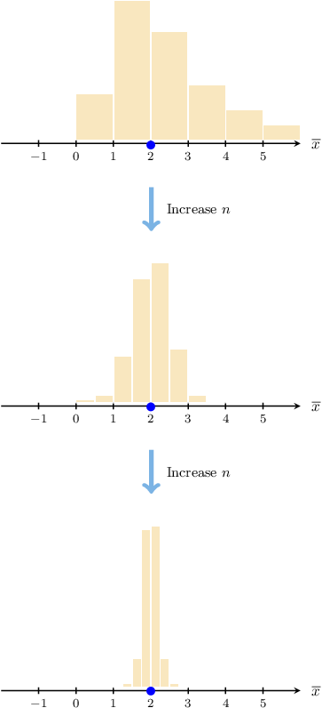

# The Method of Moments

Source: https://www.mathacademy.com/topics/4945?courseId=73
Topic ID: 4945

## Prerequisites

- [Convergent and Divergent Infinite Series](../../../ap-courses/lessons/ap-calculus-bc/982-convergent-and-divergent-infinite-series.md)
- [Mean and Variance of the Poisson Distribution](./2991-mean-and-variance-of-the-poisson-distribution.md)
- [Mean and Variance of the Geometric Distribution](./2992-mean-and-variance-of-the-geometric-distribution.md)
- [Variance of Sample Means](./3013-variance-of-sample-means.md)
- [Mean and Variance of the Exponential Distribution](./3275-mean-and-variance-of-the-exponential-distribution.md)
- [Mean and Variance of the Bernoulli Distribution](./3280-mean-and-variance-of-the-bernoulli-distribution.md)

## Lesson

### Introduction

Suppose we have an I.I.D. random sample of size $n{:}$

$$

X_1,\quad X_2,\quad \ldots, \quad X_n

$$

Since our sample elements are random variables, we can calculate the **theoretical moments** (or raw moments) of the sample elements as follows:

- The first theoretical moment, denoted $\mu_1,$ is defined as where $S$ denotes the support of $X_i.$

- The second theoretical moment $\mu_2$ is

- The third theoretical moment $\mu_3$ is

Generally, the $k$th theoretical moment, denoted $\mu_k,$ is defined as

$$

\mu_k = \textrm{E}[X_i^k] = \sum_{x\in S} x^k \cdot p(x).

$$

The $\boldsymbol k$**th sample moment** is an unbiased estimator of the $k$th theoretical moment. It is defined as

$$

M_k = \dfrac1n \sum_{i=1}^n X_i^k.

$$

In particular, the first and second sample moments are

$$

M_1 = \dfrac1n \sum_{i=1}^n X_i \,, \qquad M_2 = \dfrac1n \sum_{i=1}^n X_i^2.

$$

We will justify why $M_k$ is an unbiased estimate of $\mu_k$ at the end of the lesson.

For example, suppose we have the following random sample of size $n=5{:}$

$$

1, \quad 2, \quad 2, \quad 5, \quad 5

$$

We can compute the first and second sample moments as follows:

$$

\begin{aligned}𝑚_{1} & =\frac{1}{5}(1+2+2+5+5)=3 \\ 𝑚_{2} & =\frac{1}{5}(1^{2}+2^{2}+2^{2}+5^{2}+5^{2})=11.8\end{aligned}

$$

### The Method of Moments

The **method of moments** is a technique for estimating population parameters from sample data.

To find the **method of moments estimator** for some population parameters, we equate the corresponding theoretical and sample moments and solve the resulting equations for the unknown parameters.

$$

\textrm{E}[X_i] = M_1, \qquad \textrm{E}[X_i^2] = M_2, \qquad \textrm{E}[X_i^3] = M_3, \qquad \ldots

$$

In this lesson, we'll find method of moments estimates for single-parameter probability distributions. In future lessons, we'll see that this technique can also be used for multi-parameter distributions.

Suppose $X_1,X_2,\ldots,X_{16}$ is an I.I.D random sample with $X_i\sim \text{Bernoulli}(\theta)$ and unknown probability of success $\theta.$ For a particular sample $x_1, x_2, \ldots, x_{16},$ suppose we know that

$$

\displaystyle\sum_{i=1}^{16} x_i = 12.

$$

We wish to find the method of moments estimate for $\theta,$ which we'll denote as $\widehat{\theta}_{MM}.$

Recall that the $k$th sample moment $M_k$ of a sample $X_1, X_2, \ldots, X_n$ is given by

$$

M_k = \dfrac1n \sum_{i=1}^n X_i^k.

$$

In particular, the first sample moment is

$$

M_1 = \dfrac1n \sum_{i=1}^n X_i .

$$

We are given the sum of the sample elements. So, we can calculate the first sample moment as follows:

$$

m_1 = \dfrac{1}{n} \sum_{i=1}^{n} x_i = \dfrac{12}{16} = \dfrac{3}{4}

$$

The sample elements $X_i$ follow a Bernoulli distribution with probability of success $\theta.$ Therefore, the theoretical first moment is

$$

\mathrm{E}[X_i] = \theta.

$$

Finally, equating the first sample and theoretical moments, using the estimator $\widehat\theta_{MM}$ in place of $\theta,$ we get the following estimate for $\theta{:}$

$$

\widehat{\theta}_{MM} = \boxed{\color{blue}\dfrac 34}

$$

Let's now look at an example where we form a method of moments estimate using the second sample moment.

### Example: Finding MM Estimators for Bernoulli Random Variables

#### Question

Suppose $X_1,X_2,\ldots,X_{15}$ is an I.I.D. random sample with $X_i\sim \text{Bernoulli}(\theta)$ and unknown probability of success $\theta.$ For a particular sample $x_1, x_2, \ldots, x_{15},$ you're given that

$$

\displaystyle\sum_{i=1}^{15} x_i^2 = 9.

$$

Find the method of moments estimate $\widehat{\theta}_{MM}$ for $\theta.$

#### Explanation

Recall that the $k$th sample moment $M_k$ of a sample $X_1, X_2, \ldots, X_n$ is given by

$$

M_k = \dfrac1n \sum_{i=1}^n X_i^k.

$$

In particular, the first and second sample moments are given by

$$

M_1 = \dfrac1n \sum_{i=1}^n X_i \,, \qquad M_2 = \dfrac1n \sum_{i=1}^n X_i^2.

$$

To find the method of moments estimate for a parameter, we calculate a sample moment and the corresponding theoretical moment and equate them.

We are given the sum of the squared values in the sample. So, we can calculate the second sample moment:

$$

m_2 = \dfrac{1}{n} \sum_{i=1}^{n} x_i^2 = \dfrac{9}{15}=\dfrac{3}{5}

$$

The variables $X_i$ follow a Bernoulli distribution. Therefore,

$$

\textrm{E}[X_i] = \theta, \qquad \textrm{Var}[X_i] = \theta(1-\theta).

$$

We also have

$$

\textrm{Var}[X_i] = \textrm{E}[X^2_i] - \left(\textrm{E}[X_i]\right)^2.

$$

Therefore, we can calculate the second theoretical moment as follows:

$$

\begin{aligned}E[𝑋_{2𝑖}^{}] & =Var[𝑋_{𝑖}]+(E[𝑋_{𝑖}])^{2} \\ & =𝜃(1−𝜃)+𝜃^{2} \\ & =𝜃−𝜃^{2}+𝜃^{2} \\ & =𝜃\end{aligned}

$$

Finally, equating the sample and theoretical first moments, using the estimator $\widehat\theta_{MM}$ in place of $\theta,$ we get the following estimate for $\theta{:}$

$$

\widehat{\theta}_{MM} = \boxed{\color{blue}\dfrac{3}{5}}

$$

### Example: Finding MM Estimators for Poisson Random Variables

#### Question

Suppose $X_1,X_2,\ldots,X_{12}$ is an I.I.D. random sample with $X_i\sim \textrm{Po}(\theta)$ and unknown rate parameter $\theta.$ For a particular sample $x_1, x_2, \ldots, x_{12},$ you're given that

$$

\displaystyle\sum_{i=1}^{12} x_i^2 = 360.

$$

Calculate the method of moments estimate for $\theta.$

#### Explanation

Recall that the $k$th sample moment $M_k$ of a sample $X_1, X_2, \ldots, X_n$ is given by

$$

M_k = \dfrac1n \sum_{i=1}^n X_i^k.

$$

In particular, the first and second sample moments are given by

$$

M_1 = \dfrac1n \sum_{i=1}^n X_i \,, \qquad M_2 = \dfrac1n \sum_{i=1}^n X_i^2.

$$

To find the method of moments estimate for a parameter, we calculate a sample moment and the corresponding theoretical moment and equate them.

We are given the sum of the squared values in the sample. So, we can calculate the second sample moment:

$$

m_2 = \dfrac{1}{n} \sum_{i=1}^{n} x_i^2 = \dfrac{360}{12}=30

$$

The variables $X_i$ follow a Poisson distribution. Therefore,

$$

\textrm{E}[X_i] = \theta, \qquad \textrm{Var}[X_i] = \theta.

$$

We also have

$$

\textrm{Var}[X_i] = \textrm{E}[X^2_i] - \left(\textrm{E}[X_i]\right)^2.

$$

Therefore, we can calculate the second theoretical moment as follows:

$$

\begin{aligned}E[𝑋_{2𝑖}^{}] & =Var[𝑋_{𝑖}]+(E[𝑋_{𝑖}])^{2} \\ & =𝜃+𝜃^{2}\end{aligned}

$$

Equating the sample and theoretical second moments, using the estimator $\widehat\theta_{MM}$ in place of $\theta,$ we get

$$

\widehat{\theta}_{MM}^2 + \widehat{\theta}_{MM} = 30.

$$

Then, we solve for $\widehat{\theta}_{MM}{:}$

$$

\begin{aligned}\overset{𝜃}{ˆ}_{2𝑀𝑀}^{}+\overset{𝜃}{ˆ}_{𝑀𝑀} & =30 \\ \overset{𝜃}{ˆ}_{2𝑀𝑀}^{}+\overset{𝜃}{ˆ}_{𝑀𝑀}−30 & =0 \\ (\overset{𝜃}{ˆ}_{𝑀𝑀}+6)(\overset{𝜃}{ˆ}_{𝑀𝑀}−5) & =0\end{aligned}

$$

This gives the solutions

$$

\widehat{\theta}_{MM} = -6, \qquad \widehat{\theta}_{MM} = 5.

$$

However, we discard the negative solution since $\theta > 0.$ Therefore, our method of moments estimate for $\theta$ is

$$

\widehat{\theta}_{MM} = \boxed{\color{blue}5}.

$$

### Example: Finding MM Estimators for Geometric Random Variables

#### Question

Suppose $X_1,X_2,\ldots,X_{15}$ is an I.I.D. random sample with $X_i\sim \text{Geom}(\theta)$ and unknown probability of success $\theta.$ For a particular sample $x_1, x_2, \ldots, x_{15},$ you're given that

$$

\displaystyle\sum_{i=1}^{15} x_i^2 = 30.

$$

Find the method of moments estimate $\widehat{\theta}_{MM}$ for $\theta.$ Round your final answer to three decimal places.

#### Explanation

Recall that the $k$th sample moment $M_k$ of a sample $X_1, X_2, \ldots, X_n$ is given by

$$

M_k = \dfrac1n \sum_{i=1}^n X_i^k.

$$

In particular, the first and second sample moments are given by

$$

M_1 = \dfrac1n \sum_{i=1}^n X_i \,, \qquad M_2 = \dfrac1n \sum_{i=1}^n X_i^2.

$$

To find the method of moments estimate for a parameter, we calculate a sample moment and the corresponding theoretical moment and equate them.

We are given the sum of the squared values in the sample. So, we can calculate the second sample moment:

$$

m_2 = \dfrac{1}{n} \sum_{i=1}^{n} x_i^2 = \dfrac{30}{15} =2

$$

We are given that the variables $X_i$ follow a Geometric distribution. Therefore,

$$

\textrm{E}[X_i] = \dfrac{1}{\theta}, \qquad \textrm{Var}[X_i] = \dfrac{1-\theta}{\theta^2}.

$$

We also have

$$

\textrm{Var}[X_i] = \textrm{E}[X^2_i] - \left(\textrm{E}[X_i]\right)^2.

$$

Therefore, we can calculate the second theoretical moment as follows:

$$

\begin{aligned}E[𝑋_{2𝑖}^{}] & =Var[𝑋_{𝑖}]+(E[𝑋_{𝑖}])^{2} \\ & =\frac{1−𝜃}{𝜃^{2}}+\frac{1}{𝜃^{2}} \\ & =\frac{2−𝜃}{𝜃^{2}}\end{aligned}

$$

Equating the sample and theoretical second moments, using the estimator $\widehat\theta_{MM}$ in place of $\theta,$ we get

$$

\dfrac{2-\widehat{\theta}_{MM}}{\widehat{\theta}_{MM}^2} = 2.

$$

Then, we solve for $\widehat{\theta}_{MM}{:}$

$$

\begin{aligned}\frac{2−\overset{𝜃}{ˆ}_{𝑀𝑀}}{\overset{𝜃}{ˆ}_{2𝑀𝑀}^{}} & =2 \\ 2−\overset{𝜃}{ˆ}_{𝑀𝑀} & =2\overset{𝜃}{ˆ}_{2𝑀𝑀}^{} \\ 2\overset{𝜃}{ˆ}_{2𝑀𝑀}^{}+\overset{𝜃}{ˆ}_{𝑀𝑀}−2 & =0 \\ \overset{𝜃}{ˆ}_{𝑀𝑀} & =\frac{−1±\sqrt{√1^{2}−4(2)(−2)}}{2⋅2}\end{aligned}

$$

This gives the solutions

$$

\widehat{\theta}_{MM} \approx 0.781, \qquad \widehat{\theta}_{MM} \approx -1.281.

$$

However, we discard the negative solution since $\theta > 0.$ Therefore, our method of moments estimate for $\theta$ is

$$

\widehat{\theta}_{MM} = \boxed{\color{blue}0.781}.

$$

### Example: Finding MM Estimators for Exponential Random Variables

#### Question

Suppose $X_1, X_2, \ldots, X_{7}$ is an I.I.D. random sample with $X_i \sim \text{Exp}(\theta),$ where $\theta$ is an unknown parameter. For a particular sample $x_1, x_2, \ldots, x_{7},$ you're given that

$$

\displaystyle\sum_{i=1}^{7} x_i = \dfrac{7}{8}.

$$

Find the method of moments estimate $\widehat{\theta}_{MM}$ for $\theta.$

#### Explanation

Recall that the $k$th sample moment $M_k$ of a sample $X_1, X_2, \ldots, X_n$ is given by

$$

M_k = \dfrac1n \sum_{i=1}^n X_i^k.

$$

In particular, the first and second sample moments are given by

$$

M_1 = \dfrac1n \sum_{i=1}^n X_i \,, \qquad M_2 = \dfrac1n \sum_{i=1}^n X_i^2.

$$

To find the method of moments estimate for a parameter, we calculate a sample moment and the corresponding theoretical moment and equate them.

We are given the sum of the values in the sample. So, we can calculate the first sample moment:

$$

m_1 = \dfrac{1}{n} \sum_{i=1}^{n} x_i = \dfrac{1}{7} \cdot \dfrac{7}{8} = \dfrac{1}{8}

$$

We are given that the variables $X_i$ follow an Exponential distribution. Therefore, the theoretical first moment is

$$

\textrm{E}[X_i] = \dfrac{1}{\theta}.

$$

Finally, equating the sample and theoretical first moments, using the estimator $\widehat\theta_{MM}$ in place of $\theta,$ we get the following estimate for $\theta{:}$

$$

\dfrac{1}{\widehat{\theta}_{MM}} = \dfrac{1}{8} \quad \Rightarrow\quad \widehat{\theta}_{MM} = 8

$$

### Sample Moments as Unbiased Estimators of Population Moments

Let's now prove that the $k$th sample moment is an unbiased estimator of the $k$th theoretical moment.

Suppose we have an I.I.D. random sample of size $n{:}$

$$

X_1,\quad X_2,\quad X_3, \quad \ldots,\quad X_n

$$

The $k$th theoretical moment, denoted $\mu_k,$ is defined as

$$

\mu_k = \textrm{E}[X_i^k] = \sum_{x\in S} x^k \cdot p(x)

$$

and the $k$th sample moment is

$$

M_k = \dfrac1n \sum_{i=1}^n X_i^k.

$$

Recall that $M_k$ is an unbiased estimate of $\mu_k$ if

$$

\textrm E[M_k] = \mu_k.

$$

We can show this is true using the properties of expectation:

$$

\begin{aligned}E[𝑀_{𝑘}] & =E[\frac{1}{𝑛}\underset{\underset{𝑖=1}{∑}}{\overset{}{𝑛}}𝑋_{𝑘𝑖}^{}] \\ & =\frac{1}{𝑛}⋅E[\underset{\underset{𝑖=1}{∑}}{\overset{}{𝑛}}𝑋_{𝑘𝑖}^{}] \\ & =\frac{1}{𝑛}⋅(E[𝑋_{𝑘1}^{}]+𝐸[𝑋_{𝑘2}^{}]+⋯+𝐸[𝑋_{𝑘𝑛}^{}]) \\ & =\frac{1}{𝑛}⋅\underset{𝑛 times}{\underset{}{(𝜇_{𝑘}+𝜇_{𝑘}+⋯+𝜇_{𝑘})}} \\ & =\frac{1}{𝑛}⋅𝑛𝜇_{𝑘} \\ & =𝜇_{𝑘}\end{aligned}

$$

as required.

### The Law of Large Numbers

To justify the method of moments, we first need to discuss an important statistical law known as **the law of large numbers.**

The law of large numbers states that as the sample size $n$ becomes larger and larger, the sample mean (i.e., the first moment) *converges* to the population mean. We'll write this as follows:

$$

\overline{X} \to \mu_1 \quad \textrm{as}\quad n\to\infty

$$

We won't prove this here, but we can use some previous results to understand this law intuitively.

First, recall that if the population mean and variance are $\mu_1$ and $\sigma^2$ respectively, then

$$

\textrm E[\overline X] = \mu_1, \qquad \textrm{Var}[\overline X] = \dfrac{\sigma^2}{n}.

$$

Now, as $n\to\infty,$ we have that $\textrm{Var}[\overline X] \to 0$ since the denominator increases without bound.

We can visualize what happens to $\overline{X}$ as $n\to\infty$ by conducting the following experiment:

1. Pick a value for the sample size $n.$

2. Using a computer, randomly generate $1000$ samples of size $n$ drawn from an I.I.D. population.

3. Calculate the sample mean for each sample.

4. Create a histogram of the sample means to visualize the approximate sampling distribution.

5. Repeat this process for increasing values of $n.$

If we did this, we might get some plots similar to those shown below (the population mean here is $\mu_1 = 2$).

So, as $n$ increases, the values of $\overline X$ cluster around the population mean $\mu_1=2$ with little deviation.

### Justifying the Method of Moments

The law of large numbers suggests that when $n$ is "large enough," we have

$$

\overline X = M_1\approx \mu_1.

$$

Typically, the larger the value of $n,$ the more accurate this approximation is and, consequently, the more likely it is that our method of moments estimates of the population parameters are close to their true values.

So, the law of large numbers explains why we can set $M_1= \mu_1.$ But what about the other moments?

To justify the method of moments formulation for second moments, let $Y_i = X_i^2.$ Then, we have the following I.I.D. random sample:

$$

Y_1,\quad Y_2,\quad Y_3, \quad \ldots,\quad Y_n

$$

The *first* moment of this sample, which we'll denote as $N_1,$ is

$$

N_1 = \dfrac{1}{n}\sum_{i=1}^n Y_i = \dfrac{1}{n}\sum_{i=1}^n X_i^2.

$$

Thus, by the law of large numbers,

$$

N_1 \to \textrm E[Y_i] \quad \textrm{as}\quad n\to\infty

$$

and writing this in terms of $X_i,$ we get

$$

\dfrac{1}{n}\sum_{i=1}^n X_i^2 \to \textrm E[X_i^2] \quad \textrm{as}\quad n\to\infty.

$$

In other words,

$$

M_2 \to \mu_2 \quad \textrm{as}\quad n\to\infty.

$$

Thus, we can reliably set $M_2 = \mu_2$ when forming our methods of moments estimator.

We can use similar arguments to justify setting $M_k = \mu_k$ for any $k\geq 1.$
