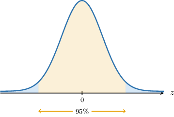
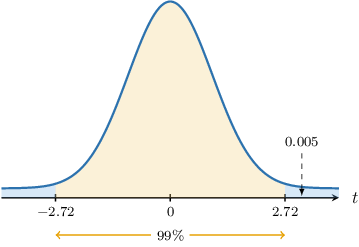

# Confidence Intervals for Two Means: Equal and Unknown Population Variance

Source: https://www.mathacademy.com/topics/4946?courseId=73
Topic ID: 4946

## Prerequisites

- [Confidence Intervals for Two Means: Known and Unequal Population Variances](./3298-confidence-intervals-for-two-means-known-and-unequal-population-variances.md)
- [Confidence Intervals for One Mean: Unknown Population Variance](./3855-confidence-intervals-for-one-mean-unknown-population-variance.md)
- [Pooled Variance](./4117-pooled-variance.md)

## Lesson

### Introduction

In this lesson, we'll learn how to construct confidence intervals for the difference between two population means when the population variances are unknown yet assumed to be equal.

Suppose we have two normally distributed populations, $X$ and $Y$, with means $\mu_x$ and $\mu_y,$ respectively. Furthermore, we assume that both populations share the same unknown variance $\sigma^2.$

$$

X\sim N(\mu_x, \sigma^2), \qquad Y\sim N(\mu_y, \sigma^2)

$$

If we conduct a random sample of size $n_x$ from the first population and a second, *independent* random sample of size $n_y$ from the second population, then we know that

$$

\overline{X}\sim N\left(\mu_x,\dfrac{\sigma^2}{n_x}\right), \qquad \overline{Y}\sim N\left(\mu_y,\dfrac{\sigma^2}{n_y}\right),

$$

where $\overline{X}$ and $\overline{Y}$ are the sample means.

Now, we know that the sum or difference of two independent normally distributed random variables is also normal. Moreover, using our usual results for subtracting means and variances, we have

$$

\overline{X} - \overline{Y} \sim N\left(\mu_x - \mu_y, \sigma^2\left(\dfrac{1}{n_x} + \dfrac{1}{n_y}\right)\right).

$$

Since the variance $\sigma^2$ is unknown, we must replace it with a suitable estimate. In this case, we can use a pooled estimate of the variance.

$$

S_p^2 = \dfrac{(n_x-1)S_x^2 + (n_y-1)S_y^2}{n_x+n_y -2}

$$

This means that the random variable $T,$ defined as

$$

T = \frac{(\overline{X} - \overline{Y}) - (\mu_x - \mu_y)}{S_p\sqrt{\dfrac{1}{n_x} + \dfrac{1}{n_y}}}

$$

follows a $t$-distribution with $\nu = n_x +n_y -2$ degrees of freedom.

### Constructing Confidence Intervals

Suppose we have two normally distributed populations $X$ and $Y$ with unknown means $\mu_x$ and $\mu_y$ and unknown common variance $\sigma^2.$ Two independent random samples of sizes $n_x=17$ and $n_y=15$ are drawn from these populations, and the following data is obtained:

$$

\overline{x}=2.3, \qquad \overline{y}=1.8, \qquad s_p^2=1.5^2

$$

Let's construct a confidence interval for $\mu_x - \mu_y,$ the difference between the means.

In our example, the samples are independent, and the populations are normally distributed. Therefore, the random variable

$$

T = \dfrac{\overline{X} - \overline{Y}- (\mu_x - \mu_y)}{S_p\sqrt{\dfrac{1}{n_x} + \dfrac{1}{n_y}}}

$$

follows a student's $t$-distribution with $\nu = n_x +n_y -2$ degrees of freedom.

We wish to find a $t$-interval that we're $95\%$ confident that the random variable $T$ lies within. This interval is indicated in the diagram below:

The number of degrees of freedom $\nu$ is

$$

\nu = n_x + n_y - 2 = 17+15-2 = 30.

$$

Since we're computing a $95\%$ confidence interval, we have

$$

\alpha=1-0.95=0.05\quad\Longrightarrow\quad \dfrac{\alpha}{2}=0.025.

$$

Let's label the critical values at the endpoints of our interval as $\pm t_{\nu, \alpha/2}\mathbin{:}$

According to our diagram,

$$

P(T > t_{30,0.025}) = P(T< -t_{30,0.025}) = 0.025.

$$

Using a percentage points table for the $t$-distribution with $30$ degrees of freedom, we find that $t_{30,0.025} \approx 2.04.$ Therefore,

$$

P(T > 2.04) = P(T < -2.04) = 0.025.

$$

In other words,

$$

\begin{aligned}𝑃(−2.04<𝑇<2.04)=0.95.\end{aligned}

$$

Therefore, there is a $95\%$ probability that our random variable $T$ will lie in the interval $(-2.04, 2.04).$

Let's consider the inequality inside the parentheses of the last probability statement:

$$

-2.04 < T < 2.04

$$

Writing this in terms of our original variables, we have:

$$

-2.04 < \:\dfrac{\overline{x} - \overline{y} - (\mu_x - \mu_y)}{S_p\sqrt{\dfrac{1}{n_x} + \dfrac{1}{n_y}}} < 2.04

$$

Solving this for the difference $\mu_x-\mu_y,$ we get

$$

(\overline{X} - \overline{Y}) - 2.04 \cdot S_p\cdot \sqrt{\dfrac{1}{n_x} + \dfrac{1}{n_y}} < \: \mu_x - \mu_y < (\overline{x} - \overline{y}) + 2.04 \cdot S_p\cdot \sqrt{\dfrac{1}{n_x} + \dfrac{1}{n_y}} .

$$

Therefore, a $95\%$ confidence interval for the difference $\mu_x - \mu_y$ of population means is given by

$$

\left((\overline{X} - \overline{Y}) - 2.04 \cdot S_p\cdot \sqrt{\dfrac{1}{n_x} + \dfrac{1}{n_y}},\: (\overline{X} - \overline{Y}) + 2.04 \cdot S_p\cdot \sqrt{\dfrac{1}{n_x} + \dfrac{1}{n_y}} \: \right).

$$

Finally, substituting our values

$$

n_x=17, \quad n_y=15, \quad \overline{x}=2.3, \quad \overline{y}=1.8, \quad S_p=1.5

$$

we obtain that our $95\%$ confidence interval for $\mu_x-\mu_y$ is

$$

\big( 0.5 - 1.084, \: 0.5 + 1.084\big)

$$

which simplifies as

$$

\big( -0.584, \: 1.584\big).

$$

Let's now discuss the general procedure.

### A Summary

Suppose we have two normal populations with unknown population means $\mu_1$ and $\mu_2$ and the same unknown population variance $\sigma^2.$ Let two independent random samples of sizes $n_1$ and $n_2$ be drawn from these populations, giving sample means $\overline{x}_1$ and $\overline{x}_2,$ and the pooled sample variance $s_p^2.$

Then, a $[100(1-\alpha)]\%$ confidence interval for the difference $\mu_1 - \mu_2$ is given by

$$

\left((\overline{x}-\overline{y}) - t_{\nu,\alpha/2} \cdot S_p\cdot \sqrt{\dfrac{1}{n_x} + \dfrac{1}{n_y}}, \: (\overline{x}-\overline{y}) + t_{\nu,\alpha/2} \cdot S_p \cdot \sqrt{\dfrac{1}{n_x} + \dfrac{1}{n_y}} \: \right)

$$

where $P(T > t_{\nu,\alpha/2}) = \dfrac{\alpha}{2},$ and $T$ follows a student's $t$-distribution with $\nu = n_x +n_y -2$ degrees of freedom.

The confidence limits (i.e., endpoints of our interval) are given by

$$

(\overline{x}-\overline{y}) \: \pm \: t_{\nu,\alpha/2} \cdot S_p \cdot \sqrt{\dfrac{1}{n_x} + \dfrac{1}{n_y}}.

$$

As usual, each part of the formula above has a name:

- $\overline{x}-\overline{y}$ is an estimate of the difference between the population means,

- $S_p\cdot \sqrt{\dfrac{1}{n_x} + \dfrac{1}{n_y}}$ is the standard error,

- $t_{\nu,\alpha/2}$ is the corresponding $t$-score, and

- $E = t_{\nu,\alpha/2} \cdot S_p \cdot \sqrt{\dfrac{1}{n_x} + \dfrac{1}{n_y}}$ is the margin of error.

Thus, we have:

$$

𝑡

$$

So, our confidence interval can be written as follows:

$$

\begin{aligned}((\overset{𝑥}{}−\overset{𝑦}{–})−[margin of error], & \,(\overset{𝑥}{}−\overset{𝑦}{–})+[margin of error]) \\ ((\overset{𝑥}{}−\overset{𝑦}{–})−[t-score]⋅[standard error], & \,(\overset{𝑥}{}−\overset{𝑦}{–})+[t-score]⋅[standard error]) \\ ((\overset{𝑥}{}−\overset{𝑦}{–})−𝑡_{𝜈,𝛼/2}⋅𝑆_{𝑝}⋅\sqrt{√\frac{1}{𝑛_{𝑥}}+\frac{1}{𝑛_{𝑦}}}, & \,(\overset{𝑥}{}−\overset{𝑦}{–})+𝑡_{𝜈,𝛼/2}⋅𝑆_{𝑝}⋅\sqrt{√\frac{1}{𝑛_{𝑥}}+\frac{1}{𝑛_{𝑦}}}\,)\end{aligned}

$$

Finally, note that if the underlying populations $X$ and $Y$ are not normally distributed, we can still use the above procedure to construct a confidence interval *provided that* the sample sizes $n_x$ and $n_y$ are sufficiently large (typically, $n_x, n_y \geq 30$).

### Example: Finding Confidence Intervals for Two Means

#### Question

Consider two independent random samples from normal populations with the same variance. The summary statistics of these samples are given in the table above, where $n$ is the size of each sample, $\overline{x}$ is the sample mean, and $s_p^2$ is the pooled variance.

Find a $95\%$ confidence interval for the difference $\mu_1-\mu_2$ between the corresponding population means.

**

#### Explanation

Notice that

- the samples are independent,

- both populations are normally distributed, and

- both populations have the same unknown variance.

As a result, given a value $\alpha$ between $0$ and $1,$ the corresponding $[100(1-\alpha)]\%$ confidence interval for the difference $\mu_1-\mu_2$ between the corresponding population means can be written as

$$

(\overline{x}_1-\overline{x}_2) \pm E

$$

where

- $E=t_{n_1+n_2-2, \alpha/2} \cdot S_p \cdot \sqrt{\dfrac{1}{n_1} + \dfrac{1}{n_2}}$ is the margin of error,

- $\overline{x}_1$ and $\overline{x}_2$ are the sample means, $\mu_1$ and $\mu_2$ are the population means, $S_p^2$ is the pooled variance, $n_1$ and $n_2$ are the sample sizes,

- $P(T > t_{n_1+n_2-2, \alpha/2}) = \dfrac{\alpha}{2}$ and $T$ has a student's $t$-distribution with $n_1+n_2-2$ degrees of freedom

Now, to construct the confidence interval, we proceed as follows:

- **** Find the point estimate:

- **** Find the margin of error. Since we are interested in finding a $95\%$ confidence interval, we have We are given that $P(T > 2.04) = 0.025.$ As a result, Now, we can compute the margin of error:

- **** Construct the $95\%$ confidence interval for the difference between the population means:

### Interpreting Confidence Intervals

A confidence interval for the difference $\mu_x-\mu_y$ between the population means can be interpreted in the following ways:

- If all values within the confidence interval are *positive*, this suggests that $\mu_x - \mu_y > 0.$ In other words

- If all values within the confidence interval are *negative*, this suggests that $\mu_x - \mu_y < 0.$ In other words

- If the confidence interval contains zero, then there is *insufficient evidence* of a statistically significant difference between the two means. Therefore, we conclude

We can also use confidence intervals to determine whether the difference between two means is greater than or smaller than some number:

- If all values within the confidence interval are greater than some number $k,$ this suggests that

- If all values within the confidence interval are smaller than some value $k,$ this suggests that

Statistical hypothesis tests should be conducted to verify such claims in all these cases.

### Example: Finding Confidence Intervals for Two Means: Applications

#### Question

The price of a kilogram of flour in states X and Y is known to be normally distributed with equal variance.

A marketer suspects that the average price per kilogram of flour in state X is less than the average price per kilogram in state Y. So, they independently and randomly sampled $n_1=21$ locations where flour is sold in state X and $n_2=17$ locations where flour is sold in state Y and found that the first sample has a mean price of $\overline{x}_1=  2.17$ per kilogram, the second sample has a mean price of $\overline{x}_2=  1.95$ per kilogram, and the pooled variance is $s_p^2 = 0.11^2.$ Which of the following statements are true?

1. The end-points of the $99\%$ confidence interval for the difference between the mean prices are approximately $0.22 \pm 0.098.$

2. All values contained within the $99\%$ confidence interval are higher than $0.2.$

3. The confidence interval data suggests the mean price per kilogram in state X is at least $0.20$ higher than the mean price per kilogram in state Y.

**

#### Explanation

Notice that

- the samples are independent,

- both populations are normally distributed, and

- both populations have the same unknown variance.

As a result, given a value $\alpha$ between $0$ and $1,$ the corresponding $[100(1-\alpha)]\%$ confidence interval for the difference $\mu_1-\mu_2$ between the corresponding population means can be written as

$$

(\overline{x}_1-\overline{x}_2) \pm E

$$

where

- $E=t_{n_1+n_2-2, \alpha/2} \cdot S_p \cdot \sqrt{\dfrac{1}{n_1} + \dfrac{1}{n_2}}$ is the margin of error,

- $\overline{x}_1$ and $\overline{x}_2$ are the sample means, $\mu_1$ and $\mu_2$ are the population means, $S_p^2$ is the pooled variance, $n_1$ and $n_2$ are the sample sizes,

- $P(T > t_{n_1+n_2-2, \alpha/2}) = \dfrac{\alpha}{2}$ and $T$ has a student's $t$-distribution with $n_1+n_2-2$ degrees of freedom.

Now, to construct the confidence interval, we proceed as follows:

- **** Find the point estimate:

- **** Find the margin of error. Since we are interested in finding a $99\%$ confidence interval, we have We are given that $P(T > 2.72) = 0.005.$ As a result, Now, we can compute the margin of error:

- **** Construct the $99\%$ confidence interval for the difference between the population means:

Let's now examine our statements.

- Statement I is true. The end-points of our confidence interval are $0.22 \pm 0.098.$

- Statement II is false. $0.2$ lies inside the confidence interval:

- Statement III is false. Since not all values contained within the $99\%$ confidence interval are higher than $0.2$, there is no evidence to suggest the difference between the means is $0.2$ or higher.

Therefore, the correct answer is "I only."
