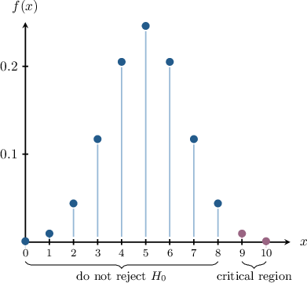

# Critical Regions for Right-Tailed Hypothesis Tests

Source: https://www.mathacademy.com/topics/4948?courseId=73
Topic ID: 4948

## Prerequisites

- [Critical Regions for Left-Tailed Hypothesis Tests](./4131-critical-regions-for-left-tailed-hypothesis-tests.md)

## Lesson

### Introduction

In this lesson, we'll learn how to find critical regions and critical values for right-tailed hypothesis tests.

Suppose we have a coin that we suspect is biased *towards* landing on heads (i.e., the coin is more likely to land on heads than tails). We wish to design a hypothesis test at the significance level to determine whether or not our suspicions are correct with the following null and alternative hypotheses:

Let the test statistic equal the number of heads we get when the coin is tossed at random times in a row. Under the null hypothesis, our test statistic can be modeled as the following binomial random variable:

The probability mass function of is shown below.

Remember that the critical region contains all -values that are *collectively* unlikely under the null hypothesis and, therefore, cause the null hypothesis to be rejected. For *right-tailed* hypothesis tests, the critical regions lie to the *right* of the corresponding probability distribution.

Notice that the combined probability of getting or more heads out of spins causes us to reject the null hypothesis because

All of these values lie in the critical region. However, does not lie in the critical region because

Therefore, the critical region for this hypothesis test at the significance level is

We can also write this as

Finally, is the **critical value** since it lies on the boundary between the critical region and the region where we do not reject

### Example: Identifying Critical Regions Using CDFs

#### Question

A math teacher believes that his students obtain higher algebra scores than geometry. In a geometry test, $2$ out of $10$ students obtain the maximum score. Let $X$ represent the number of students obtaining the maximum score in an algebra test in a sample of $10$ students. Under the null hypothesis that the proportion of students that obtain the maximum score in algebra is the same as in geometry, what is the critical region of a one-tailed test at a significance level of $5\%?$

**

#### Explanation

Let $p$ be the probability that a randomly selected student obtains the maximum score in geometry. Then, we have the following null and alternative hypotheses:

$$

\begin{aligned}𝐻_{0}:𝑝 & =\frac{2}{10}=0.2 \\ 𝐻_{1}:𝑝 & >0.2\end{aligned}

$$

The critical region is the set of $X$-values for which we reject the null hypothesis.

This is a one-sided test where the teacher wishes to conclude that students have higher scores in algebra. This would correspond to observing an abnormally large value of $X.$

To reject the null hypothesis at a significance level of $5\%,$ we must observe a value $x$ such that $P(X \geq x) \leq 0.05$ under the null hypothesis.

Using the table, we have the following probabilities:

$$

\begin{aligned}𝑃(𝑋≥6) & =1−𝑃(𝑋≤5) \\ & =1−0.9936 \\ & =0.0064 \\ & <0.05\,✓ \\ 𝑃(𝑋≥5) & =1−𝑃(𝑋≤4) \\ & =1−0.9672 \\ & =0.0328 \\ & <0.05\,✓ \\ 𝑃(𝑋≥4) & =1−𝑃(𝑋≤3) \\ & =1−0.8791 \\ & =0.1209 \\ & ≮0.05\,×\end{aligned}

$$

So, the values of $X$ that would cause the null hypothesis to be rejected at a significance level of $5\%$ are $5$ or more.

Therefore, the critical region is $X\geq 5.$

### Example: Identifying Critical Regions Using PMFs

#### Question

A shop owner believes customer numbers have increased in the last month. Last month, there were $2.5$ customers per hour on average. Let $X$ represent the number of customers visiting the shop in a randomly selected one-hour period. Under the null hypothesis that the number of customers is the same as before, what is the critical region of a one-tailed test at a significance level of $2\%?$

**

#### Explanation

Let $\lambda$ be the average number of customers per hour. Then, we have the following null and alternative hypotheses:

$$

\begin{aligned}𝐻_{0}:𝜆 & =2.5 \\ 𝐻_{1}:𝜆 & >2.5\end{aligned}

$$

The critical region is the set of values of $X$ for which we reject the null hypothesis.

This is a one-sided test where the shop owner wishes to conclude that the number of customers has increased. This would correspond to observing an abnormally large value of $X.$

To reject the null hypothesis at a significance level of $2\%,$ we must observe a value $x$ such that $P(X \geq x) \leq 0.02$ under the null hypothesis.

Using the table and the fact that $P(X\geq 11) = 0,$ we have the following probabilities:

$$

\begin{aligned}𝑃(𝑋≥7) & =𝑃(𝑋=7)+𝑃(𝑋=8)+𝑃(𝑋=9)+𝑃(𝑋=10) \\ & =0.0099+0.0031+0.0009+0.0002 \\ & =0.0141 \\ & <0.02\,✓ \\ 𝑃(𝑋≥6) & =𝑃(𝑋=6)+𝑃(𝑋≥7) \\ & =0.0278+0.0141 \\ & =0.0419 \\ & ≮0.02\,×\end{aligned}

$$

So, the values of $X$ that would cause the null hypothesis to be rejected at a significance level of $2\%$ are $7$ and above.

Therefore, the critical region is $X\geq 7.$

### Example: Identifying Critical Values

#### Question

A magician has a $6$-sided die, and an audience member suspects it is biased towards landing on $1.$ Let $X$ represent the number of times the die lands on $1$ when rolled a total of $5$ times. Under the null hypothesis that the die is fair, what is the critical value of a one-tailed test at a significance level of $2.5\%?$

**

#### Explanation

Let $p$ be the probability that the die lands on $1$ in a random toss. Then, we have the following null and alternative hypotheses:

$$

\begin{aligned}𝐻_{0}:𝑝 & =\frac{1}{6} \\ 𝐻_{1}:𝑝 & >\frac{1}{6}\end{aligned}

$$

The critical region is the set of values of $X$ for which we reject the null hypothesis. A critical value lies on the boundary of the critical region.

This is a one-sided test where the audience member wishes to conclude that the die is biased towards landing on $1.$ This would correspond to observing an abnormally large value of $X.$

To reject the null hypothesis at a significance level of $2.5\%,$ we must observe a value $x$ such that $P(X \geq x) \leq 0.025$ under the null hypothesis.

Using the table, we have the following probabilities:

$$

\begin{aligned}𝑃(𝑋≥5) & =𝑃(𝑋=5) \\ & =0.0001 \\ & <0.025\,✓ \\ 𝑃(𝑋≥4) & =𝑃(𝑋=4)+𝑃(𝑋=5) \\ & =0.0032+0.0001 \\ & =0.0033 \\ & <0.025\,✓ \\ 𝑃(𝑋≥3) & =𝑃(𝑋=3)+𝑃(𝑋=4)+𝑃(𝑋=5) \\ & =0.0322+0.0032+0.0001 \\ & =0.0355 \\ & ≮0.025\,×\end{aligned}

$$

So, the values of $X$ that would cause the null hypothesis to be rejected at a significance level of $2.5\%$ are the values such that $X \geq 4.$ Therefore, the critical value is $X=4.$
