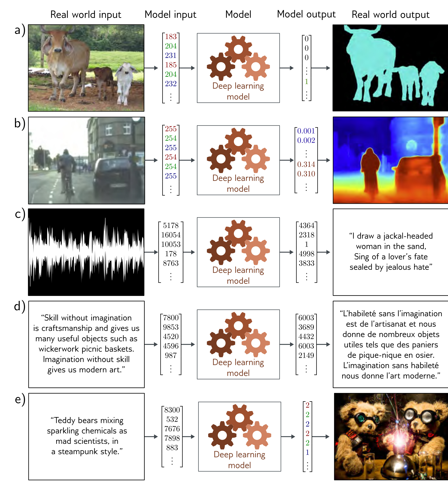

  

  <strong>Figure 1.4</strong> Supervised learning tasks with structured outputs. a) This semantic segmentation model maps an RGB image to a binary image indicating whether each pixel belongs to the background or a cow (adapted from Noh et al., 2015). b) This monocular depth estimation model maps an RGB image to an output image where each pixel represents the depth (adapted from Cordts et al., 2016). c) This audio transcription model maps an audio sample to a transcription of the spoken words in the audio. d) This translation model maps an English text string to its French translation. e) This image synthesis model maps a caption to an image (example from https://openai.com/dall-e-2/). In each case, the output has a complex internal structure or grammar. In some cases, many outputs are compatible with the input.

