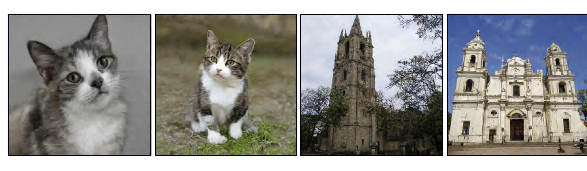
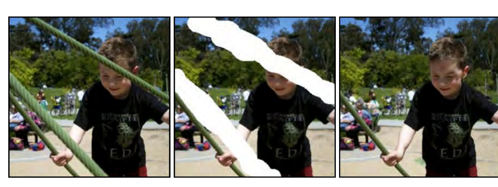

  

  <strong>Figure 1.5</strong> Generative models for images. Left: two images were generated from a model trained on pictures of cats. These are not real cats, but samples from a probability model. Right: two images generated from a model trained on images of buildings. Adapted from Karras et al. (2020b).

The moon had risen by the time I reached the edge of the forest, and the light that filtered through the trees was silver and cold. I shivered, though I was not cold, and quickened my pace. I had never been so far from the village before, and I was not sure what to expect. I had been walking for hours, and I was tired and hungry. I had left in such a hurry that I had not thought to pack any food, and I had not thought to bring a weapon. I was unarmed and alone in a strange place, and I did not know what I was doing.

I had been walking for so long that I had lost all sense of time, and I had no idea how far I had come. I only knew that I had to keep going. I had to find her. I was getting close. I could feel it. She was nearby, and she was in trouble. I had to find her and help her, before it was too late.

Figure 1.6 Short story synthesized from a generative model of text data. The model describes a probability distribution that assigns a probability to every output string. Sampling from the model creates strings that follow the statistics of the training data (here, short stories) but have never been seen before.

  

  <strong>Figure 1.7</strong> Inpainting. In the original image (left), the boy is obscured by metal cables. These undesirable regions (center) are removed and the generative model synthesizes a new image (right) under the constraint that the remaining pixels must stay the same. Adapted from Saharia et al. (2022a).

