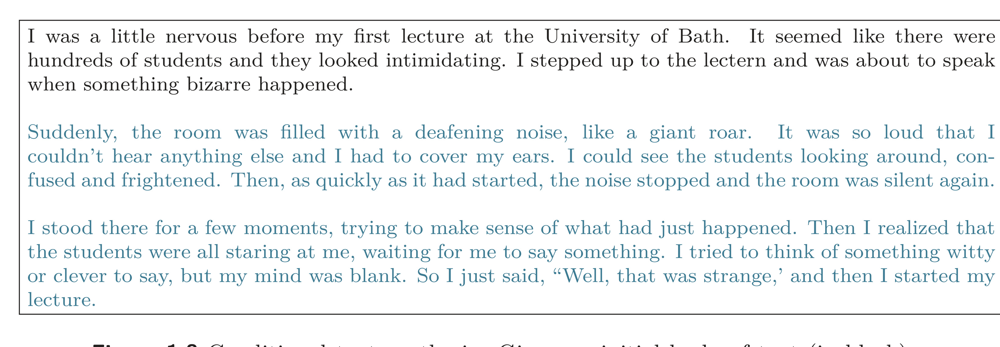
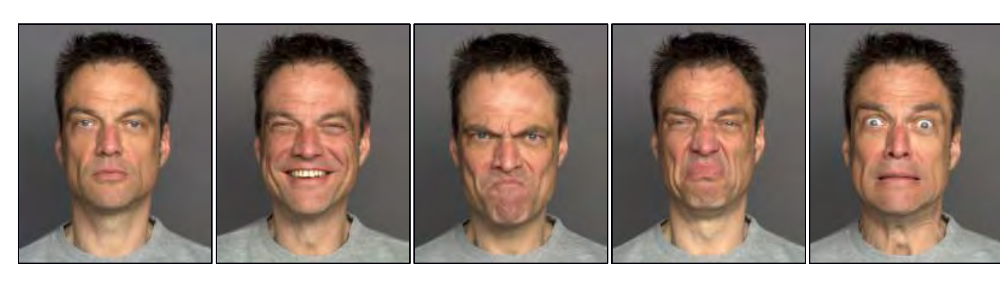

  

I was a little nervous before my first lecture at the University of Bath. It seemed like there were hundreds of students and they looked intimidating. I stepped up to the lectern and was about to speak when something bizarre happened.

Suddenly, the room was filled with a deafening noise, like a giant roar. It was so loud that I couldn't hear anything else and I had to cover my ears. I could see the students looking around, confused and frightened. Then, as quickly as it had started, the noise stopped and the room was silent again.

I stood there for a few moments, trying to make sense of what had just happened. Then I realized that the students were all staring at me, waiting for me to say something. I tried to think of something witty or clever to say, but my mind was blank. So I just said, "Well, that was strange," and then I started my lecture.

Figure 1.8 Conditional text synthesis. Given an initial body of text (in black), generative models of text can continue the string plausibly by synthesizing the "missing" remaining part of the string. Generated by GPT3 (Brown et al., 2020).

  

  <strong>Figure 1.9</strong> Variation of the human face. The human face contains roughly 42 muscles, so it's possible to describe most of the variation in images of the same person in the same lighting with just 42 numbers. In general, datasets of images, music, and text can be described by a relatively small number of underlying variables although it is typically more difficult to tie these to particular physical mechanisms. Images from Dynamic FACES database (Holland et al., 2019).

## 1.2.2 Latent variables

Some (but not all) generative models exploit the fact that data can be lower dimensional than the raw number of observed variables suggests. For example, the number of valid and meaningful English sentences is much smaller than the number of strings created by drawing words at random. Similarly, real-world images are a tiny subset of the images that can be created by drawing random red, green, and blue (RGB) values for every pixel. This is because images are generated by physical processes (see figure 1.9).

This leads to the idea that we can describe each data example using a smaller number of underlying latent variables. Here, the role of deep learning is to describe the mapping between these latent variables and the data. The latent variables typically have a simple
