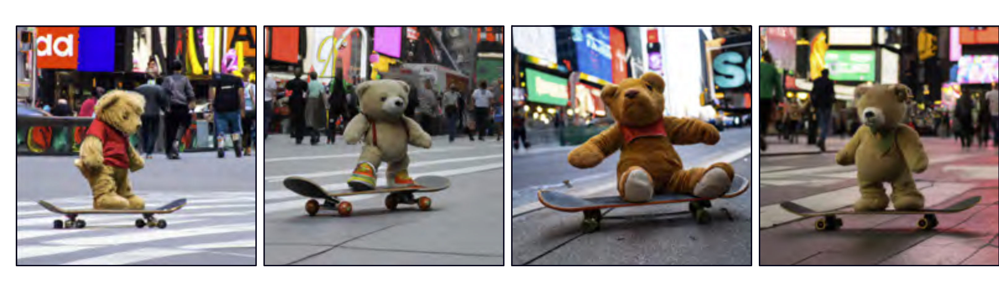

  

  <strong>Figure 1.12</strong> Multiple images generated from the caption "A teddy bear on a skateboard in Times Square." Generated by DALL-E-2 (Ramesh et al., 2022).

probability distribution by design. By sampling from this distribution and passing the result through the deep learning model, we can create new samples (figure 1.10).

These models lead to new methods for manipulating real data. For example, consider finding the latent variables that underpin two real examples. We can interpolate between these examples by interpolating between their latent representations and mapping the intermediate positions back into the data space (figure 1.11).

## 1.2.3 Connecting supervised and unsupervised learning

Generative models with latent variables can also benefit supervised learning models where the outputs have structure (figure 1.4). For example, consider learning to predict the images corresponding to a caption. Rather than directly map the text input to an image, we can learn a relation between latent variables that explain the text and the latent variables that explain the image.

This has three advantages. First, we may need fewer text/image pairs to learn this mapping now that the inputs and outputs are lower dimensional. Second, we are more likely to generate a plausible-looking image; any sensible values of the latent variables should produce something that looks like a plausible example. Third, if we introduce randomness to either the mapping between the two sets of latent variables or the mapping from the latent variables to the image, then we can generate multiple images that are all described well by the caption (figure 1.12).

## 1.3 Reinforcement learning

The final area of machine learning is reinforcement learning. This paradigm introduces the idea of an agent which lives in a world and can perform certain actions at each time step. The actions change the state of the system but not necessarily in a deterministic way. Taking an action can also produce rewards, and the goal of reinforcement learning
