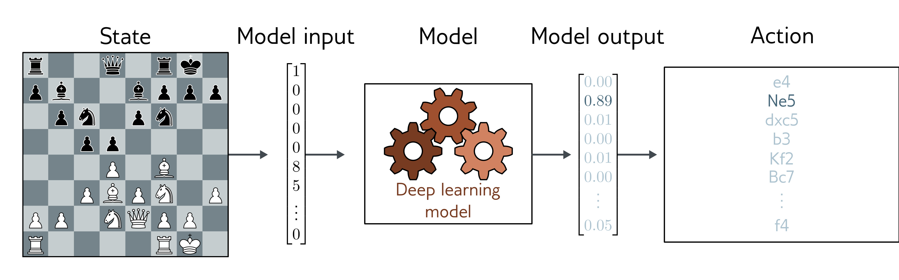

  

  <strong>Figure 1.13</strong> Policy networks for reinforcement learning. One way to incorporate deep neural networks into reinforcement learning is to use them to define a mapping from the state (here position on chessboard) to the actions (possible moves). This mapping is known as a policy.

same extent as electricity, the internal combustion engine, the transistor, or the internet. The potential benefits in healthcare, design, entertainment, transport, education, and almost every area of commerce are enormous. However, scientists and engineers are often unrealistically optimistic about the outcomes of their work, and the potential for harm is just as great. The following paragraphs highlight five concerns.

Bias and fairness: If we train a system to predict salary levels for individuals based on historical data, then this system will reproduce historical biases; for example, it will probably predict that women should be paid less than men. Several such cases have already become international news stories: an AI system for super-resolving face images made non-white people look more white; a system for generating images produced only pictures of men when asked to synthesize pictures of lawyers. Careless application of algorithmic decision-making using AI has the potential to entrench or aggravate existing biases. See Binns (2018) for further discussion.

Explainability: Deep learning systems make decisions, but we do not usually know exactly how or based on what information. They may be enormous, and there is no way we can understand how they work based on examination. This has led to the sub-field of explainable AI. One moderately successful area is producing local explanations; we cannot explain the entire system, but we can produce an interpretable description of why a particular decision was made. However, it remains unknown whether it is possible to build complex decision-making systems that are fully transparent to their users or even their creators. See Grennan et al. (2022) for further information.

Weaponizing AI: All significant technologies have been applied directly or indirectly toward war. Sadly, violent conflict seems to be an inevitable feature of human behavior. AI is arguably the most powerful technology ever built and will doubtless be deployed extensively in a military context. Indeed, this is already happening (Heikkila, 2022).
