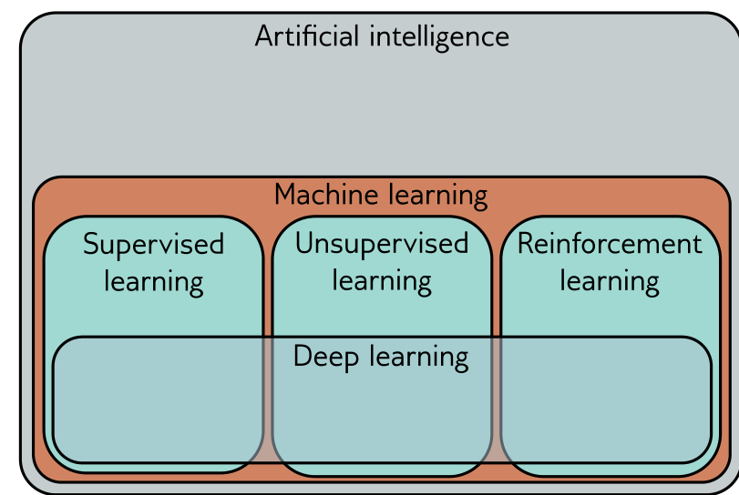

Figure 1.1 Machine learning is an area of artificial intelligence that fits mathematical models to observed data. It can coarsely be divided into supervised learning, unsupervised learning, and reinforcement learning. Deep neural networks contribute to each of these areas.

**Figure 1** — Figure 1.2 depicts several regression and classification problems.

## 1.1.1 Regression and classification problems

Figure 1.2 depicts several regression and classification problems. In each case, there is a meaningful real-world input (a sentence, a sound file, an image, etc.), and this is encoded as a vector of numbers. This vector forms the model input. The model maps the input to an output vector which is then “translated” back to a meaningful real-world prediction. For now, we focus on the inputs and outputs and treat the model as a black box that ingests a vector of numbers and returns another vector of numbers.

The model in figure 1.2c receives a text string containing a restaurant review as input and predicts whether the review is positive or negative. This is a binary classification problem because the model attempts to assign the input to one of two categories. The output vector contains the probabilities that the input belongs to each category. Figures 1.2d and 1.2e depict multiclass classification problems. Here, the model assigns the input to one of N > 2 categories. In the first case, the input is an audio file, and the model predicts which genre of music it contains. In the second case, the input is an image, and the model predicts which object it contains. In each case, the model returns a vector of size N that contains the probabilities of the N categories.

## 1.1.2 Inputs

The input data in figure 1.2 varies widely. In the house pricing example, the input is a fixed-length vector containing values that characterize the property. This is an example of tabular data because it has no internal structure; if we change the order of the inputs and build a new model, then we expect the model prediction to remain the same.

Conversely, the input in the restaurant review example is a body of text. This may be of variable length depending on the number of words in the review, and here input
