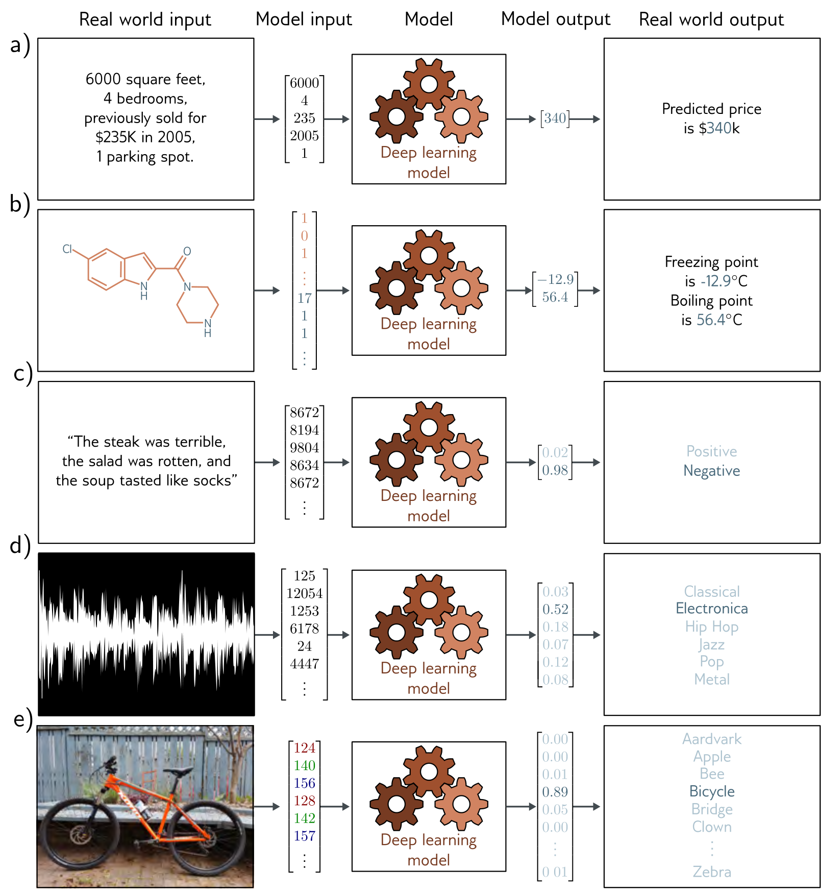

**Figure 1** — Figure 1.2 Regression and classification problems.

Figure 1.2 Regression and classification problems. a) This regression model takes a vector of numbers that characterize a property and predicts its price. b) This multivariate regression model takes the structure of a chemical molecule and predicts its freezing and boiling points. c) This binary classification model takes a restaurant review and classifies it as either positive or negative. d) This multiclass classification problem assigns a snippet of audio to one of N genres. e) A second multiclass classification problem in which the model classifies an image according to which of N possible objects it might contain.
