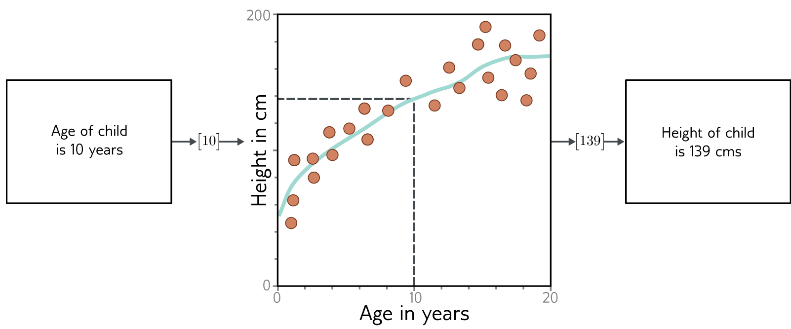

**Figure 1** — Figure 1.3 Machine learning model.

Figure 1.3 Machine learning model. The model represents a family of relationships that relate the input (age of child) to the output (height of child). The particular relationship is chosen using training data, which consists of input/output pairs (orange points). When we train the model, we search through the possible relationships for one that describes the data well. Here, the trained model is the cyan curve and can be used to compute the height for any age.

order is important; my wife ate the chicken is not the same as the chicken ate my wife. The text must be encoded into numerical form before passing it to the model. Here, we use a fixed vocabulary of size 10,000 and simply concatenate the word indices.

For the music classification example, the input vector might be of fixed size (perhaps a 10-second clip) but is very high-dimensional (i.e., contains many entries). Digital audio is usually sampled at 44.1 kHz and represented by 16-bit integers, so a ten-second clip consists of 441,000 integers. Clearly, supervised learning models will have to be able to process sizeable inputs. The input in the image classification example (which consists of the concatenated RGB values at every pixel) is also enormous. Moreover, it contains spatial structure; two pixels above and below one another are closely related, even if they are not adjacent in the input vector.

Finally, consider the input for the model that predicts the freezing and boiling points of the molecule. A molecule may contain varying numbers of atoms that can be connected in different ways. In this case, the model must ingest both the geometric structure of the molecule and the constituent atoms to the model.

## 1.1.3 Machine learning models

Until now, we have treated the machine learning model as a black box that takes an input vector and returns an output vector. But what exactly is in this black box? Consider a model to predict the height of a child from their age (figure 1.3). The machine learning
