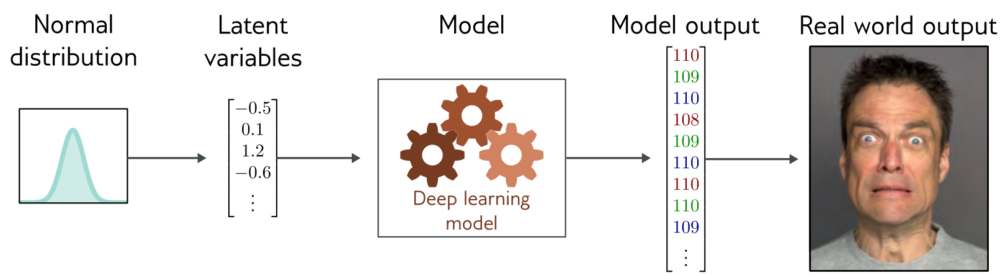
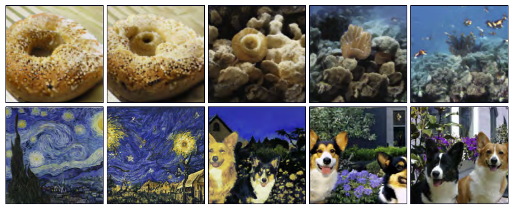

**Figure 1** — Figure 1.10 Latent variables.

Figure 1.10 Latent variables. Many generative models use a deep learning model to describe the relationship between a low-dimensional “latent” variable and the observed high-dimensional data. The latent variables have a simple probability distribution by design. Hence, new examples can be generated by sampling from the simple distribution over the latent variables and then using the deep learning model to map the sample to the observed data space.

**Figure 2** — Figure 1.10 Latent variables.

Figure 1.11 Image interpolation. In each row the left and right images are real and the three images in between represent a sequence of interpolations created by a generative model. The generative models that underpin these interpolations have learned that all images can be created by a set of underlying latent variables. By finding these variables for the two real images, interpolating their values, and then using these intermediate variables to create new images, we can generate by a generative model. The generative models that underpin these interpolations have learned that all images can be created by a set of underlying latent variables. By finding these variables for the two real images, interpolating their values, and then using these intermediate variables to create new images, we can generate by a generative model. The generative models that underpin these interpolations have learned that all images can be created by a set of underlying latent variables. By finding these variables for the two real images, interpolating their values, and then using these intermediate variables to create new images, we can generate by a generative model. The generative models that underpin these interpolations have learned that all images can be created by a set of underlying latent variables. By finding these variables for the two real images, interpolating their values, and then using these intermediate variables to create new images, we can generate by a generative model. The generative models that underpin these interpolations have learned that all images can be created by a set of underlying latent variables. By finding these variables for the two real images, interpolating their values, and then using these intermediate variables to create new images, we can generate by a generative model. The generative models that underpin these interpolations have learned that all images can be created by a set of underlying latent variables. By finding these variables for the two real images, interpolating their values, and then using these intermediate variables to create new images, we can generate by a generative model. The generative models that underpin these interpolations have learned that all images can be created by a set of underlying latent variables. By finding these variables for the two real images, interpolating their values, and then using these intermediate variables to create new images, we can generate by a generative model. The generative models that underpin these interpolations have learned that all images can be created by a set of underlying latent variables. By finding these variables for the two real images, interpolating their values, and then using these intermediate variables to create new images, we can generate by a generative model. The generative models that underpin these interpolations have learned that all images can be created by a set of underlying latent variables. By finding these variables for the two real images, interpolating their values, and then using these intermediate variables to create new images, we can generate by a generative model. The generative models that underpin these interpolations have learned that all images can be created by a set of underlying latent variables. By finding these variables for the two real images, interpolating their values, and then using these intermediate variables to create new images, we can generate by a generative model. The generative models that underpin these interpolations have learned that all images can be created by a set of underlying latent variables. By finding these variables for the two real images, interpolating their values, and then using these intermediate variables to create new images, we can generate by a generative model. The generative models that underpin these interpolations have learned that all images can be created by a set of underlying latent variables. By finding these variables for the two real images, interpolating their values, and then using these intermediate variables to create new images, we can generate by a generative model. The generative models that underpin these interpolations have learned that all images can be created by a set of underlying latent variables. By finding these variables for the two real images, interpolating their values, and then using these intermediate variables to create new images, we can generate by a generative model. The generative models that underpin these interpolations have learned that all images can be created by a set of underlying latent variables. By finding these variables for the two real images, interpolating their values, and then using these intermediate variables to create new images, we can generate by a generative model. The generative models that underpin these interpolations have learned that all images can be created by a set of underlying latent variables. By finding these variables for the two real images, interpolating their values, and then using these intermediate variables to create new images, we can generate by a generative model. The generative models that underpin these interpolations have learned that all images can be created by a set of underlying latent variables. By finding these variables for the two real images, interpolating their values, and then using these intermediate variables to create new images, we can generate by a generative model. The generative models that underpin these interpolations have learned that all images can be created by a set of underlying latent variables. By finding these variables for the two real images, interpolating their values, and then using these intermediate variables to create new images, we can generate by a generative model. The generative models that underpin these interpolations have learned that all images can be created by a set of underlying latent variables. By finding these variables for the two real images, interpolating their values, and then using these intermediate variables to create new images, we can generate by a generative model. The generative models that underpin these interpolations have learned that all images can be created by a set of underlying latent variables. By finding these variables for the two real images, interpolating their values, and then using these intermediate variables to create new images, we can generate by a generative model. The generative models that underpin these interpolations have learned that all images can be created by a set of underlying latent variables. By finding these variables for the two real images, interpolating their values, and then using these intermediate variables to create new images, we can generate by a generative model. The generative models that underpin these interpolations have learned that all images can be created by a set of underlying latent variables. By finding these variables for the two real images, interpolating their values, and then using these intermediate variables to create new images, we can generate by a generative model. The generative models that underpin these interpolations have learned that all images can be created by a set of underlying latent variables. By finding these variables for the two real images, interpolating their values, and then using these intermediate variables to create new images, we can generate by a generative model. The generative models that underpin these interpolations have learned that all images can be created by a set of underlying latent variables. By finding these variables for the two real images, interpolating their values, and then using these intermediate variables to create new images, we can generate by a generative model. The generative models that underpin these interpolations have learned that all images can be created by a set of underlying latent variables. By finding these variables for the two real images, interpolating their values, and then using these intermediate variables to create new images, we can generate by a generative model. The generative models that underpin these interpolations have learned that all images can be created by a set of underlying latent variables. By finding these variables for the two real images, interpolating their values, and then using these intermediate variables to create new images, we can generate by a generative model. The generative models that underpin these interpolations have learned that all images can be created by a set of underlying latent variables. By finding these variables for the two real images, interpolating their values, and then using these intermediate variables to create new images, we can generate by a generative model. The generative models that underpin these interpolations have learned that all images can be created by a set of underlying latent variables. By finding these variables for the two real images, interpolating their values, and then using these intermediate variables to create new images, we can generate by a generative model. The generative models that underpin these interpolations have learned that all images can be created by a set of underlying latent variables. By finding these variables for the two real images, interpolating their values, and then using these intermediate variables to create new images, we can generate by a generative model. The generative models that underpin these interpolations have learned that all images can be created by a set of underlying latent variables. By finding these variables for the two real images, interpolating their values, and then using these intermediate variables to create new images, we can generate by a generative model. The generative models that underpin these interpolations have learned that all images can be created by a set of underlying latent variables. By finding these variables for the two real images, interpolating their values, and then using these intermediate variables to create new images, we can generate by a generative model. The generative models that underpin these interpolations have learned that all images can be created by a set of underlying latent variables. By finding these variables for the two real images, interpolating their values, and then using these intermediate variables to create new images, we can generate by a generative model. The generative models that underpin these interpolations have learned that all images can be created by a set of underlying latent variables. By finding these variables for the two real images, interpolating their values, and then using these intermediate variables to create new images, we can generate by a generative model. The generative models that underpin these interpolations have learned that all images can be created by a set of underlying latent variables. By finding these variables for the two real images, interpolating their values, and then using these intermediate variables to create new images, we can generate by a generative model. The generative models that underpin these interpolations have learned that all images can be created by a set of underlying latent variables. By finding these variables for the two real images, interpolating their values, and then using these intermediate variables to create new images, we can generate by a generative model. The generative models that underpin these interpolations have learned that all images can be created by a set of underlying latent variables. By finding these variables for the two real images, interpolating their values, and then using these intermediate variables to create new images, we can generate by a generative model. The generative models that underpin these interpolations have learned that all images can be created by a set of underlying latent variables. By finding these variables for the two real images, interpolating their values, and then using these intermediate variables to create new images, we can generate by a generative model. The generative models that underpin these interpolations have learned that all images can be created by a set of underlying latent variables. By finding these variables for the two real images, interpolating their values, and then using these intermediate variables to create new images, we can generate by a generative model. The generative models that underpin these interpolations have learned that all images can be created by a set of underlying latent variables. By finding these variables for the two real images, interpolating their values, and then using these intermediate variables to create new images, we can generate by a generative model. The generative models that underpin these interpolations have learned that all images can be created by a set of underlying latent variables. By finding these variables for the two real images, interpolating their values, and then using these intermediate variables to create new images, we can generate by a generative model. The generative models that underpin these interpolations have learned that all images can be created by a set of underlying latent variables. By finding these variables for the two real images, interpolating their values, and then using these intermediate variables to create new images, we can generate by a generative model. The generative models that underpin these interpolations have learned that all images can be created by a set of underlying latent variables. By finding these variables for the two real images, interpolating their values, and then using these intermediate variables to create new images, we can generate by a generative model. The generative models that underpin these interpolations have learned that all images can be created by a set of underlying latent variables. By finding these variables for the two real images, interpolating their values, and then using these intermediate variables to create new images, we can generate by a generative model. The generative models that underpin these interpolations have learned that all images can be created by a set of underlying latent variables. By finding these variables for the two real images, interpolating their values, and then using these intermediate variables to create new images, we can generate by a generative model. The generative models that underpin these interpolations have learned that all images can be created by a set of underlying latent variables. By finding these variables for the two real images, interpolating their values, and then using these intermediate variables to create new images, we can generate by a generative model. The generative models that underpin these interpolations have learned that all images can be created by a set of underlying latent variables. By finding these variables for the two real images, interpolating their values, and then using these intermediate variables to create new images, we can generate by a generative model. The generative models that underpin these interpolations have learned that all images can be created by a set of underlying latent variables. By finding these variables for the two real images, interpolating their values, and then using these intermediate variables to create new images, we can generate by a generative model. The generative models that underpin these interpolations have learned that all images can be created by a set of underlying latent variables. By finding these variables for the two real images, interpolating their values, and then using these intermediate variables to create new images, we can generate by a generative model. The generative models that underpin these interpolations have learned that all images can be created by a set of underlying latent variables. By finding these variables for the two real images, interpolating their values, and then using these intermediate variables to create new images, we can generate by a generative model. The generative models that underpin these interpolations have learned that all images can be created by a set of underlying latent variables. By finding these variables for the two real images, interpolating their values, and then using these intermediate variables to create new images, we can generate by a generative model. The generative models that underpin these interpolations have learned that all images can be created by a set of underlying latent variables. By finding these variables for the two real images, interpolating their values, and then using these intermediate variables to create new images, we can generate by a generative model. The generative models that underpin these interpolations have learned that all images can be created by a set of underlying latent variables. By finding these variables for the two real images, interpolating their values, and then using these intermediate variables to create new images, we can generate by a generative model. The generative models that underpin these interpolations have learned that all images can be created by a set of underlying latent variables. By finding these variables for the two real images, interpolating their values, and then using these intermediate variables to create new images, we can generate by a generative model. The generative models that underpin these interpolations have learned that all images can be created by a set of underlying latent variables. By finding these variables for the two real images, interpolating their values, and then using these intermediate variables to create new images, we can generate by a generative model. The generative models that underpin these interpolations have learned that all images can be created by a set of underlying latent variables. By finding these variables for the two real images, interpolating their values, and then using these intermediate variables to create new images, we can generate by a generative model. The generative models that underpin these interpolations have learned that all images can be created by a set of underlying latent variables. By finding these variables for the two real images, interpolating their values, and then using these intermediate variables to create new images, we can generate by a generative model. The generative models that underpin these interpolations have learned that all images can be created by a set of underlying latent variables. By finding these variables for the two real images, interpolating their values, and then using these intermediate variables to create new images, we can generate by a generative model. The generative models that underpin these interpolations have learned that all images can be created by a set of underlying latent variables. By finding these variables for the two real images, interpolating their values, and then using these intermediate variables to create new images, we can generate by a generative model. The generative models that underpin these interpolations have learned that all images can be created by a set of underlying latent variables. By finding these variables for the two real images, interpolating their values, and then using these intermediate variables to create new images, we can generate by a generative model. The generative models that underpin these interpolations have learned that all images can be created by a set of underlying latent variables. By finding these variables for the two real images, interpolating their values, and then using these intermediate variables to create new images, we can generate by a generative model. The generative models that underpin these interpolations have learned that all images can be created by a set of underlying latent variables. By finding these variables for the two real images, interpolating their values, and then using these intermediate variables to create new images, we can generate by a generative model. The generative models that underpin these interpolations have learned that all images can be created by a set of underlying latent variables. By finding these variables for the two real images, interpolating their values, and then using these intermediate variables to create new images, we can generate by a generative model. The generative models that underpin these interpolations have learned that all images can be created by a set of underlying latent variables. By finding these variables for the two real images, interpolating their values, and then using these intermediate variables to create new images, we can generate by a generative model. The generative models that underpin these interpolations have learned that all images can be created by a set of underlying latent variables. By finding these variables for the two real images, interpolating their values, and then using these intermediate variables to create new images, we can generate by a generative model. The generative models that underpin these interpolations have learned that all images can be created by a set of underlying latent variables. By finding these variables for the two real images, interpolating their values, and then using these intermediate variables to create new images, we can generate by a generative model. The generative models that underpin these interpolations have learned that all images can be created by a set of underlying latent variables. By finding these variables for the two real images, interpolating their values, and then using these intermediate variables to create new images, we can generate by a generative model. The generative models that underpin these interpolations have learned that all images can be created by a set of underlying latent variables. By finding these variables for the two real images, interpolating their values, and then using these intermediate variables to create new images, we can generate by a generative model. The generative models that underpin these interpolations have learned that all images can be created by a set of underlying latent variables. By finding these variables for the two real images, interpolating their values, and then using these intermediate variables to create new images, we can generate by a generative model. The generative models that underpin these interpolations have learned that all images can be created by a set of underlying latent variables. By finding these variables for the two real images, interpolating their values, and then using these intermediate variables to create new images, we can generate by a generative model. The generative models that underpin these interpolations have learned that all images can be created by a set of underlying latent variables. By finding these variables for the two real images, interpolating their values, and then using these intermediate variables to create new images, we can generate by a generative model. The generative models that underpin these interpolations have learned that all images can be created by a set of underlying latent variables. By finding these variables for the two real images, interpolating their values, and then using these intermediate variables to create new images, we can generate by a generative model. The generative models that underpin these interpolations have learned that all images can be created by a set of underlying latent variables. By finding these variables for the two real images, interpolating their values, and then using these intermediate variables to create new images, we can generate by a generative model. The generative models that underpin these interpolations have learned that all images can be created by a set of underlying latent variables. By finding these variables for the two real images, interpolating their values, and then using these intermediate variables to create new images, we can generate by a generative model. The generative models that underpin these interpolations have learned that all images can be created by a set of underlying latent variables. By finding these variables for the two real images, interpolating their values, and then using these intermediate variables to create new images, we can generate by a generative model. The generative models that underpin these interpolations have learned that all images can be created by a set of underlying latent variables. By finding these variables for the two real images, interpolating their values, and then using these intermediate variables to create new images, we can generate by a generative model. The generative models that underpin these interpolations have learned that all images can be created by a set of underlying latent variables. By finding these variables for the two real images, interpolating their values, and then using these intermediate variables to create new images, we can generate by a generative model. The generative models that underpin these interpolations have learned that all images can be created by a set of underlying latent variables. By finding these variables for the two real images, interpolating their values, and then using these intermediate variables to create new images, we can generate by a generative model. The generative models that underpin these interpolations have learned that all images can be created by a set of underlying latent variables. By finding these variables for the two real images, interpolating their values, and then using these intermediate variables to create new images, we can generate by a generative model. The generative models that underpin these interpolations have learned that all images can be created by a set of underlying latent variables. By finding these variables for the two real images, interpolating their values, and then using these intermediate variables to create new images, we can generate by a generative model. The generative models that underpin these interpolations have learned that all images can be created by a set of underlying latent variables. By finding these variables for the two real images, interpolating their values, and then using these intermediate variables to create new images, we can generate by a generative model. The generative models that underpin these interpolations have learned that all images can be created by a set of underlying latent variables. By finding these variables for the two real images, interpolating their values, and then using these intermediate variables to create new images, we can generate by a generative model. The generative models that underpin these interpolations have learned that all images can be created by a set of underlying latent variables. By finding these variables for the two real images, interpolating their values, and then using these intermediate variables to create new images, we can generate by a generative model. The generative models that underpin these interpolations have learned that all images can be created by a set of underlying latent variables. By finding these variables for the two real images, interpolating their values, and then using these intermediate variables to create new images, we can generate by a generative model. The generative models that underpin these interpolations have learned that all images can be created by a set of underlying latent variables. By finding these variables for the two real images, interpolating their values, and then using these intermediate variables to create new images, we can generate by a generative model. The generative models that underpin these interpolations have learned that all images can be created by a set of underlying latent variables. By finding these variables for the two real images, interpolating their values, and then using these intermediate variables to create new images, we can generate by a generative model. The generative models that underpin these interpolations have learned that all images can be created by a set of underlying latent variables. By finding these variables for the two real images, interpolating their values, and then using these intermediate variables to create new images, we can generate by a generative model. The generative models that underpin these interpolations have learned that all images can be created by a set of underlying latent variables. By finding these variables for the two real images, interpolating their values, and then using these intermediate variables to create new images, we can generate by a generative model. The generative models that underpin these interpolations have learned that all images can be created by a set of underlying latent variables. By finding these variables for the two real images, interpolating their values, and then using these intermediate variables to create new images, we can generate by a generative model. The generative models that underpin these interpolations have learned that all images can be created by a set of underlying latent variables. By finding these variables for the two real images, interpolating their values, and then using these intermediate variables to create new images, we can generate by a generative model. The generative models that underpin these interpolations have learned that all images can be created by a set of underlying latent variables. By finding these variables for the two real images, interpolating their values, and then using these intermediate variables to create new images, we can generate by a generative model. The generative models that underpin these interpolations have learned that all images can be created by a set of underlying latent variables. By finding these variables for the two real images, interpolating their values, and then using these intermediate variables to create new images, we can generate by a generative model. The generative models that underpin these interpolations have learned that all images can be created by a set of underlying latent variables. By finding these variables for the two real images, interpolating their values, and then using these intermediate variables to create new images, we can generate by a generative model. The generative models that underpin these interpolations have learned that all images can be created by a set of underlying latent variables. By finding these variables for the two real images, interpolating their values, and then using these intermediate variables to create new images, we can generate by a generative model. The generative models that underpin these interpolations have learned that all images can be created by a set of underlying latent variables. By finding these variables for the two real images, interpolating their values, and then using these intermediate variables to create new images, we can generate by a generative model. The generative models that underpin these interpolations have learned that all images can be created by a set of underlying latent variables. By finding these variables for the two real images, interpolating their values, and then using these intermediate variables to create new images, we can generate by a generative model. The generative models that underpin these interpolations have learned that all images can be created by a set of underlying latent variables. By finding these variables for the two real images, interpolating their values, and then using these intermediate variables to create new images, we can generate by a generative model. The generative models that underpin these interpolations have learned that all images can be created by a set of underlying latent variables. By finding these variables for the two real images, interpolating their values, and then using these intermediate variables to create new images, we can generate by a generative model. The generative models that underpin these interpolations have learned that all images can be created by a set of underlying latent variables. By finding these variables for the two real images, interpolating their values, and then using these intermediate variables to create new images, we can generate by a generative model. The generative models that underpin these interpolations have learned that all images can be created by a set of underlying latent variables. By finding these variables for the two real images, interpolating their values, and then using these intermediate variables to create new images, we can generate by a generative model. The generative models that underpin these interpolations have learned that all images can be created by a set of underlying latent variables. By finding these variables for the two real images, interpolating their values, and then using these intermediate variables to create new images, we can generate by a generative model. The generative models that underpin these interpolations have learned that all images can be created by a set of underlying latent variables. By finding these variables for the two real images, interpolating their values, and then using these intermediate variables to create new images, we can generate by a generative model. The generative models that underpin these interpolations have learned that all images can be created by a set of underlying latent variables. By finding these variables for the two real images, interpolating their values, and then using these intermediate variables to create new images, we can generate by a generative model. The generative models that underpin these interpolations have learned that all images can be created by a set of underlying latent variables. By finding these variables for the two real images, interpolating their values, and then using these intermediate variables to create new images, we can generate by a generative model. The generative models that underpin these interpolations have learned that all images can be created by a set of underlying latent variables. By finding these variables for the two real images, interpolating their values, and then using these intermediate variables to create new images, we can generate by a generative model. The generative models that underpin these interpolations have learned that all images can be created by a set of underlying latent variables. By finding these variables for the two real images, interpolating their values, and then using these intermediate variables to create new images, we can generate by a generative model. The generative models that underpin these interpolations have learned that all images can be created by a set of underlying latent variables. By finding these variables for the two real images, interpolating their values, and then using these intermediate variables to create new images, we can generate by a generative model. The generative models that underpin these interpolations have learned that all images can be created by a set of underlying latent variables. By finding these variables for the two real images, interpolating their values, and then using these intermediate variables to create new images, we can generate by a generative model. The generative models that underpin these interpolations have learned that all images can be created by a set of underlying latent variables. By finding these variables for the two real images, interpolating their values, and then using these intermediate variables to create new images, we can generate by a generative model. The generative models that underpin these interpolations have learned that all images can be created by a set of underlying latent variables. By finding these variables for the two real images, interpolating their values, and then using these intermediate variables to create new images, we can generate by a generative model. The generative models that underpin these interpolations have learned that all images can be created by a set of underlying latent variables. By finding these variables for the two real images, interpolating their values, and then using these intermediate variables to create new images, we can generate by a generative model. The generative models that underpin these interpolations have learned that all images can be created by a set of underlying latent variables. By finding these variables for the two real images, interpolating their values, and then using these intermediate variables to create new images, we can generate by a generative model. The generative models that underpin these interpolations have learned that all images can be created by a set of underlying latent variables. By finding these variables for the two real images, interpolating their values, and then using these intermediate variables to create new images, we can generate by a generative model. The generative models that underpin these interpolations have learned that all images can be created by a set of underlying latent variables. By finding these variables for the two real images, interpolating their values, and then using these intermediate variables to create new images, we can generate by a generative model. The generative models that underpin these interpolations have learned that all images can be created by a set of underlying latent variables. By finding these variables for the two real images, interpolating their values, and then using these intermediate variables to create new images, we can generate by a generative model. The generative models that underpin these interpolations have learned that all images can be created by a set of underlying latent variables. By finding these variables for the two real images, interpolating their values, and then using these intermediate variables to create new images, we can generate by a generative model. The generative models that underpin these interpolations have learned that all images can be created by a set of underlying latent variables. By finding these variables for the two real images, interpolating their values, and then using these intermediate variables to create new images, we can generate by a generative model. The generative models that underpin these interpolations have learned that all images can be created by a set of underlying latent variables. By finding these variables for the two real images, interpolating their values, and then using these intermediate variables to create new images, we can generate by a generative model. The generative models that underpin these interpolations have learned that all images can be created by a set of underlying latent variables. By finding these variables for the two real images, interpolating their values, and then using these intermediate variables to create new images, we can generate by a generative model. The generative models that underpin these interpolations have learned that all images can be created by a set of underlying latent variables. By finding these variables for the two real images, interpolating their values, and then using these intermediate variables to create new images, we can generate by a generative model. The generative models that underpin the two have learned that all images, to create by a set of underlying latent variables. By finding these variables for the two real images, interpolating their values, and then using these intermediate latent variables to create new images, we can generate by a set of underlying latent variables. By finding these variables for the two real images, interpolating their values, and then using these intermediate latent variables to create new images, we can generate by a set of underlying latent variables. By finding these variables for the two real images, interpolating their values, and then using these intermediate latent variables to create new images, we can generate by a set of underlying latent variables. By finding these variables for the two real images, interpolating their values, and then using these intermediate latent variables to create new images, we can generate by a set of underlying latent variables. By finding these variables for the two real images, interpolating their values, and then using these intermediate latent variables to create new images, we can generate by a set of underlying latent variables. By finding these two real images, interpolating their values, and then using the intermediate variables to create new images, we can generate by a set of underlying latent variables. By finding these two real images, interpolating their values, and then using the intermediate variables to create new images, we can generate by a set of underlying latent variables. By finding these two real images, interpolating their values, and then using the intermediate variables to create new images, we can generate by a set of underlying latent variables. By finding these two real images, interpolating their
