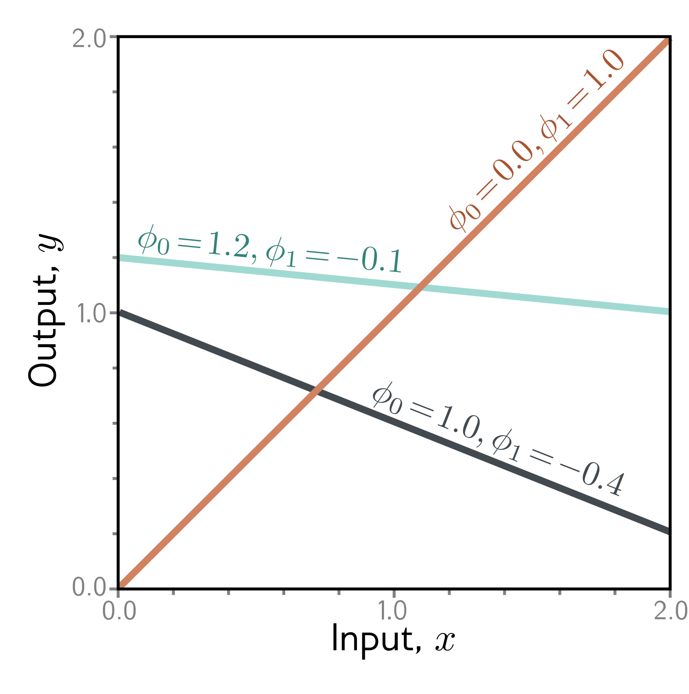

  

  <strong>Figure 2.1</strong> Linear regression model. For a given choice of parameters $\phi=[\phi_0,\phi_1]$, the model makes a prediction for the output (y-axis) based on the input (x-axis). Different choices for the y-intercept $\phi_0$ and the slope $\phi_1$ change these predictions (cyan, orange, and gray lines). The linear regression model (equation 2.4) defines a family of input/output relations (lines) and the parameters determine the member of the family (the particular line). (Interactive figure)

This model has two parameters $\phi=[\phi_0,\phi_1]$, where $\phi_0$ is the y-intercept of the line and $\phi_1$ is the slope. Different choices for the y-intercept and slope result in different relations between input and output (figure 2.1). Hence, equation 2.4 defines a family of possible input-output relations (all possible lines), and the choice of parameters determines the member of this family (the particular line).

## 2.2.2 Loss

For this model, the training dataset (figure 2.2a) consists of $I$ input/output pairs $\lbrace x_i,y_i\rbrace$. Figures 2.2b-d show three lines defined by three sets of parameters. The green line in figure 2.2d describes the data more accurately than the other two since it is much closer to the data points. However, we need a principled approach for deciding which parameters $\phi$ are better than others. To this end, we assign a numerical value to each choice of parameters that quantifies the degree of mismatch between the model and the data. We term this value the loss; a lower loss means a better fit.

The mismatch is captured by the deviation between the model predictions $f[x_i,\phi]$ (height of the line at $x_i$) and the ground truth outputs $y_i$. These deviations are depicted as orange dashed lines in figures 2.2b-d. We quantify the total mismatch, training error, or loss as the sum of the squares of these deviations for all $I$ training pairs:

$$
\begin{aligned}
L[\phi] &= \sum_{i=1}^{I}\left(f[x_i,\phi]-y_i\right)^2\\
&= \sum_{i=1}^{I}\left(\phi_0+\phi_1x_i-y_i\right)^2.
\end{aligned}
\quad (2.5)
$$

Since the best parameters minimize this expression, we call this a least-squares loss. The squaring operation means that the direction of the deviation (i.e., whether the line is
