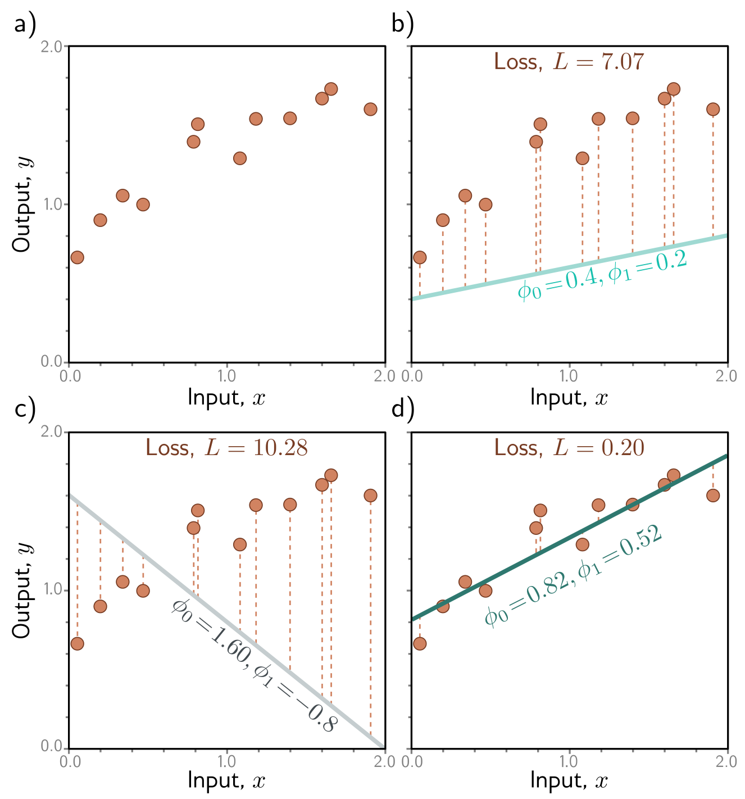

**Figure 1** — Figure 2.2 Linear regression training data, model, and loss. — Labels: b), c), d)

b)

c)

d)

Figure 2.2 Linear regression training data, model, and loss. a) The training data (orange points) consist of I = 12 input/output pairs  \( \{x_{i}, y_{i}\} \) . b–d) Each panel shows the linear regression model with different parameters. Depending on the choice of y-intercept and slope parameters  \( \phi = [\phi_{0}, \phi_{1}] \) , the model errors (orange dashed lines) may be larger or smaller. The loss L is the sum of the squares of these errors. The parameters that define the lines in panels (b) and (c) have large losses L = 7.07 and L = 10.28, respectively because the models fit badly. The loss L = 0.20 in panel (d) is smaller because the model fits well; in fact, this has the smallest loss of all possible lines, so these are the optimal parameters. (Interactive figure)
