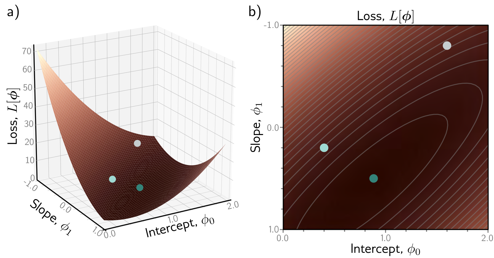

**Figure 1** — Figure 2.3 Loss function for linear regression model with the dataset in figure 2.2a. — Labels: b)

b)

Figure 2.3 Loss function for linear regression model with the dataset in figure 2.2a. a) Each combination of parameters \(\phi = [\phi_{0}, \phi_{1}]\) has an associated loss. The resulting loss function \(L[\phi]\) can be visualized as a surface. The three circles represent the lines from figure 2.2b–d. b) The loss can also be visualized as a heatmap, where brighter regions represent larger losses; here we are looking straight down at the surface in (a) from above and gray ellipses represent isocontours. The best fitting line (figure 2.2d) has the parameters with the smallest loss (green circle).

above or below the data) is unimportant. There are also theoretical reasons for this choice which we return to in chapter 5.

The loss L is a function of the parameters  \( \phi \) ; it will be larger when the model fit is poor (figure 2.2b,c) and smaller when it is good (figure 2.2d). Considered in this light, we term  \( L[\phi] \)  the loss function or cost function. The goal is to find the parameters  \( \hat{\phi} \)  that minimize this quantity:

\[ \begin{align*}\hat{\phi}&=\quad\underset{\phi}{\operatorname{argmin}}\left[L[\phi]\right]\\&=\quad\underset{\phi}{\operatorname{argmin}}\left[\sum_{i=1}^{I}\left(f[x_{i},\phi]-y_{i}\right)^{2}\right]\\&=\quad\underset{\phi}{\operatorname{argmin}}\left[\sum_{i=1}^{I}\left(\phi_{0}+\phi_{1}x_{i}-y_{i}\right)^{2}\right].\end{align*} \quad (2.6) \]

There are only two parameters (the y-intercept \(\phi_{0}\) and slope \(\phi_{1}\)), so we can calculate the loss for every combination of values and visualize the loss function as a surface (figure 2.3). The “best” parameters are at the minimum of this surface.

Notebook 2.1
Supervised learning
