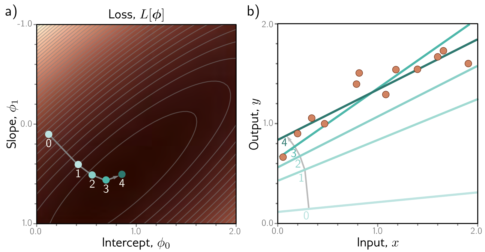

**Figure 1** — Figure 2.4 Linear regression training. — Labels: b)

b)

Figure 2.4 Linear regression training. The goal is to find the y-intercept and slope parameters that correspond to the smallest loss. a) Iterative training algorithms initialize the parameters randomly and then improve them by “walking downhill” until no further improvement can be made. Here, we start at position 0 and move a certain distance downhill (perpendicular to the contours) to position 1. Then we re-calculate the downhill direction and move to position 2. Eventually, we reach the minimum of the function (position 4). b) Each position 0–4 from panel (a) corresponds to a different y-intercept and slope and so represents a different line. As the loss decreases, the lines fit the data more closely. (Interactive figure)

## Notes

Loss functions vs. cost functions: In much of machine learning and in this book, the terms loss function and cost function are used interchangeably. However, more properly, a loss function is the individual term associated with a data point (i.e., each of the squared terms on the right-hand side of equation 2.5), and the cost function is the overall quantity that is minimized (i.e., the entire right-hand side of equation 2.5). A cost function can contain additional terms that are not associated with individual data points (see section 9.1). More generally, an objective function is any function that is to be maximized or minimized.

Generative vs. discriminative models: The models  \( y = f[x, \phi] \)  in this chapter are discriminative models. These make an output prediction y from real-world measurements x. Another approach is to build a generative model  \( x = g[y, \phi] \) , in which the real-world measurements x are computed as a function of the output y.

The generative approach has the disadvantage that it doesn’t directly predict y. To perform inference, we must invert the generative equation as  \( \mathbf{y} = g^{-1}[x, \phi] \) , and this may be difficult. However, generative models have the advantage that we can build in prior knowledge about how the data were created. For example, if we wanted to predict the 3D position and orientation y
