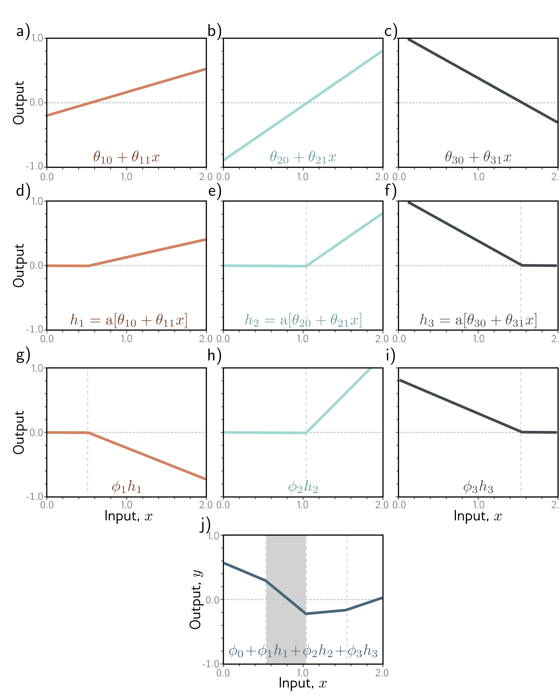

  

  <strong>Figure 3.3</strong> Computation for function in figure 3.2a. a-c) The input $x$ is passed through three linear functions, each with a different $y$-intercept $\theta\_0$ and slope $\theta\_1$. d-f) Each line is passed through the ReLU activation function, which clips negative values to zero. g-i) The three clipped lines are then weighted (scaled) by $\phi\_1$, $\phi\_2$, and $\phi\_3$, respectively. j) Finally, the clipped and weighted functions are summed, and an offset $\phi\_0$ that controls the height is added. Each of the four linear regions corresponds to a different activation pattern in the hidden units. In the shaded region, $h\_2$ is inactive (clipped), but $h\_1$ and $h\_3$ are both active. (Interactive figure)

