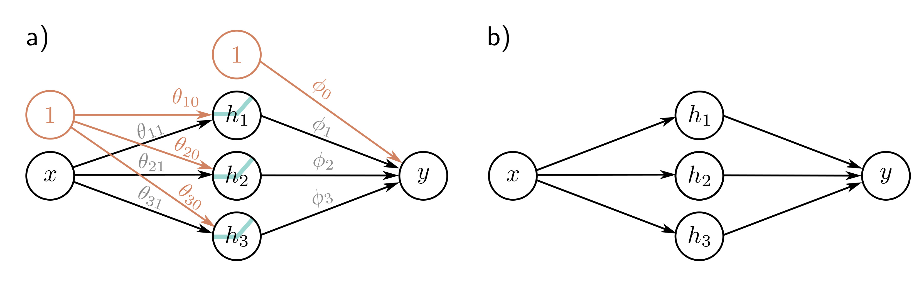

  

  <strong>Figure 3.4</strong> Depicting neural networks. a) The input \(x\) is on the left, the hidden units \(h_1\), \(h_2\), and \(h_3\) in the center, and the output \(y\) on the right. Computation flows from left to right. The input is used to compute the hidden units, which are combined to create the output. Each of the ten arrows represents a parameter (intercepts in orange and slopes in black). Each parameter multiplies its source and adds the result to its target. For example, we multiply the parameter \(\phi_1\) by source \(h_1\) and add it to \(y\). We introduce additional nodes containing ones (orange circles) to incorporate the offsets into this scheme, so we multiply \(\phi_0\) by one (with no effect) and add it to \(y\). ReLU functions are applied at the hidden units. b) More typically, the intercepts, ReLU functions, and parameter names are omitted; this simpler depiction represents the same network.

## 3.2 Universal approximation theorem

In the previous section, we introduced an example neural network with one input, one output, ReLU activation functions, and three hidden units. Let's now generalize this slightly and consider the case with \(D\) hidden units where the \(d^{\mathrm{th}}\) hidden unit is:

\[
h_d=a[\theta_{d0}+\theta_{d1}x],
\tag{3.5}
\]

and these are combined linearly to create the output:

\[
y=\phi_0+\sum_{d=1}^{D}\phi_d h_d.
\tag{3.6}
\]

The number of hidden units in a shallow network is a measure of the network capacity. With ReLU activation functions, the output of a network with \(D\) hidden units has at most \(D\) joints and so is a piecewise linear function with at most \(D+1\) linear regions. As we add more hidden units, the model can approximate more complex functions.

Indeed, with enough capacity (hidden units), a shallow network can describe any continuous 1D function defined on a compact subset of the real line to arbitrary precision. To see this, consider that every time we add a hidden unit, we add another linear region to the function. As these regions become more numerous, they represent smaller sections of the function, which are increasingly well approximated by a line (figure 3.5). The universal approximation theorem proves that for any continuous function, there exists a shallow network that can approximate this function to any specified precision.
