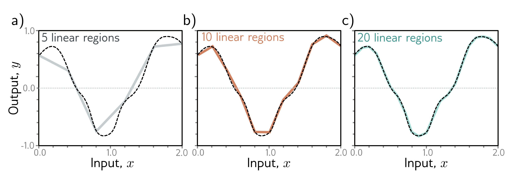

  

  <strong>Figure 3.5</strong> Approximation of a 1D function (dashed line) by a piecewise linear model. a-c) As the number of regions increases, the model becomes closer and closer to the continuous function. A neural network with a scalar input creates one extra linear region per hidden unit. This idea generalizes to functions in $D\_i$ dimensions. The universal approximation theorem proves that, with enough hidden units, there exists a shallow neural network that can describe any given continuous function defined on a compact subset of $\mathbb{R}^{D\_i}$ to arbitrary precision.

## 3.3 Multivariate inputs and outputs

In the above example, the network has a single scalar input $x$ and a single scalar output $y$. However, the universal approximation theorem also holds for the more general case where the network maps multivariate inputs $\mathbf{x}=[x\_1,x\_2,\ldots,x\_{D\_i}]^T$ to multivariate output predictions $\mathbf{y}=[y\_1,y\_2,\ldots,y\_{D\_o}]^T$. We first explore how to extend the model to predict multivariate outputs. Then we consider multivariate inputs. Finally, in section 3.4, we present a general definition of a shallow neural network.

## 3.3.1 Visualizing multivariate outputs

To extend the network to multivariate outputs $\mathbf{y}$, we simply use a different linear function of the hidden units for each output. So, a network with a scalar input $x$, four hidden units $h\_1$, $h\_2$, $h\_3$, and $h\_4$, and a 2D multivariate output $\mathbf{y}=[y\_1,y\_2]^T$ would be defined as:

$$
\begin{aligned}
h_1 &= a[\theta_{10}+\theta_{11}x]\\
h_2 &= a[\theta_{20}+\theta_{21}x]\\
h_3 &= a[\theta_{30}+\theta_{31}x]\\
h_4 &= a[\theta_{40}+\theta_{41}x],
\end{aligned} \quad (3.7)
$$

and
