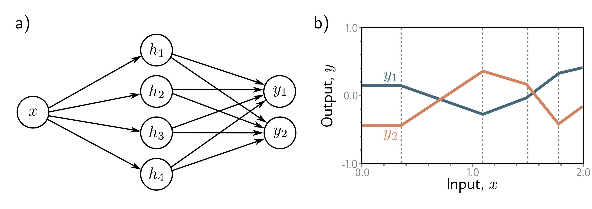
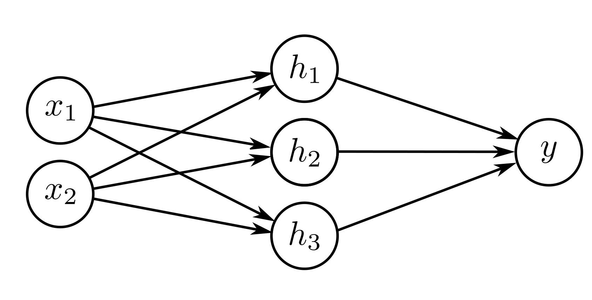

  

  <strong>Figure 3.6</strong> Network with one input, four hidden units, and two outputs. a) Visualization of network structure. b) This network produces two piecewise linear functions, $y\_1[x]$ and $y\_2[x]$. The four "joints" of these functions (at vertical dotted lines) are constrained to be in the same places since they share the same hidden units, but the slopes and overall height may differ.

  

  <strong>Figure 3.7</strong> Visualization of neural network with 2D multivariate input $\mathbf{x}=[x\_1,x\_2]^T$ and scalar output $y$.

$$
\begin{aligned}
y_1 &= \phi_{10}+\phi_{11}h_1+\phi_{12}h_2+\phi_{13}h_3+\phi_{14}h_4\\
y_2 &= \phi_{20}+\phi_{21}h_1+\phi_{22}h_2+\phi_{23}h_3+\phi_{24}h_4.
\end{aligned} \quad (3.8)
$$

The two outputs are two different linear functions of the hidden units.

As we saw in figure 3.3, the "joints" in the piecewise functions depend on where the initial linear functions $\theta\_{\bullet0}+\theta\_{\bullet1}x$ are clipped by the ReLU functions $a[\bullet]$ at the hidden units. Since both outputs $y\_1$ and $y\_2$ are different linear functions of the same four hidden units, the four "joints" in each must be in the same places. However, the slopes of the linear regions and the overall vertical offset can differ (figure 3.6).

## 3.3.2 Visualizing multivariate inputs

To cope with multivariate inputs $\mathbf{x}$, we extend the linear relations between the input and the hidden units. So a network with two inputs $\mathbf{x}=[x\_1,x\_2]^T$ and a scalar output $y$ (figure 3.7) might have three hidden units defined by:
