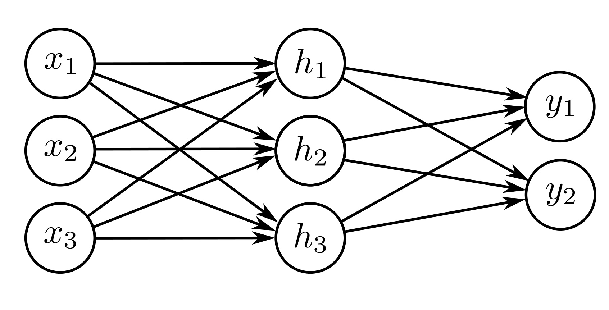

  

  <strong>Figure 3.11</strong> Visualization of neural network with three inputs and two outputs. This network has twenty parameters. There are fifteen slopes (indicated by arrows) and five offsets (not shown).

$$
\begin{aligned}
y_j &= \phi_{j0}+\sum_{d=1}^{D}\phi_{jd}h_d,
\end{aligned} \quad (3.12)
$$

where $a[\bullet]$ is a nonlinear activation function. The model has parameters $\boldsymbol{\phi}=\lbrace \theta_{\bullet\bullet},\phi_{\bullet\bullet}\rbrace$. Figure 3.11 shows an example with three inputs, three hidden units, and two outputs.

The activation function permits the model to describe nonlinear relations between input and the output, and as such, it must be nonlinear itself; with no activation function, or a linear activation function, the overall mapping from input to output would be restricted to be linear. Many different activation functions have been tried (see figure 3.13), but the most common choice is the ReLU (figure 3.1), which has the merit of being easily interpretable. With ReLU activations, the network divides the input space into convex polytopes defined by the intersections of hyperplanes computed by the "joints" in the ReLU functions. Each convex polytope contains a different linear function. The polytopes are the same for each output, but the linear functions they contain can differ.

## 3.5 Terminology

We conclude this chapter by introducing some terminology. Regrettably, neural networks have a lot of associated jargon. They are often referred to in terms of layers. The left of figure 3.12 is the input layer, the center is the hidden layer, and to the right is the output layer. We would say that the network in figure 3.12 has one hidden layer containing four hidden units. The hidden units themselves are sometimes referred to as neurons. When we pass data through the network, the values of the inputs to the hidden layer (i.e., before the ReLU functions are applied) are termed pre-activations. The values at the hidden layer (i.e., after the ReLU functions) are termed activations.

For historical reasons, any neural network with at least one hidden layer is also called a multi-layer perceptron, or MLP for short. Networks with one hidden layer (as described in this chapter) are sometimes referred to as shallow neural networks. Networks with multiple hidden layers (as described in the next chapter) are referred to as deep neural networks. Neural networks in which the connections form an acyclic graph (i.e., a graph with no loops, as in all the examples in this chapter) are referred to as feed-forward networks. If every element in one layer connects to every element in the next (as in all the examples in this chapter), the network is fully connected. These connections
