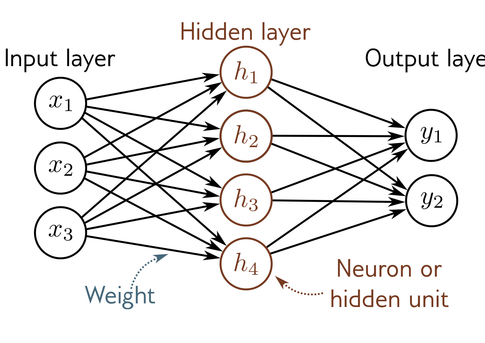

  

  <strong>Figure 3.12</strong> Terminology. A shallow network consists of an input layer, a hidden layer, and an output layer. Each layer is connected to the next by forward connections (arrows). For this reason, these models are referred to as feed-forward networks. When every variable in one layer connects to every variable in the next, we call this a fully connected network. Each connection represents a slope parameter in the underlying equation, and these parameters are termed weights. The variables in the hidden layer are termed neurons or hidden units. The values feeding into the hidden units are termed pre-activations, and the values at the hidden units (i.e., after the ReLU function is applied) are termed activations.

represent slope parameters in the underlying equations and are referred to as network weights. The offset parameters (not shown in figure 3.12) are called biases.

## 3.6 Summary

Shallow neural networks have one hidden layer. They (i) compute several linear functions of the input, (ii) pass each result through an activation function, and then (iii) take a linear combination of these activations to form the outputs. Shallow neural networks make predictions $\mathbf{y}$ based on inputs $\mathbf{x}$ by dividing the input space into a continuous surface of piecewise linear regions. With enough hidden units (neurons), shallow neural networks can approximate any continuous function to arbitrary precision.

Chapter 4 discusses deep neural networks, which extend the models from this chapter by adding more hidden layers. Chapters 5-7 describe how to train these models.

## Notes

**"Neural" networks:** If the models in this chapter are just functions, why are they called "neural networks"? The connection is, unfortunately, tenuous. Visualizations like figure 3.12 consist of nodes (inputs, hidden units, and outputs) that are densely connected to one another. This bears a superficial similarity to neurons in the mammalian brain, which also have dense connections. However, there is scant evidence that brain computation works in the same way as neural networks, and it is unhelpful to think about biology going forward.
