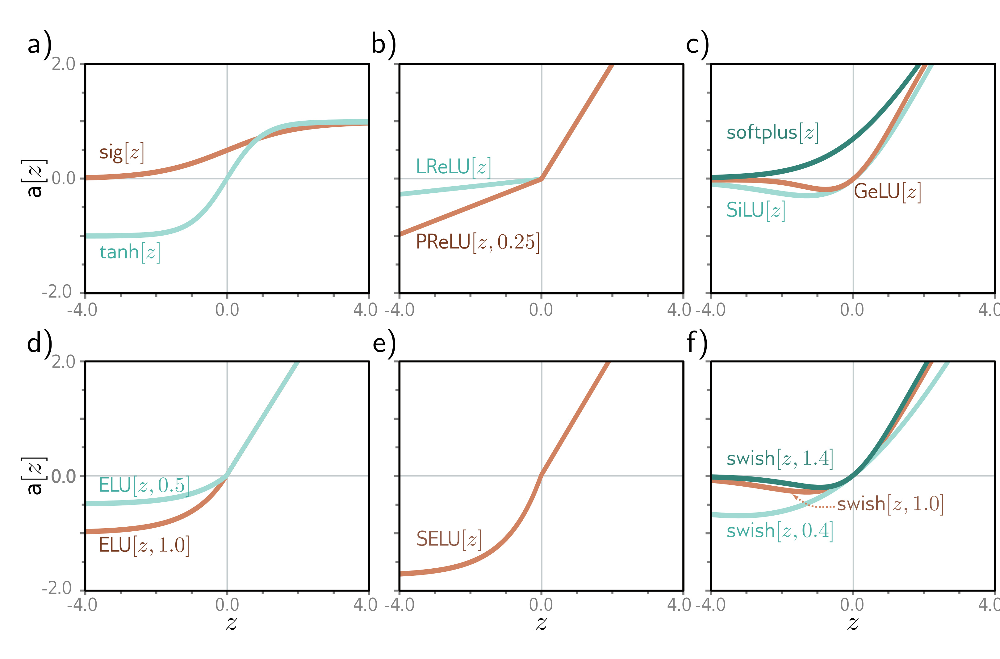

  

  <strong>Figure 3.13</strong> Activation functions. a) Logistic sigmoid and tanh functions. b) Leaky ReLU and parametric ReLU with parameter 0.25. c) SoftPlus, Gaussian error linear unit, and sigmoid linear unit. d) Exponential linear unit with parameters 0.5 and 1.0. e) Scaled exponential linear unit. f) Swish with parameters 0.4, 1.0, and 1.4.

**History of neural networks:** McCulloch & Pitts (1943) first came up with the notion of an artificial neuron that combined inputs to produce an output, but this model did not have a practical learning algorithm. Rosenblatt (1958) developed the perceptron, which linearly combined inputs and then thresholded them to make a yes/no decision. He also provided an algorithm to learn the weights from data. Minsky & Papert (1969) argued that the linear function was inadequate for general classification problems but that adding hidden layers with nonlinear activation functions (hence the term multi-layer perceptron) could allow the learning of more general input/output relations. However, they concluded that Rosenblatt's algorithm could not learn the parameters of such models. It was not until the 1980s that a practical algorithm (backpropagation, see chapter 7) was developed, and significant work on neural networks resumed. The history of neural networks is chronicled by Kurenkov (2020), Sejnowski (2018), and Schmidhuber (2022).

**Activation functions:** The ReLU function has been used as far back as Fukushima (1969). However, in the early days of neural networks, it was more common to use the logistic sigmoid or tanh activation functions (figure 3.13a). The ReLU was re-popularized by Jarrett et al. (2009), Nair & Hinton (2010), and Glorot et al. (2011) and is an important part of the success story of modern neural networks. It has the nice property that the derivative of the output with respect to the input is always one for inputs greater than zero. This contributes to the stability and efficiency of training (see chapter 7) and contrasts with the derivatives of sigmoid activation
