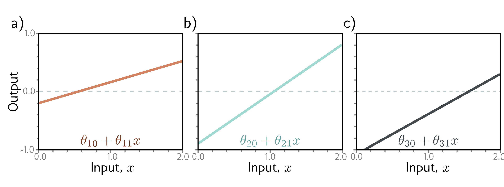

**Linear, affine, and nonlinear functions:** Technically, a linear transformation $f[\bullet]$ is any function that obeys the principle of superposition, so $f[a+b]=f[a]+f[b]$. This definition implies that $f[2a]=2f[a]$. The weighted sum $f[h_1,h_2,h_3]=\phi_1h_1+\phi_2h_2+\phi_3h_3$ is linear, but once the offset (bias) is added so $f[h_1,h_2,h_3]=\phi_0+\phi_1h_1+\phi_2h_2+\phi_3h_3$, this is no longer true. To see this, consider that the output is doubled when we double the arguments of the former function. This is not the case for the latter function, which is more properly termed an affine function. However, it is common in machine learning to conflate these terms. We follow this convention in this book and refer to both as linear. All other functions we will encounter are nonlinear.

## Problems

**Problem 3.1** What kind of mapping from input to output would be created if the activation function in equation 3.1 was linear so that $a[z]=\psi_0+\psi_1z$? What kind of mapping would be created if the activation function was removed, so $a[z]=z$?

**Problem 3.2** For each of the four linear regions in figure 3.3j, indicate which hidden units are inactive and which are active (i.e., which do and do not clip their inputs).

**Problem 3.3*** Derive expressions for the positions of the "joints" in function in figure 3.3j in terms of the ten parameters $\boldsymbol{\phi}$ and the input $x$. Derive expressions for the slopes of the four linear regions.

**Problem 3.4** Draw a version of figure 3.3 where the $y$-intercept and slope of the third hidden unit have changed as in figure 3.14c. Assume that the remaining parameters remain the same.

  

  <strong>Figure 3.14</strong> Processing in network with one input, three hidden units, and one output for problem 3.4. a-c) The input to each hidden unit is a linear function of the inputs. The first two are the same as in figure 3.3, but the last one differs.

**Problem 3.5** Prove that the following property holds for $\alpha\in\mathbb{R}^{+}$:

$$
\mathrm{ReLU}[\alpha\cdot z]=\alpha\cdot\mathrm{ReLU}[z].
\tag{3.14}
$$

This is known as the non-negative homogeneity property of the ReLU function.
