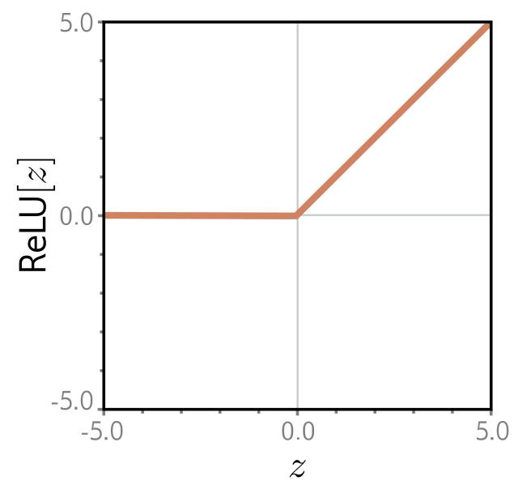
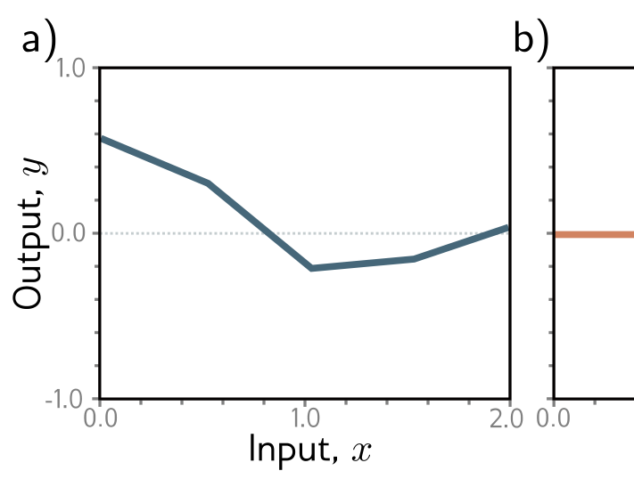
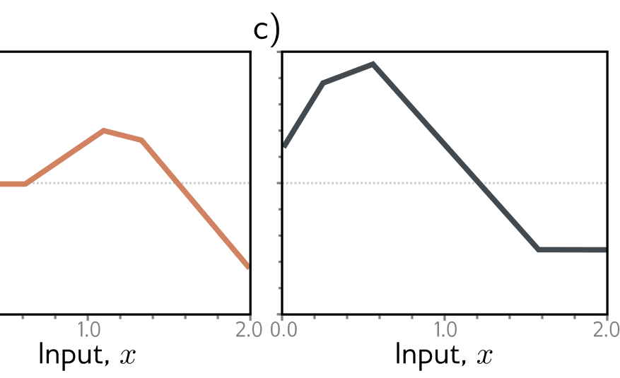

Figure 3.1 Rectified linear unit (ReLU). This activation function returns zero if the input is less than zero and returns the input unchanged otherwise. In other words, it clips negative values to zero. Note that there are many other possible choices for the activation function (see figure 3.13), but the ReLU is the most commonly used and the easiest to understand.

**Figure 1** — Labels: c)

a)

**Figure 2** — Figure 3.2 Family of functions defined by equation 3.1. — Labels: a), b)

b)

**Figure 3** — Figure 3.2 Family of functions defined by equation 3.1. — Labels: c)

c)

Figure 3.2 Family of functions defined by equation 3.1. a–c) Functions for three different choices of the ten parameters \(\phi\). In each case, the input/output relation is piecewise linear. However, the positions of the joints, the slopes of the linear regions between them, and the overall height vary.

depends on the ten parameters in  \( \phi \) . If we know these parameters, we can perform inference (predict y) by evaluating the equation for a given input x. Given a training dataset  \( \{x_{i}, y_{i}\}_{i=1}^{I} \) , we can define a least squares loss function  \( L[\phi] \)  and use this to measure how effectively the model describes this dataset for any given parameter values  \( \phi \) . To train the model, we search for the values  \( \hat{\phi} \)  that minimize this loss.

## 3.1.1 Neural network intuition

In fact, equation 3.1 represents a family of continuous piecewise linear functions (figure 3.2) with up to four linear regions. We now break down equation 3.1 and show why it describes this family. To make this easier to understand, we split the function into two parts. First, we introduce the intermediate quantities:
