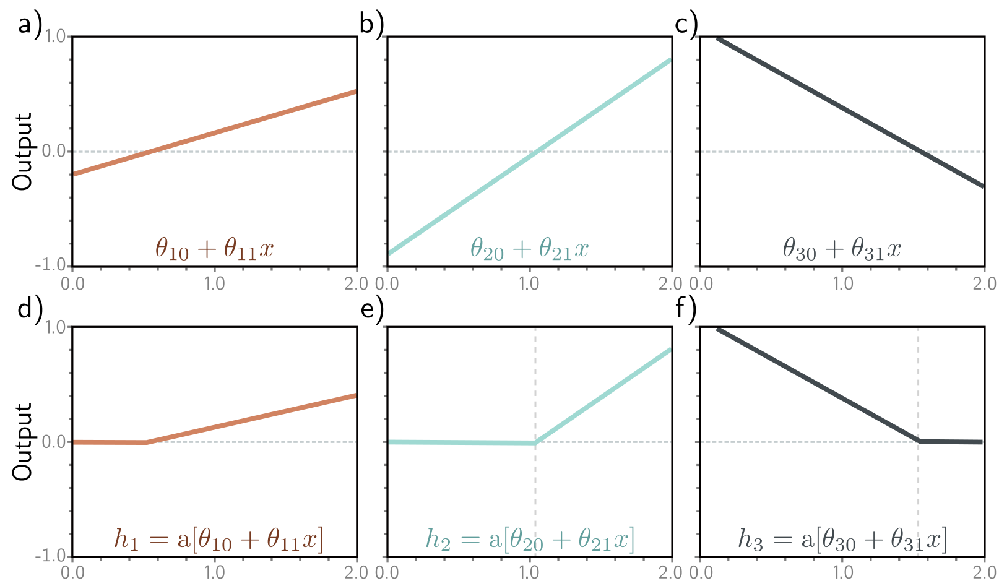
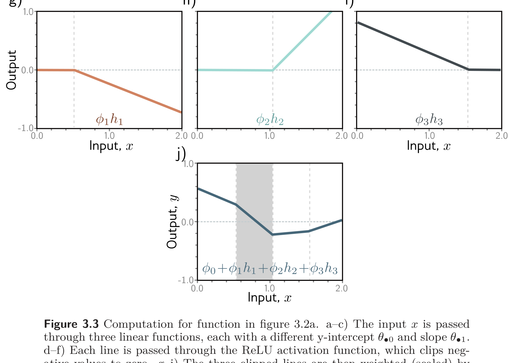

**Figure 1** — Labels: e), f), d), g), h), i)

e)

f)

d)

e)

f)

g)

**Figure 2** — Figure 3.3 Computation for function in figure 3.2a. — Labels: g), j)

h)

i)

g)

j)

Figure 3.3 Computation for function in figure 3.2a. a–c) The input x is passed through three linear functions, each with a different y-intercept  \( \theta_{0} \)  and slope  \( \theta_{1} \) . d–f) Each line is passed through the ReLU activation function, which clips negative values to zero. g–i) The three clipped lines are then weighted (scaled) by  \( \phi_{1} \) ,  \( \phi_{2} \) , and  \( \phi_{3} \) , respectively. j) Finally, the clipped and weighted functions are summed, and an offset  \( \phi_{0} \)  that controls the height is added. Each of the four linear regions corresponds to a different activation pattern in the hidden units. In the shaded region,  \( h_{2} \)  is inactive (clipped), but  \( h_{1} \)  and  \( h_{3} \)  are both active. (Interactive figure)

This work is subject to a Creative Commons CC-BY-NC-ND license. (C) MIT Press.
