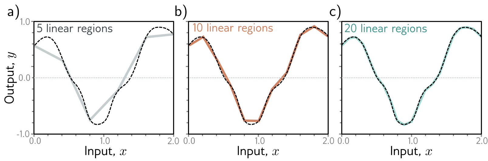

**Figure 1** — Figure 3.5 Approximation of a 1D function (dashed line) by a piecewise linear model. — Labels: b), c)

b)

c)

Figure 3.5 Approximation of a 1D function (dashed line) by a piecewise linear model. a–c) As the number of regions increases, the model becomes closer and closer to the continuous function. A neural network with a scalar input creates one extra linear region per hidden unit. This idea generalizes to functions in  \( D_{i} \)  dimensions. The universal approximation theorem proves that, with enough hidden units, there exists a shallow neural network that can describe any given continuous function defined on a compact subset of  \( R^{D_{i}} \)  to arbitrary precision.

## 3.3 Multivariate inputs and outputs

In the above example, the network has a single scalar input x and a single scalar output y. However, the universal approximation theorem also holds for the more general case where the network maps multivariate inputs  \( \mathbf{x} = [x_{1}, x_{2}, \ldots, x_{D_{i}}]^{T} \)  to multivariate output predictions  \( \mathbf{y} = [y_{1}, y_{2}, \ldots, y_{D_{\circ}}]^{T} \) . We first explore how to extend the model to predict multivariate outputs. Then we consider multivariate inputs. Finally, in section 3.4, we present a general definition of a shallow neural network.

## 3.3.1 Visualizing multivariate outputs

To extend the network to multivariate outputs y, we simply use a different linear function of the hidden units for each output. So, a network with a scalar input x, four hidden units  \( h_{1}, h_{2}, h_{3} \) , and  \( h_{4} \) , and a 2D multivariate output  \( \mathbf{y} = [y_{1}, y_{2}]^{T} \)  would be defined as:

\[ \begin{array}{rcl}h_{1}&=&a[\theta_{10}+\theta_{11}x]\\h_{2}&=&a[\theta_{20}+\theta_{21}x]\\h_{3}&=&a[\theta_{30}+\theta_{31}x]\\h_{4}&=&a[\theta_{40}+\theta_{41}x],\end{array} \quad (3.7) \]

and
