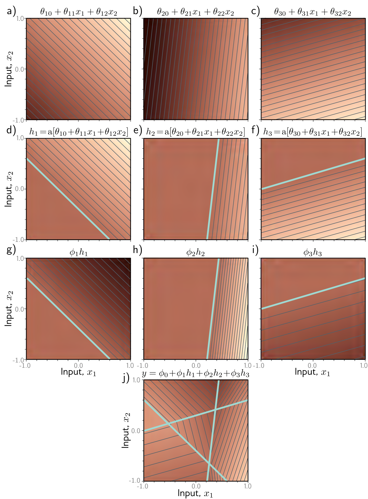

**Figure 1** — Figure 3.8 Processing in network with two inputs \(\mathbf{x} = [x_1, x_2]^T\), three hidden units \(h_1, h_2, h_3\), and one output \(y\).

Figure 3.8 Processing in network with two inputs \(\mathbf{x} = [x_1, x_2]^T\), three hidden units \(h_1, h_2, h_3\), and one output \(y\). a–c) The input to each hidden unit is a linear function of the two inputs, which corresponds to an oriented plane. Brightness indicates function output. For example, in panel (a), the brightness represents \(\theta_{10} + \theta_{11}x_1 + \theta_{12}x_2\). Thin lines are contours. d–f) Each plane is clipped by the ReLU activation function (cyan lines are equivalent to “joints” in figures 3.3d–f). g-i) The clipped planes are then weighted, and j) summed together with an offset that determines the overall height of the surface. The result is a continuous surface made up of convex piecewise linear polygonal regions. (Interactive figure)
