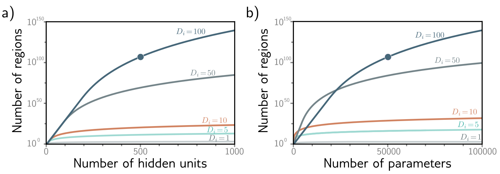
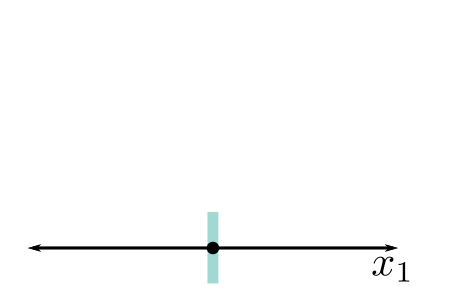
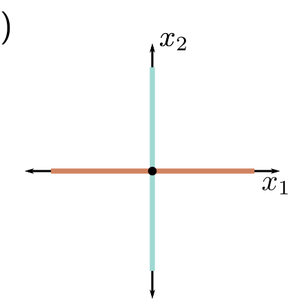
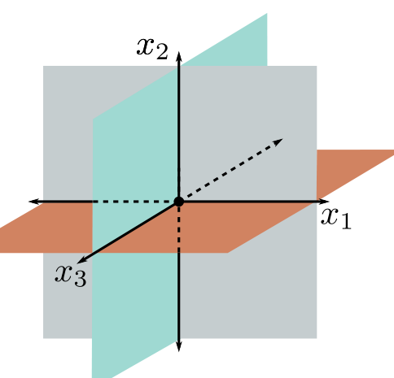

**Figure 1** — Figure 3.9 Linear regions vs. — Labels: b)

b)

Figure 3.9 Linear regions vs. hidden units. a) Maximum possible regions as a function of the number of hidden units for five different input dimensions  \( D_{i} = \{1, 5, 10, 50, 100\} \) . The number of regions increases rapidly in high dimensions; with D = 500 units and input size  \( D_{i} = 100 \) , there can be greater than  \( 10^{107} \)  regions (solid circle). b) The same data are plotted as a function of the number of parameters. The solid circle represents the same model as in panel (a) with D = 500 hidden units. This network has 51,001 parameters and would be considered very small by modern standards.

**Figure 2** — Figure 3.9 Linear regions vs.

b)

**Figure 3** — Figure 3.9 Linear regions vs.

c)

**Figure 4**

Figure 3.10 Number of linear regions vs. input dimensions. a) With a single input dimension, a model with one hidden unit creates one joint, which divides the axis into two linear regions. b) With two input dimensions, a model with two hidden units can divide the input space using two lines (here aligned with axes) to create four regions. c) With three input dimensions, a model with three hidden units can divide the input space using three planes (again aligned with axes) to create eight regions. Continuing this argument, it follows that a model with  \( D_{i} \)  input dimensions and  \( D_{i} \)  hidden units can divide the input space with  \( D_{i} \)  hyperplanes to create  \( 2^{D_{i}} \)  linear regions.
