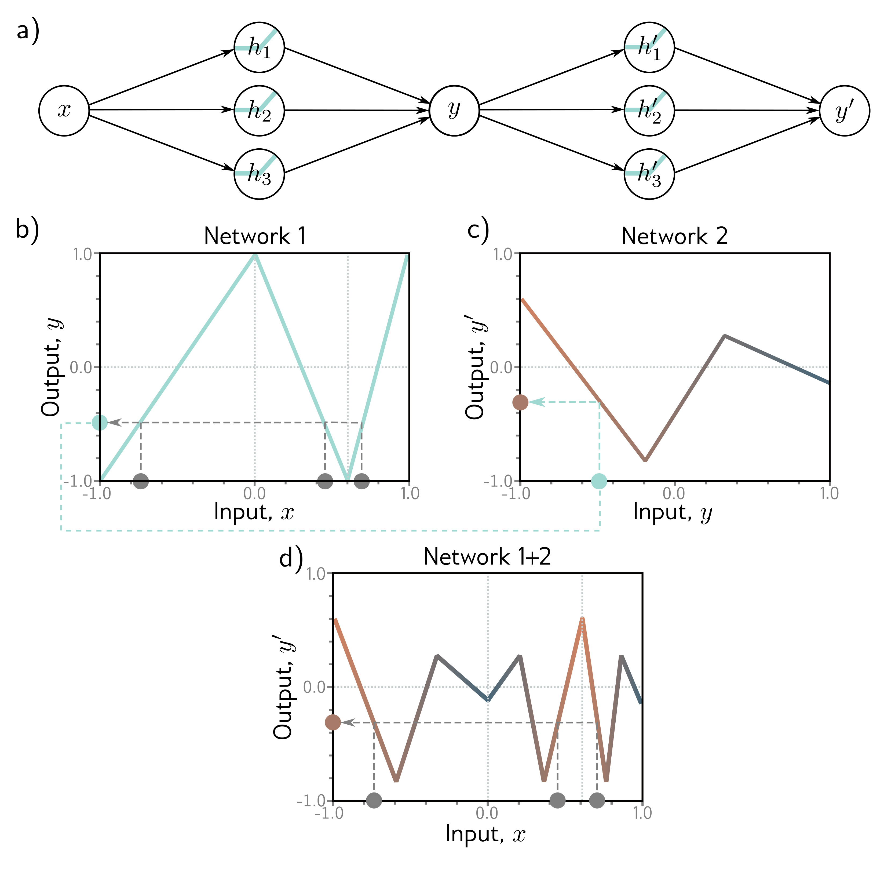

  

  <strong>Figure 4.1</strong> Composing two single-layer networks with three hidden units each. a) The output y of the first network constitutes the input to the second network. b) The first network maps inputs $ x \in [-1, 1]$ to outputs $ y \in [-1, 1]$ using a function comprising three linear regions that are chosen so that they alternate the sign of their slope (fourth linear region is outside range of graph). Multiple inputs x (gray circles) now map to the same output y (cyan circle). c) The second network defines a function comprising three linear regions that takes y and returns y′ (i.e., the cyan circle is mapped to the brown circle). d) The combined effect of these two functions when composed is that (i) three different inputs x are mapped to any given value of y by the first network and (ii) are processed in the same way by the second network; the result is that the function defined by the second network in panel (c) is duplicated three times, variously flipped and rescaled according to the slope of the regions of panel (b)

