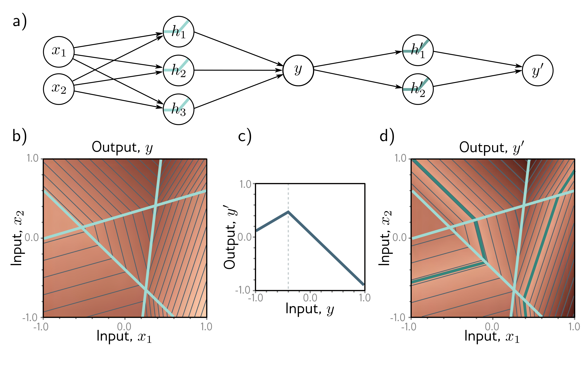
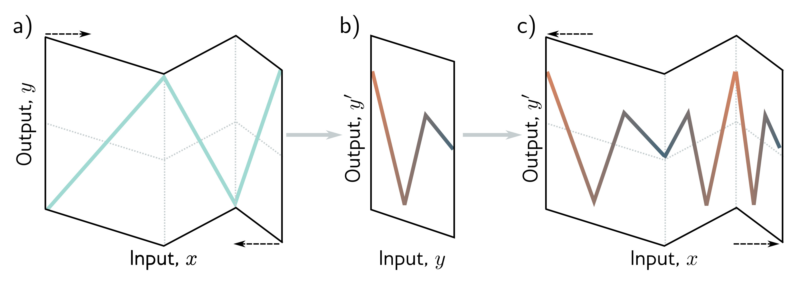

  

  <strong>Figure 4.2</strong> Composing neural networks with a 2D input. a) The first network (from figure 3.8) has three hidden units and takes two inputs x1 and x2 and returns a scalar output y. This is passed into a second network with two hidden units to produce y′. b) The first network produces a function consisting of seven linear regions, one of which is flat. c) The second network defines a function comprising two linear regions in $ y \in [-1, 1]$. d) When these networks are composed, each of the six non-flat regions from the first network is divided into two new regions by the second network to create a total of 13 linear regions

  

  <strong>Figure 4.3</strong> Deep networks as folding input space. a) One way to think about the first network from figure 4.1 is that it "folds" the input space back on top of itself. b) The second network applies its function to the folded space. c) The final output is revealed by "unfolding" again

Figure 4.2: Composing neural networks with a 2D input. a) The first network (from figure 3.8) has three hidden units and takes two inputs $ x\_{1}$ and $ x\_{2}$ and returns a scalar output $ y $. This is passed into a second network with two hidden units to produce $ y'$. b) The first network produces a function consisting of seven linear regions, one of which is flat. c) The second network defines a function comprising two linear regions in $ y \in [-1, 1]$. d) When these networks are composed, each of the six non-flat regions from the first network is divided into two new regions by the second network to create a total of 13 linear regions.
