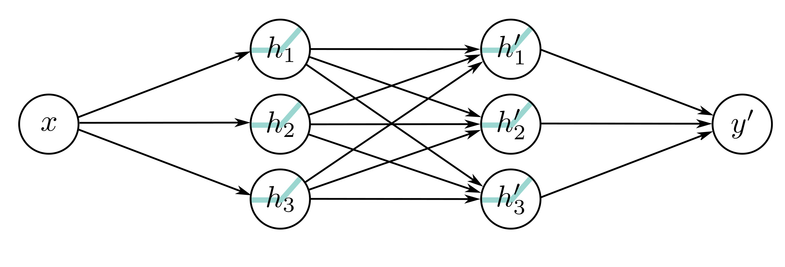

  

  <strong>Figure 4.4</strong> Neural network with one input, one output, and two hidden layers, each containing three hidden units.

where $\psi_{10} = \theta'_{10} + \theta'_{11}\phi_0$, $\psi_{12} = \theta'_{11}\phi_2$ and so on. The result is a network with two hidden layers (figure 4.4).

It follows that a network with two layers can represent the family of functions created by passing the output of one single-layer network into another. In fact, it represents a broader family because in equation 4.6, the nine slope parameters $\psi_{11}, \psi_{21}, \ldots, \psi_{33}$ can take arbitrary values, whereas in equation 4.5, these parameters are constrained to be the outer product $\left[\theta'_{11}, \theta'_{21}, \theta'_{31}\right]^{T}[\phi_1, \phi_2, \phi_3]$.

## 4.3 Deep neural networks

In the previous section, we showed that composing two shallow networks yields a special case of a deep network with two hidden layers. Now we consider the general case of a deep network with two hidden layers, each containing three hidden units (figure 4.4). The first layer is defined by:

$$
\begin{aligned}
\begin{array}{rcl}h_{1}&=&a[\theta_{10}+\theta_{11}x]\\h_{2}&=&a[\theta_{20}+\theta_{21}x]\\h_{3}&=&a[\psi_{30}+\psi_{31}h_{1}+\psi_{32}h_{2}+\psi_{33}h_{3}],\end{array}
\end{aligned}
\tag{4.7}
$$

the second layer by:

$$
\begin{aligned}
\begin{array}{rcl}h_{1}&=&a[\psi_{10}+\psi_{11}h_{1}+\psi_{12}h_{2}+\psi_{13}h_{3}]\\h_{2}&=&a[\psi_{20}+\psi_{21}h_{1}+\psi_{22}h_{2}+\psi_{23}h_{3}]\\h_{3}&=&a[\psi_{30}+\psi_{31}h_{1}+\psi_{32}h_{2}+\psi_{33}h_{3}],\end{array}
\end{aligned}
\tag{4.8}
$$

and the output by:

$$
\begin{aligned}
y^{\prime}=\phi_{0}^{\prime}+\phi_{1}^{\prime}h_{1}^{\prime}+\phi_{2}^{\prime}h_{2}^{\prime}+\phi_{3}^{\prime}h_{3}^{\prime}.
\end{aligned}
\tag{4.9}
$$
