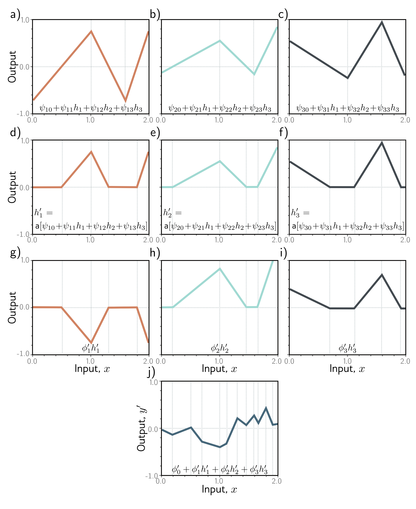

  

  <strong>Figure 4.5</strong> Computation for the deep network in figure 4.4. a-c) The inputs to the second hidden layer (i.e., the pre-activations) are three piecewise linear functions where the "joints" between the linear regions are at the same places (see figure 3.6). d-f) Each piecewise linear function is clipped to zero by the ReLU activation function. g-i) These clipped functions are then weighted with parameters $\phi $′ 1, $\phi $′ 2, and $\phi $′ 3, respectively. j) Finally, the clipped and weighted functions are summed and an offset $\phi $′ 0 that controls the overall height is added

Input, x
