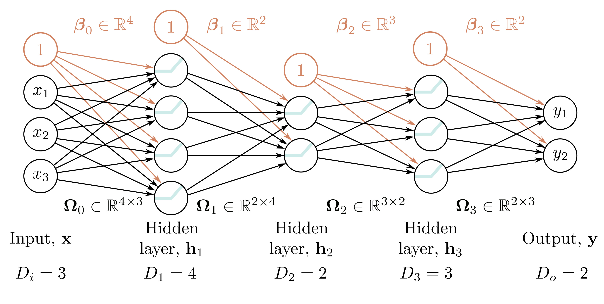

  

  <strong>Figure 4.6</strong> Matrix notation for network with $D_{i}=3$-dimensional input $\mathbf{x}$, $D_{o}=2$-dimensional output $\mathbf{y}$, and $K=3$ hidden layers $\mathbf{h}_{1}, \mathbf{h}_{2}$, and $\mathbf{h}_{3}$ of dimensions $D_{1}=4$, $D_{2}=2$, and $D_{3}=3$ respectively. The weights are stored in matrices $\Omega_{k}$ at the subsequent layer. For example, the bias vector $\beta_{2}$ is length three because layer $\mathbf{h}_{3}$ contains three hidden units.

## 4.4 Matrix notation

We have seen that a deep neural network consists of linear transformations alternating with activation functions. We could equivalently describe equations 4.7–4.9 in matrix notation as:

$$
\begin{aligned}
\begin{bmatrix}h_{1}\\ h_{2}\\ h_{3}\end{bmatrix}=\mathbf{a}\left[\begin{array}{c}{\psi_{10}}\\ {\psi_{20}}\\ {\psi_{30}}\end{array}\right]+\begin{bmatrix}{\phi_{10}}\\ {\phi_{21}}\\ {\phi_{31}}\end{bmatrix}x\left.\begin{array}{c}{\psi_{11}}\\ {\psi_{12}}\\ {\psi_{32}}\end{array}\right], \tag{4.11}
\end{aligned}
$$

$$
\begin{aligned}
\begin{bmatrix}h_{1}^{\prime}\\ h_{2}^{\prime}\\ h_{3}^{\prime}\end{bmatrix}=\mathbf{a}\left[\begin{array}{c}{\psi^{\prime}_{10}}\\ {\psi^{\prime}_{20}}\\ {\psi^{\prime}_{30}}\end{array}\right]+\begin{bmatrix}{\phi_{10}^{\prime}}\\ {\phi^{\prime}_{21}}\\ {\psi^{\prime}_{31}}\end{bmatrix}+\begin{bmatrix}{\theta_{11}^{\prime}}\\ {\theta^{\prime}_{21}}\\ {\psi^{\prime}_{32}}\end{bmatrix}x\left.\begin{array}{c}{\theta_{11}^{\prime}}\\ {\theta^{\prime}_{31}}\end{array}\right], \tag{4.12}
\end{aligned}
$$

and

$$
\begin{aligned}
y^{\prime}=\phi_{0}^{\prime}+\left[\begin{matrix}\psi_{1}^{\prime}&\phi_{2}^{\prime}&\phi_{3}^{\prime}\end{matrix}\right]\begin{bmatrix}h_{1}^{\prime}\\ h_{2}^{\prime}\\ h_{3}^{\prime}\end{bmatrix}, \tag{4.13}
\end{aligned}
$$
