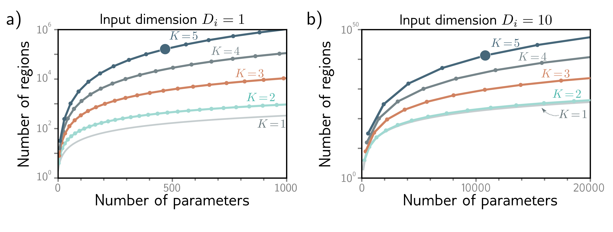

  

  <strong>Figure 4.7</strong> The maximum number of linear regions for neural networks increases rapidly with the network depth. a) Network with Di = 1 input. Each curve represents a fixed number of hidden layers K, as we vary the number of hidden units D per layer. For a fixed parameter budget (horizontal position), deeper networks produce more linear regions than shallower ones. A network with K = 5 layers and D = 10 hidden units per layer has 471 parameters (highlighted point) and can produce 161,051 regions. b) Network with Di = 10 inputs. Each subsequent point along a curve represents ten hidden units. Here, a model with K = 5 layers and D = 50 hidden units per layer has 10,801 parameters (highlighted point) and can create more than 1040 linear regions

structured inputs like images, where the input might comprise $\sim10^{6}$ pixels. The number of parameters would be prohibitive, and moreover, we want different parts of the image to be processed similarly; there is no point in independently learning to recognize the same object at every possible position in the image.

The solution is to process local image regions in parallel and then gradually integrate information from increasingly large regions. This kind of local-to-global processing is difficult to specify without using multiple layers (see chapter 10).

## 4.5.5 Training and generalization

A further possible advantage of deep networks over shallow networks is their ease of fitting; it is usually easier to train moderately deep networks than to train shallower ones (see chapter 20). In practice, the best results for most tasks have been achieved using networks with tens or hundreds of layers. Neither of these phenomena are well understood, and we return to them in chapter 20.

Deep neural networks also seem to generalize to new data better than shallow ones. In practice, the best results for most tasks have been achieved using networks with tens or hundreds of layers. Neither of these phenomena are well understood, and we return to them in chapter 20.
