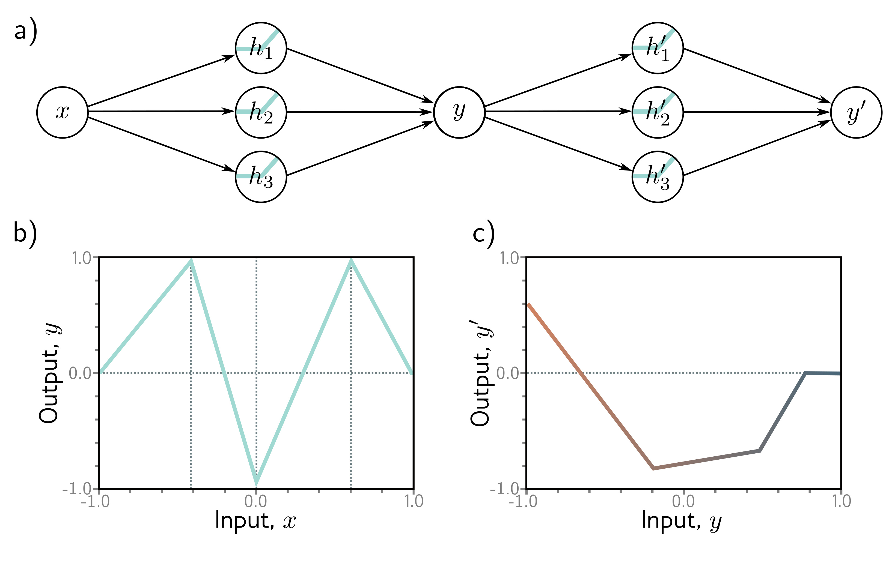

**Figure 1** - Labels: b), c)

  

  <strong>Figure 4.8</strong> Composition of two networks for problem 4.1. a) The output y of the first network becomes the input to the second. b) The first network computes this function with output values  $y \in [-1,1]$ . c) The second network computes this function on the input range  $y \in [-1,1]$ .

**Problem 4.3** Using the non-negative homogeneity property of the ReLU function (see problem 3.5), show that:

$$
\begin{aligned}
\mathrm{ReLU}\Big[\boldsymbol{\beta}_{1}+\lambda_{1}\cdot\boldsymbol{\Omega}_{1}\mathrm{ReLU}[\boldsymbol{\beta}_{0}+\lambda_{0}\cdot\boldsymbol{\Omega}_{0}\mathbf{x}]\Big]=\lambda_{0}\lambda_{1}\cdot\mathrm{ReLU}\left[\frac{1}{\lambda_{0}}\boldsymbol{\beta}_{0}+\mathbf{\Omega}_{0}\mathbf{x}\right],
\end{aligned}
\tag{4.18}
$$

where $\lambda_{0}$ and $\lambda_{1}$ are non-negative scalars. From this, we see that the weight matrices can be rescaled by any magnitude as long as the biases are also adjusted, and the scale factors can be re-applied at the end of the network.

**Problem 4.4** Write out the equations for a deep neural network that takes $D_{i}=5$ inputs, $D_{o}=4$ hidden layers containing $D=30$ hidden units each. What is the depth of this network? What is the width?

**Problem 4.5** Consider a network with $D_{i}=1$ input, $D_{o}=1$ output, and $K=20$ hidden layers containing $D=30$ hidden units each. What is the depth of this network? What is the width?

**Problem 4.6** Consider a network with $D_{i}=1$ input, $D_{o}=1$ output, and $K=10$ layers, with $D=10$ hidden units in each. Would the number of weights increase more if we increased the depth by one or the width by one? Provide your reasoning.
