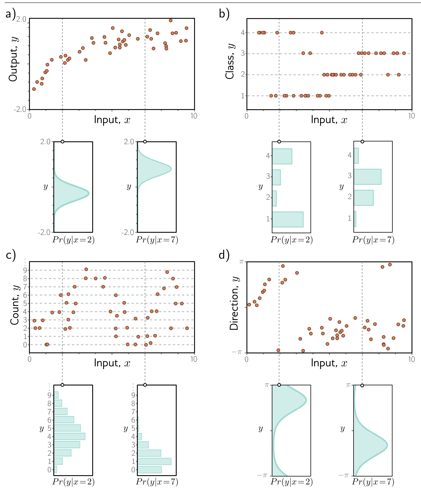

**Figure 1** - Labels: c)

**Figure 2** - Labels: b), d)

  

  <strong>Figure 5.1</strong> Predicting distributions over outputs. a) Regression task, where the goal is to predict a real-valued output y from the input x based on training data  $\lbrace x_{i}, y_{i}\rbrace$  (orange points). For each input value x, the machine learning model predicts a distribution  $Pr(y|x)$  over the output y ∈ ℝ (cyan curves show distributions for x = 2.0 and x = 7.0). Minimizing the loss function corresponds to maximizing the probability of the training outputs  $y_{i}$  under the distribution predicted from the corresponding inputs  $x_{i}$ . b) To predict discrete classes y ∈ {1, 2, 3, 4} in a classification task, we use a discrete probability distribution, so the model predicts a different histogram over the four possible values of  $y_{i}$  for each value of  $x_{i}$ . c) To predict counts y ∈ {0, 1, 2, …} and d) direction  $y \in (-\pi, \pi]$ , we use distributions defined over positive integers and circular domains, respectively.

