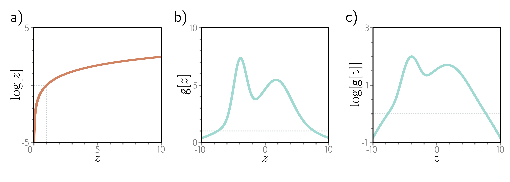

  

  <strong>Figure 5.2</strong> The log transform. a) The log function is monotonically increasing. If  $z > z'$ , then  $\log[z] > \log[z']$ . It follows that the maximum of any function  $g[z]$  will be at the same position as the maximum of  $\log[g[z]]$ . b) A function  $g[z]$ . c) The logarithm of this function  $\log[g[z]]$ . All positions on g[z] with a positive slope retain a positive slope after the log transform, and those with a negative slope retain a negative slope. The position of the maximum remains the same.

## 5.1.3 Maximizing log-likelihood

The maximum likelihood criterion (equation 5.1) is not very practical. Each term  $Pr(\mathbf{y}_{i}|\mathbf{f}[\mathbf{x}_{i},\boldsymbol{\phi}])$  can be small, so the product of many of these terms can be tiny. It may be difficult to represent this quantity with finite precision arithmetic. Fortunately, we can equivalently maximize the logarithm of the likelihood:

$$
\begin{aligned}
\begin{align*}\hat{\phi}&=\argmax_{\boldsymbol{\phi}}\left[\prod_{i=1}^{I}Pr(\mathbf{y}_{i}|\mathbf{f}[\mathbf{x}_{i},\boldsymbol{\phi}])\right]\\&=\argmax_{\boldsymbol{\phi}}\left[\log\left[\prod_{i=1}^{I}Pr(\mathbf{y}_{i}|\mathbf{f}[\mathbf{x}_{i},\boldsymbol{\phi}])\right]\right]\\&=\argmax_{\boldsymbol{\phi}}\left[\sum_{i=1}^{I}\log\left[Pr(\mathbf{y}_{i}|\mathbf{f}[\mathbf{x}_{i},\boldsymbol{\phi}])\right]\right].\end{align*} \tag{5.3}
\end{aligned}
$$

This log-likelihood criterion is equivalent because the logarithm is a monotonically increasing function: if  $z > z'$ , then  $\log[z] > \log[z']$  and vice versa (figure 5.2). It follows that when we change the model parameters  $\phi$  to improve the log-likelihood criterion, we also improve the original maximum likelihood criterion. It also follows that the overall maxima of the two criteria must be in the same place, so the best model parameters  $\hat{\phi}$  are the same in both cases. However, the log-likelihood criterion has the practical advantage of using a sum of terms, not a product, so representing it with finite precision isn’t problematic.
