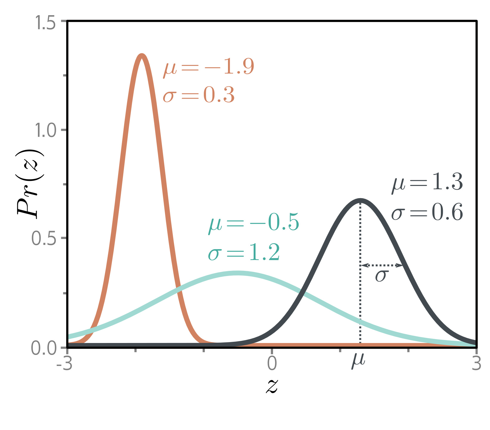

**Figure 1** - Labels: 5.3 Example 1

  

  <strong>Figure 5.3</strong> The univariate normal distribution (also known as the Gaussian distribution) is defined on the real line  $z \in R$  and has parameters  $\mu$  and  $\sigma^{2}$ . The mean  $\mu$  determines the position of the peak. The positive root of the variance  $\sigma^{2}$  (the standard deviation) determines the width of the distribution. Since the total probability density sums to one, the peak becomes higher as the variance decreases and the distribution becomes narrower.

## 5.3 Example 1: univariate regression

We start by considering univariate regression models. Here the goal is to predict a single scalar output  $y \in R$  from input x using a model f[x,  $\phi$ ] with parameters  $\phi$ . Following the recipe, we choose a probability distribution over the output domain y. We select the univariate normal distribution (figure 5.3), which is defined over  $y \in R$ . This has two parameters (mean  $\mu$  and variance  $\sigma^{2}$ ) and has a probability density function:

$$
\begin{aligned}
P r(y|\mu,\sigma^{2})=\frac{1}{\sqrt{2\pi\sigma^{2}}}\exp\left[-\frac{(y-\mu)^{2}}{2\sigma^{2}}\right]. \tag{5.7}
\end{aligned}
$$

Second, we set the machine learning model f[x, $\phi$ ] to compute one or more of the parameters of this distribution. Here, we just compute the mean so  $\mu = f[x,$   $\phi]$ :

$$
\begin{aligned}
P r(y|\mathbf{x},\phi),\sigma^{2})=\frac{1}{\sqrt{2\pi\sigma^{2}}}\exp\left[-\frac{(y-f[\mathbf{x},\phi])^{2}}{2\sigma^{2}}\right]. \tag{5.8}
\end{aligned}
$$

We aim to find the parameters $\phi$ that make the training data $\lbrace x_{i}, y_{i}\rbrace$ most probable under this distribution (figure 5.4). To accomplish this, we choose a loss function $L[\phi]$ based on the negative log-likelihood:

$$
\begin{aligned}
\begin{align*}L[\phi]\ =&\ -\sum_{i=1}^{I}\log\left[Pr(y_{i}|f[\mathbf{x}_{i},\phi],\sigma^{2})\right]\\=&\ -\sum_{i=1}^{I}\log\left[\frac{1}{\sqrt{2\pi\sigma^{2}}}\exp\left[-\frac{(y_{i}-f[\mathbf{x}_{i},\phi])^{2}}{2\sigma^{2}}\right]\right].\end{align*} \tag{5.9}
\end{aligned}
$$

When we train the model, we seek parameters $\hat{\phi}$ that minimize this loss.
