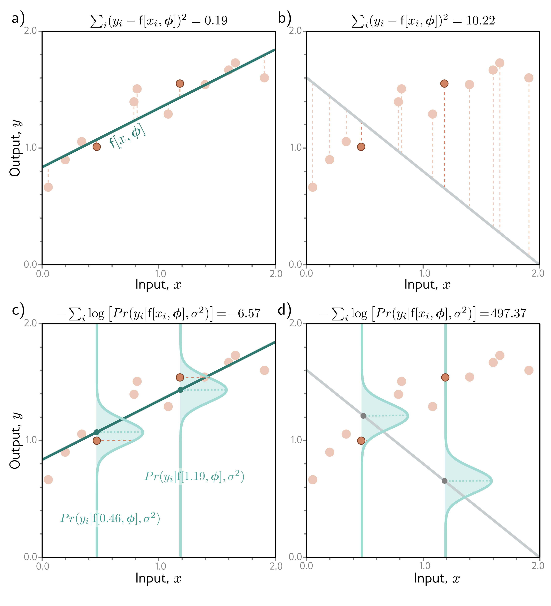

  

  <strong>Figure 5.4</strong> Equivalence of least squares and maximum likelihood loss for the normal distribution. a) Consider the linear model from figure 2.2. The least squares criterion minimizes the sum of the squares of the deviations (dashed lines) between the model prediction f[xi, $\phi $] (green line) and the true output values yi (orange points). Here the fit is good, so these deviations are small (e.g., for the two highlighted points). b) For these parameters, the fit is bad, and the squared deviations are large. c) The least squares criterion follows from the assumption that the model predicts the mean of a normal distribution over the outputs and that we maximize the probability. For the first case, the model fits well, so the probability Pr(yi|xi) of the data (horizontal orange dashed lines) is large (and the negative log probability is small). d) For the second case, the model fits badly, so the probability is small and the negative log probability is large

