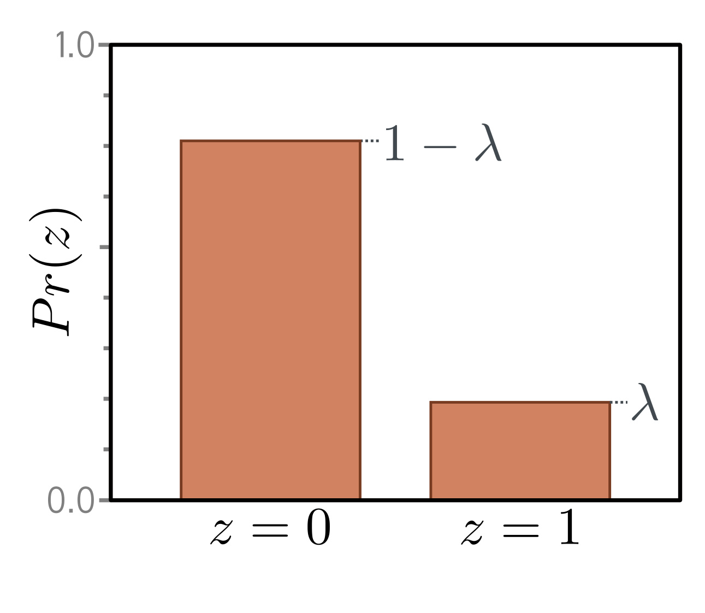
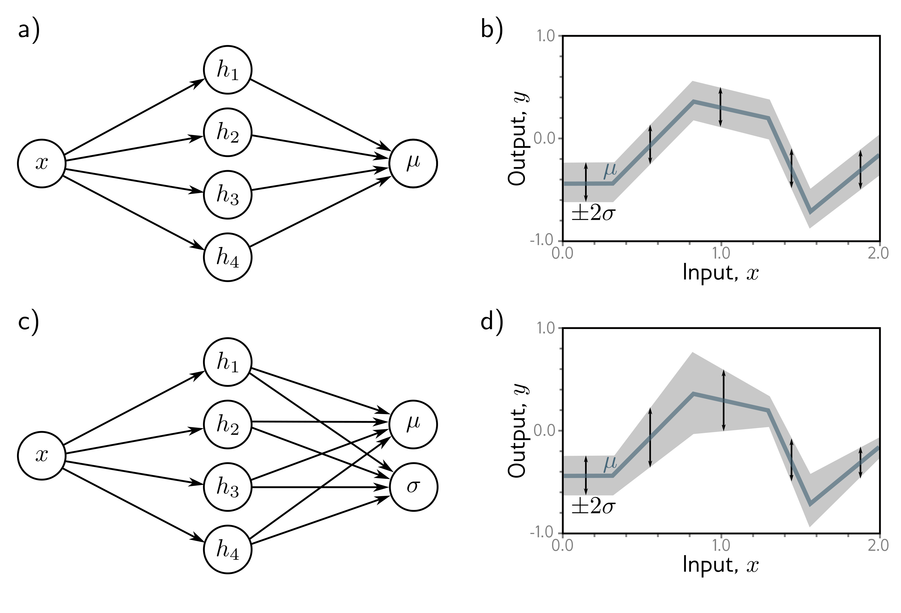

**Figure 1** - Labels: c)

**Figure 2** - Labels: b), d)

  

  <strong>Figure 5.5</strong> Homoscedastic vs. heteroscedastic regression. a) A shallow neural network for homoscedastic regression predicts just the mean  $\mu$  of the output distribution from the input x. b) The result is that while the mean (blue line) is a piecewise linear function of the input x, the variance is constant everywhere (arrows and gray region show  $\pm2$  standard deviations). c) A shallow neural network for heteroscedastic regression also predicts the variance  $\sigma^{2}$  (or, more precisely, computes its square root, which we then square). d) The standard deviation now also becomes a piecewise linear function of the input x.

**Figure 5**

  

  <strong>Figure 5.6</strong> Bernoulli distribution. The Bernoulli distribution is defined on the domain $z \in \lbrace 0,1\rbrace$ and has a single parameter $\lambda$ that denotes the probability of observing $z = 0.1$. It follows that the domain $z \in \lbrace 0,1\rbrace$ and has a single parameter $\lambda$ that denotes the probability of observing $z = 0.1$. It follows that the

please send errata to udlbookmail@gmail.com.
