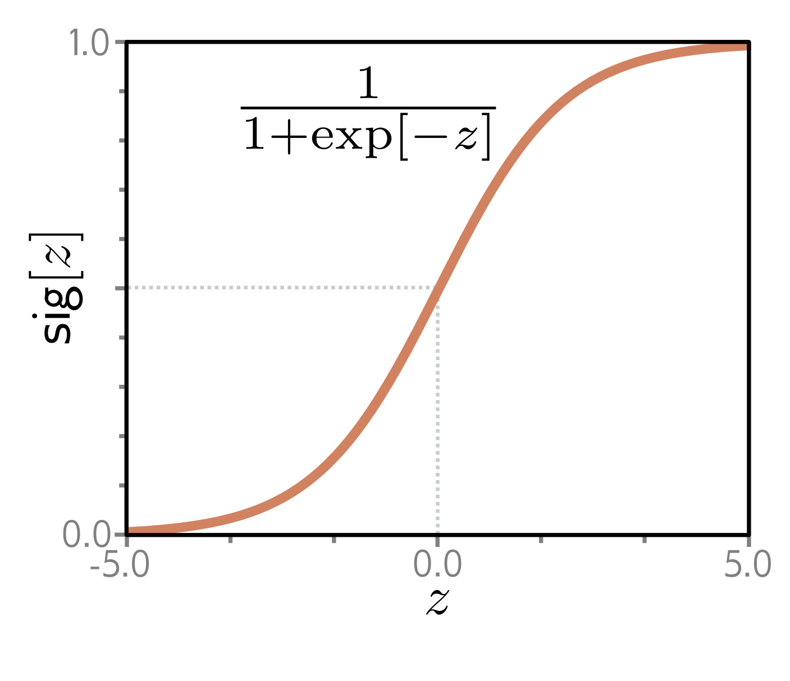

  

  <strong>Figure 5.7</strong> Logistic sigmoid function. This function maps the real line $z \in \mathbb{R}$ to numbers between zero and one, so $\text{sig}[z] \in [0, 1]$. An input of $0$ is mapped to $0.5$. Negative inputs are mapped to numbers below 0.5, and positive inputs to numbers above 0.5.

**Figure 1**

Once again, we follow the recipe from section 5.2 to construct the loss function. First, we choose a probability distribution over the output space  $y \in \lbrace 0,1\rbrace$ . A suitable choice is the Bernoulli distribution, which is defined on the domain  $\lbrace 0,1\rbrace$ . This has a single parameter  $\lambda \in [0,1]$  that represents the probability that y takes the value one (figure 5.6):
Once again, we follow the recipe from section 5.2 to construct the loss function. First, we choose a probability distribution over the output space  $y \in \lbrace 0,1\rbrace$ . A suitable choice is the Bernoulli distribution, which is defined on the domain  $\lbrace 0,1\rbrace$ . This has a single parameter  $\lambda \in [0,1]$  that represents the probability that y takes the value one (figure 5.6):

$$
\begin{aligned}
P r(y|\lambda)=\begin{cases}1-\lambda&y=0\\ \lambda&y=1\end{cases}, \tag{5.16}
\end{aligned}
$$

which can equivalently be written as:

(5.16)

$$
\begin{aligned}
P r(y|\lambda)=(1-\lambda)^{1-y}\cdot\lambda^{y}. \tag{5.17}
\end{aligned}
$$

Second, we set the machine learning model f[x, φ] to predict the single distribution parameter λ. However, λ can only take values in the range [0, 1], and we cannot guarantee that the network output will lie in this range. Consequently, we pass the network output through a function that maps the real numbers R to [0, 1]. A suitable function is the logistic sigmoid (figure 5.7):

(5.17)

**Problem 5.1** $$
\begin{aligned}
\mathrm{s i g}[z]=\frac{1}{1+\exp[-z]}. \tag{5.18}
\end{aligned}
$$

Hence, we predict the distribution parameter as $\lambda = \mathrm{sig}[\mathbf{f}[\mathbf{x}, \boldsymbol{\phi}]]$. The likelihood is now:

$$
\begin{aligned}
P r(y|\mathbf{x})=(1-\mathrm{s i g}[f[\mathbf{x},\boldsymbol{\phi}]])^{1-y}\cdot\mathrm{s i g}[f[\mathbf{x}_{i},\boldsymbol{\phi}]]^{y}. \tag{5.19}
\end{aligned}
$$

This is depicted in figure 5.8 for a shallow neural network model. The loss function is the negative log-likelihood of the training set:

$$
\begin{aligned}
L[\phi]=\sum_{i=1}^{I}-(1-y_{i})\log\left[1-\mathrm{s i g}[f[\mathbf{x}_{i},\boldsymbol{\phi}]]\right]-y_{i}\log\left[\mathrm{s i g}[f[\mathbf{x}_{i},\boldsymbol{\phi}]]\right]. \tag{5.20}
\end{aligned}
$$

For reasons to be explained in section 5.7, this is known as the binary cross-entropy loss.

The transformed model output sig[f[x, φ]] predicts the parameter λ of the Bernoulli distribution. This represents the probability that y = 1, and it follows that  $1 - \lambda$  represents the probability that y = 0. When we perform inference, we may want a point estimate of y, so we set y = 1 if λ > 0.5 and y = 0 otherwise.
