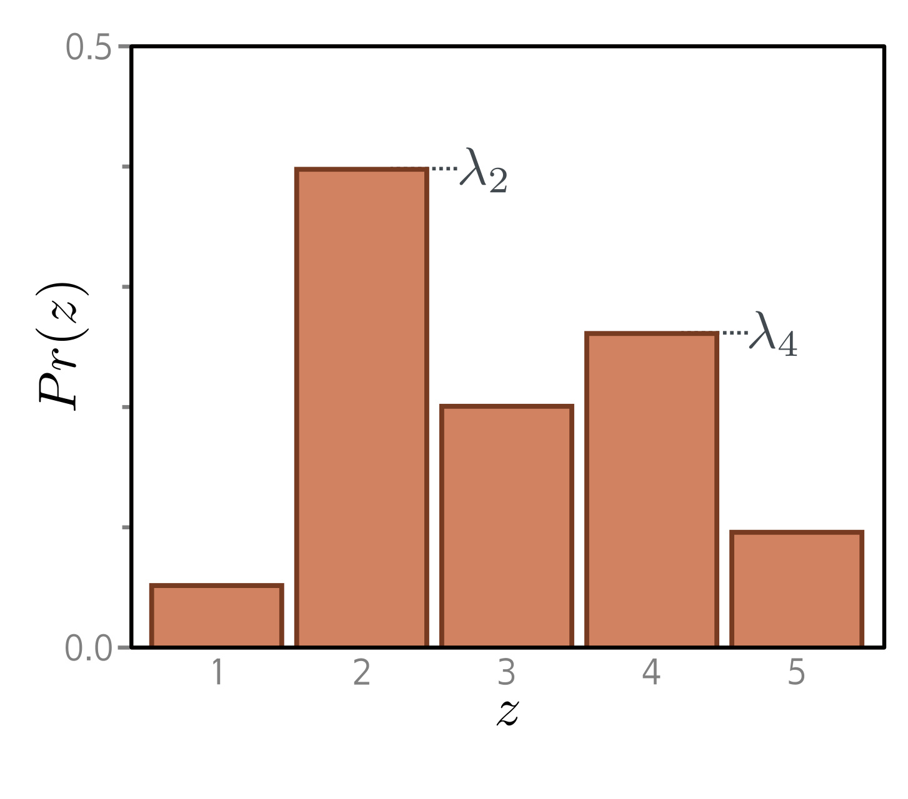
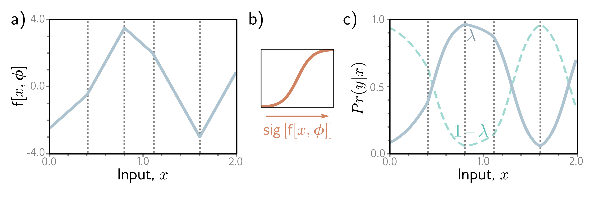

  

  <strong>Figure 5.8</strong> Binary classification model. a) The network output is a piecewise linear function that can take arbitrary real values. b) This is transformed by the logistic sigmoid function, which compresses these values to the range  $[0,1]$ . c) The transformed output predicts the probability  $\lambda$  that y = 1 (solid line). The probability that y = 0 is hence  $1 - \lambda$  (dashed line). For any fixed x (vertical slice), we retrieve the two values of a Bernoulli distribution similar to that in figure 5.6. The loss function favors model parameters that produce large values of  $\lambda$  at positions  $x_{i}$  that are associated with positive examples  $y_{i} = 1$  and small values of  $\lambda$  at positions associated with negative examples  $y_{i} = 0$ .

  

  <strong>Figure 5.9</strong> Categorical distribution. The categorical distribution assigns probabilities to K > 2 categories, with associated probabilities $\lambda_{1}, \lambda_{2}, \ldots, \lambda_{K}$. Here, there are five categories, so K = 5. To ensure that this is a valid probability distribution, each parameter $\lambda_{k}$ must lie in the range $[0, 1]$, and all K parameters must sum to one.

## 5.5 Example 3: multiclass classification

The goal of multiclass classification is to assign an input data example x to one of K > 2 classes, so  $y \in \lbrace 1, 2, ..., K\rbrace$ . Real-world examples include (i) predicting which of K = 10 digits y is present in an image x of a handwritten number and (ii) predicting which of K possible words y follows an incomplete sentence x.

We once more follow the recipe from section 5.2. We first choose a distribution over the prediction space y. In this case, we have  $y \in \lbrace 1,2,\ldots,K\rbrace$ , so we choose the categorical distribution (figure 5.9), which is defined on this domain. This has K parameters  $\lambda_{1}, \lambda_{2},\ldots,\lambda_{K}$ , which determine the probability of each category:
