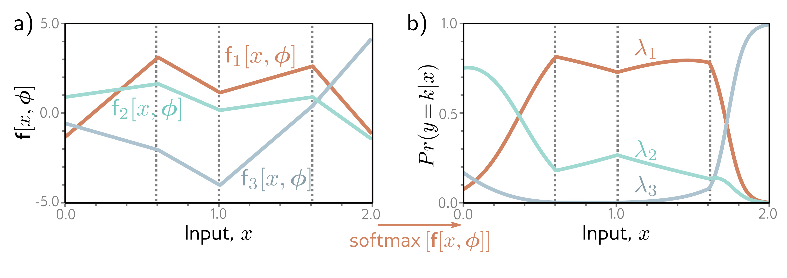

  

  <strong>Figure 5.10</strong> Multiclass classification for K=3 classes. a) The network has three piecewise linear outputs, which can take arbitrary values. b) After the softmax function, these outputs are constrained to be non-negative and sum to one. Hence, for a given input x, we compute valid parameters for the categorical distribution: any vertical slice of this plot produces three values that sum to one and would form the heights of the bars in a categorical distribution similar to figure 5.9.

$$
\begin{aligned}
P r(y=k)=\lambda_{k}. \tag{5.21}
\end{aligned}
$$

The parameters are constrained to take values between zero and one, and they must collectively sum to one to ensure a valid probability distribution.

Then we use a network  $f[x,\phi]$  with K outputs to compute these K parameters from the input x. Unfortunately, the network outputs will not necessarily obey the aforementioned constraints. Consequently, we pass the K outputs of the network through a function that ensures these constraints are respected. A suitable choice is the softmax function (figure 5.10). This takes an arbitrary vector of length K and returns a vector of the same length but where the elements are now in the range [0,1] and sum to one. The  $k^{th}$  output of the softmax function is:

$$
\begin{aligned}
\mathrm{s o f t m a x}_{k}[\mathbf{z}]=\frac{\exp[z_{k}]}{\sum_{k^{\prime}=1}^{K}\exp[z_{k^{\prime}}]}, \tag{5.22}
\end{aligned}
$$

where the exponential functions ensure positivity, and the sum in the denominator ensures that the K numbers sum to one.

The likelihood that input x has label y = k (figure 5.10) is hence:

$$
\begin{aligned}
P r(y=k|\mathbf{x})=\\mathrm{softmax}_{k}\Big[\mathbf{f}[\mathbf{x},\boldsymbol{\phi}]\Big]. \tag{5.23}
\end{aligned}
$$

The loss function is the negative log-likelihood of the training data:
