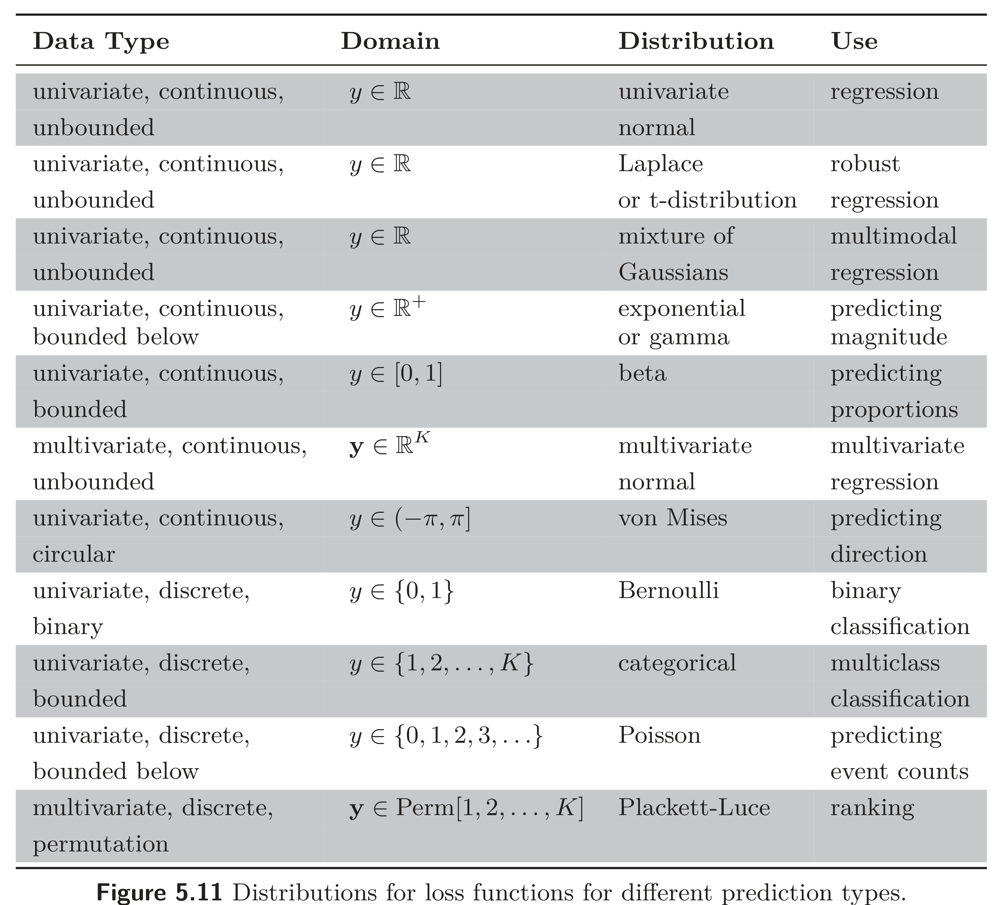

  

  <strong>Figure 5.11</strong> Distributions for loss functions for different prediction types.

<table><tr><td>Data Type</td><td>Domain</td><td>Distribution</td><td>Use</td></tr><tr><td colspan="4">univariate, continuous, unbounded</td></tr><tr><td rowspan="2">univariate, continuous, unbounded</td><td>y ∈ ℝ</td><td>univariate normal</td><td rowspan="2">regression</td></tr><tr><td>y ∈ ℝ⁺</td><td>Laplace or t-distribution</td></tr><tr><td colspan="4">univariate, continuous, unbounded</td></tr><tr><td>univariate, continuous, unbounded</td><td>y ∈ ℝ⁺</td><td>exponential or gamma</td><td rowspan="2">predicting magnitude</td></tr><tr><td>univariate, continuous, unbounded</td><td>y ∈ [0, 1]</td><td>beta</td></tr><tr><td colspan="4">multivariate, continuous, unbounded</td></tr><tr><td>univariate, continuous, unbounded</td><td>y ∈ ℝ⁺</td><td>multivariate normal</td><td rowspan="2">predicting direction</td></tr><tr><td>univariate, continuous, unbounded</td><td>y ∈ (-π, π]</td><td>von Mises</td></tr><tr><td colspan="4">univariate, discrete, binary</td></tr><tr><td>univariate, discrete, unbounded</td><td>y ∈ {0, 1}</td><td>Bernoulli</td><td rowspan="2">binary classification</td></tr><tr><td>univariate, discrete, unbounded</td><td>y ∈ {0, 1}</td><td>Poisson</td></tr><tr><td colspan="4">univariate, discrete, unbounded</td></tr><tr><td>univariate, discrete, unbounded</td><td>y ∈ {0, 1}</td><td>Poisson</td><td rowspan="2">predicting direction</td></tr><tr><td>univariate, discrete, unbounded</td><td>y ∈ {0, 1}</td><td>Poisson</td></tr><tr><td colspan="4">univariate, discrete, unbounded</td></tr></table>

categorical distribution for each $ y\_{d}$. Here, each set of network outputs $\mathbf{f}\_{d}[\mathbf{x}, \boldsymbol{\phi}]$ predicts the $ K $ values that contribute to the categorical distribution for $ y\_{d}$.

When we minimize the negative log probability, this product becomes a sum of terms:

$$
\begin{aligned}
L[\boldsymbol{\phi}]
&=-\sum_{i=1}^{I}\log\left[\Pr\left(\mathbf{y}_i\mid\mathbf{f}[\mathbf{x}_i,\boldsymbol{\phi}]\right)\right] \\
&=-\sum_{i=1}^{I}\sum_d\log\left[\Pr\left(y_{id}\mid\mathbf{f}_d[\mathbf{x}_i,\boldsymbol{\phi}]\right)\right].
\end{aligned} \qquad (5.26)
$$

where $ y\_{id}$ is the $ d^{th}$ output from the $ i^{th}$ training example.

To make two or more prediction types simultaneously, we similarly assume the errors in each are independent. For example, to predict wind direction and strength, we might choose the von Mises distribution (defined on circular domains) for the direction and the exponential distribution (defined on positive real numbers) for the strength. The independence assumption implies that the joint likelihood of the two predictions is the product of individual likelihoods. These terms will become additive when we compute the negative log-likelihood.
