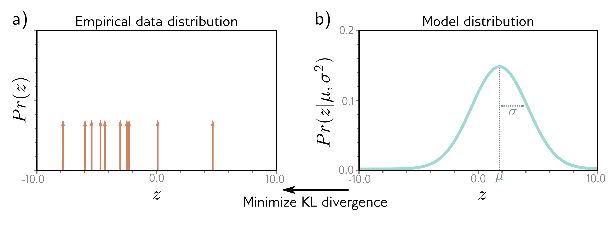

## 5.7 Cross-entropy loss

  

  <strong>Figure 5.12</strong> Cross-entropy method. a) Empirical distribution of training samples (arrows denote Dirac delta functions). b) Model distribution (a normal distribution with parameters $\theta $ = {$\mu $, \sigma2}). In the cross-entropy approach, we minimize the distance (KL divergence) between these two distributions as a function of the model parameters $\theta $

In this chapter, we developed loss functions that minimize negative log-likelihood. However, the term cross-entropy loss is also commonplace. In this section, we describe the cross-entropy loss and show that it is equivalent to using negative log-likelihood.

The cross-entropy loss is based on the idea of finding parameters $\theta $ that minimize the distance between the empirical distribution $ q(y) $ of the observed data $ y $ and a model distribution $\Pr(y|\theta) $ (figure 5.12). The distance between two probability distributions $ q(z) $ and $ p(z) $ can be evaluated using the Kullback-Leibler (KL) divergence:

$$
\begin{aligned}
D_{KL}\left[q\mid\mid p\right]
&= \int_{-\infty}^{\infty}q(z)\log[q(z)]dz-\int_{-\infty}^{\infty}q(z)\log[p(z)]dz
\end{aligned} \qquad (5.27)
$$

Now consider that we observe an empirical data distribution at points $\lbrace y_{i} \rbrace_{i=1}^{I}$. We can describe this as a weighted sum of point masses:

$$
\begin{aligned}
q(y)&=\frac{1}{I}\sum_{i=1}^{I}\delta[y-y_{i}]
\end{aligned} \qquad (5.28)
$$

where $\delta[\bullet]$ is the Dirac delta function. We want to minimize the KL divergence between the model distribution $\Pr(y|\theta) $ and this empirical distribution:

$$
\begin{aligned}
\hat{\boldsymbol{\theta}}
&= \underset{\boldsymbol{\theta}}{\mathop{\mathrm{arg\,min}}}\left[\int_{-\infty}^{\infty}q(y)\log[q(y)]dy-\int_{-\infty}^{\infty}q(y)\log\left[\Pr\left(y\mid\boldsymbol{\theta}\right)\right]dy\right] \\
&= \underset{\boldsymbol{\theta}}{\mathop{\mathrm{arg\,min}}}\left[-\int_{-\infty}^{\infty}q(y)\log\left[\Pr\left(y\mid\boldsymbol{\theta}\right)\right]dy\right]
\end{aligned} \qquad (5.29)
$$

Appendix C.5.1

KL Divergence

Appendix B.1.3

Dirac delta

function
